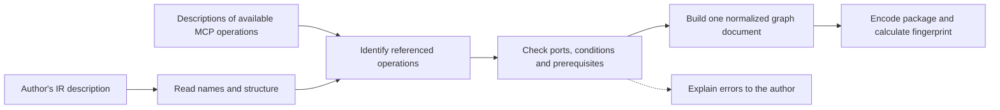
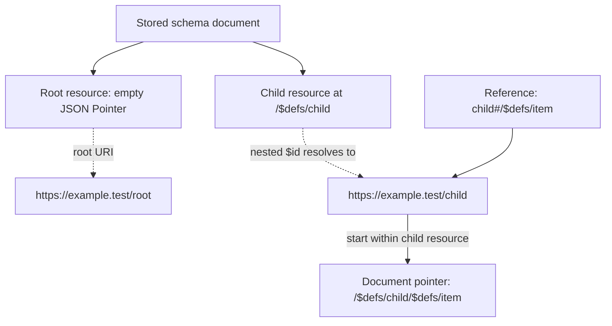
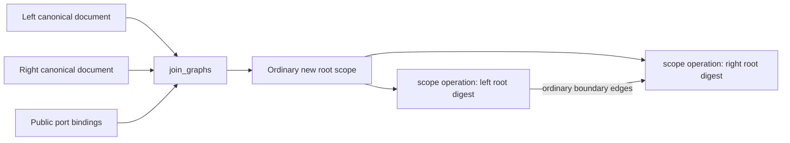

# HTLK Compiler Specification

**Status:** Draft 0.1\
**Companions:** [Language](htlk-grammar-spec.md) · [Syntax](htlk-ir-syntax-reference.md) · [Runtime](runtime-spec.md) · [Executable schema](htlk-executable.cddl)

## 1. Responsibility and compiler boundary

The **compiler** is the program that checks a proposed HTLK graph and prepares it for execution. A **graph** is a plan of named work steps, called nodes, connected by the values they pass to one another. The author describes that plan in **HTLK IR**. IR stands for *intermediate representation*: a structured form between an author's intent and the program that performs the work.

The **runtime** is the separate part of the system that carries out the checked graph. For example, the compiler can check that a drafting step refers to a known tool and supplies the required inputs. It does not ask the tool to write the draft. That request happens later, in a run—one execution of the graph.

### 1.1 What information the compiler needs

**MCP**, the *Model Context Protocol*, is a standard way for an application to request work or material from connected services. A service offering MCP operations is called an MCP server. The compiler receives descriptions of those operations, not live connections.

A **catalog** is an inventory of the available operations and their descriptions. Exactly three catalogs accompany the IR:

| Catalog | What it describes | Example |
|---|---|---|
| Tools | Operations a server can perform, with rules for their arguments and results. | A tool that receives a question and returns a draft. |
| Resources and resource templates | Material that can be read, either at a fixed identifier or at one built from supplied variables. | A project document or a document selected by project ID. |
| Prompts | Reusable instructions or message sequences that can be retrieved from a server. | A server-maintained review prompt. |

A **schema** describes allowed data: for example, “an object with a required text field named `question`.” A **descriptor** is the server's operation description, including schemas where applicable. The compiler uses these descriptions to check names and value boundaries. A **port** is a named input or output; an **edge** binds one output or graph input to a destination port.

The compiler never connects to MCP, runs a condition to discover facts from outside the program, interprets natural language, or changes a run that has already started. A planning application may ask an LLM—a *large language model*—to propose IR, but that is outside this compiler's responsibility.

### 1.2 What the compiler produces

The result is an **executable package**: the checked graph and every referenced definition needed to interpret it. It is not a standalone machine-code application. The runtime reads the package and executes the described operations.

The following representation terms are used throughout this document:

| Term | Meaning |
|---|---|
| Value and type | A value is data, such as a question; its type describes which kinds of data are allowed, such as text, a number, or a list. |
| Record or object | A group of named fields, such as `{ question: "What should we test?" }`. |
| List and map | A list keeps items in order. A map looks up values by names, called keys. |
| JSON | JavaScript Object Notation, a text format for objects, lists, text, numbers, true/false, and null. |
| Bytes | Units of stored data; each byte contains eight binary digits. |
| Encoding and decoding | Converting values into stored bytes and reading those bytes back. |
| CBOR | Concise Binary Object Representation, a compact format for encoding those values and raw bytes. |
| Canonical or deterministic encoding | Following fixed representation choices so the same normalized structure has the same bytes. |
| Hash or digest | A fixed-size summary calculated from bytes. It detects content changes but does not establish who supplied the content. |
| Fingerprint | The digest identifying the executable graph's contents. |
| Immutable | Not modified after creation; a changed graph receives a new package. |
| CDDL | Concise Data Definition Language, the notation used by the companion file to describe valid CBOR record shapes. |

The compiler **normalizes** the source: it removes irrelevant presentation differences and resolves names into precise references. For example, a reusable type alias becomes its underlying type. It must not assume that two arbitrary calculations are equivalent just because they sometimes return the same value.

### 1.3 Built-in behavior and guarantees

Some calculations are **pure**: they use supplied values and fixed functions without reading outside state or changing another system. A **predicate** is a calculation that returns true or false and can act as a condition. A **regular expression**, or regex, is a text-matching pattern.

A fixed compiler build includes the pure-expression evaluator, reusable function libraries written in Rust, a JSON Schema checker, a regex interpreter, a URI-template interpreter, and compiler policy. Rust is the implementation language; a **registry** lists the functions already built into this compiler. A **URI** names a resource, and a URI template fills supplied variables into such a name.

These components are compiler configuration, not a fourth input catalog. Their exact versions and settings form the **profile**. The executable records that profile so the runtime can require the same interpretation. Compiler policy sets ceilings and supported checks; it does not authorize external actions on behalf of a user.



**Diagram 8 — The compiler prepares work; it does not perform it.** The same checking code verifies both text-authored graphs and previously normalized graph documents. The latter skip text parsing, not correctness checks.

A **dependency** means one step needs another's value or final outcome. A **scope** groups steps behind its own public ports. The compiler checks that references resolve, scopes do not access each other's private internals, and no chain of prerequisites circles back within one loop repetition. It also checks that types are compatible or that an actual-value check can enforce the boundary.

These checks do not prove that a model's answer is correct, that arbitrary conditions cannot overlap, or that every value admitted by one complex schema must satisfy another. When only actual returned data can settle a question, the compiler leaves an explicit runtime validation obligation.

## 2. Host interfaces

The **host** is the application that asks the compiler to compile or combine graphs. An **interface** describes what that application supplies and what it receives. These are logical interfaces, not a claim that a particular software development kit is installed.

Read `name: Type` as “a field or argument named name containing that type.” Parentheses contain supplied arguments; `->` introduces a result; `A | B` means either form is allowed. Braces group fields, `list(T)` means an ordered list of T values, and `map(T)` means named entries containing T values.

`SourceText` is the author's IR text. `CanonicalDocument` is the normalized graph structure. `ExecutableBytes` is the stored package. A `Diagnostic` is a structured explanation of an error or warning. The precise records are defined below and in the CDDL companion.

```text
compile_ir(
    ir: SourceText | SourceBundle | CanonicalDocument,
    catalogs: MCPCatalogInputs
) -> CompilationSuccess | CompilationFailure

join_graphs(
    left: CanonicalDocument,
    right: CanonicalDocument,
    join: JoinSpec,
    catalogs: MCPCatalogInputs
) -> CompilationSuccess | CompilationFailure

CompilationSuccess {
    canonical_document: CanonicalDocument,
    executable_bytes: bytes,
    fingerprint: Digest,
    diagnostics: list(Diagnostic),
    source_map: list(SourceMapEntry),
    documentation: map(string)
}

CompilationFailure {
    diagnostics: list(Diagnostic)
}
```

The **root** is the entry graph where execution begins. A **reachable closure** is the complete set of definitions it needs: follow each reference, then each reference inside the referenced definition, until nothing required is missing. The returned document includes task and loop scopes, calculations, types, prompt templates, MCP selections, and library identities. It cannot return only the top-level nodes and leave their task definitions behind, because the result must be usable in a later graph join.

A **source map** links a normalized record back to the author's text so an error can point to the relevant line or span. A **JSON Pointer** identifies a location in a structured document, such as `/nodes/0/id`; it is not a network address. **UTF-8** is the byte encoding used for source text. A byte offset counts stored bytes from the beginning, which is not always the same as counting displayed characters.

`SourceMapEntry` contains `canonical_path` (an RFC 6901 JSON Pointer into the decoded document), `source`, `start_byte`, `end_byte` (exclusive UTF-8 source offsets), and optional `declaration_name`. `source` distinguishes the standalone string from an exact package/module/source-path location, as defined in [module source locations](htlk-modules-spec.md#7-locations-diagnostics-and-required-tests). Offsets are within that one string or file; canonical-input compilation has an empty source map. `documentation` maps canonical paths to retained author descriptions. These two report fields are **sidecars**—supporting information kept outside the executable—and are not authoritative descriptions of graph behavior. They are data that a host can retain for graph inspection; they are not fields of the executable payload. One canonical scope may have several source-map entries when identical definitions were deduplicated.

Passing a canonical document never trusts its IDs, schemas, function signatures, or “already verified” claims. The compiler rechecks them against its linked profile and supplied catalogs. Failure returns no partial executable. Source maps and author descriptions are separate compiler report data.

### 2.1 Multi-file and package compilation

The [Modules and Source Packages specification](htlk-modules-spec.md) is the normative extension of this compiler contract. It defines the closed `SourceBundle` and manifest records, dependency digest calculation, import/export resolution, and `inspect_module` interface reports. The host collects directories into a finite source snapshot; the compiler resolves only supplied data. It still takes IR plus exactly three MCP catalogs, not a source-discovery service or fourth catalog.

Standalone and multi-file source use the same 0.1 language rules and normalize into a 0.1 canonical document. Every HTLK-owned format version and version label used in hash calculations in this specification is `0.1`. External protocol, schema, and third-party implementation versions retain their actual identities. Source packages, aliases, file locations, and interface reports are erased or kept outside the executable. Within this baseline, moving unchanged work into modules must not change executable bytes when the graph ID, resolved work, catalogs, and profile are unchanged. This is not a compatibility guarantee for bytes produced under earlier drafts: version labels and contract record keys have changed, so migrated source must be recompiled.

Compilation validates source snapshots, resolves acyclic module imports in their defining modules, and applies the existing type, contract, MCP, scope, dependency, and structural-limit checks. It emits only the entry graph's reached definition closure. Module inspection supports editing in isolation, but neither an interface report nor a cache substitutes for the actual verified implementation closure.

## 3. Catalog contract

A **contract** here means the exact structure and rules the supplied catalog must satisfy. An **alias** is a convenient source name, such as `research`, mapped to the server's full identity. Collection order is non-semantic when changing that order cannot change what the graph means.

Each of the three catalogs has `catalog_version = "0.1"`, `mcp_protocol_version = "2025-11-25"`, a server-alias map, and entries for its category. The resources catalog has separate fixed-resource and template collections. Collection order is non-semantic. This MCP baseline is explicit; supporting another protocol requires an explicit profile revision.

The input object shapes are fixed below. All fields are required unless marked `?`; maps use exact string keys. The notation describes JSON objects, not additional HTLK source syntax.

```text
MCPCatalogInputs {
    tools: ToolCatalog,
    resources: ResourceCatalog,
    prompts: PromptCatalog
}

CatalogHeader {
    catalog_version: "0.1",
    mcp_protocol_version: "2025-11-25",
    servers: map(ServerIdentity),
    schema_documents: map(JSONSchemaDocument)
}

ToolCatalog     = CatalogHeader + { tools: list(CatalogEntry) }
ResourceCatalog = CatalogHeader + {
    resources: list(CatalogEntry),
    templates: list(CatalogEntry)
}
PromptCatalog   = CatalogHeader + { prompts: list(CatalogEntry) }

CatalogEntry {
    server: string,
    descriptor: MCPDescriptorObject,
    expected_descriptor_digest?: Digest
}
```

`+` means merge these disjoint object fields, not inheritance or a serialized operator. Unknown HTLK-owned fields fail. `server` is a key in that catalog's `servers` map; an alias is a nonempty arbitrary string, not necessarily an HTLK identifier. The enclosing collection selects the exact MCP tool/resource/template/prompt descriptor schema. `schema_documents` maps absolute fragment-free retrieval URIs to JSON Schema objects or booleans; an empty map is explicit. Its union across the three catalogs is resolved offline. Expected digests assert content but do not add semantic payload fields.

Entry lookup uses resolved compound server identity plus the descriptor's `name`, `uri`, or `uriTemplate`, as appropriate. Duplicate entries for the same lookup key deduplicate only if their canonical descriptor bytes agree; conflicting copies fail. Distinct aliases may name one server. Unreferenced entries need valid catalog/protocol structure but are not required to satisfy HTLK's callable-tool `outputSchema` policy until selected. This allows a catalog to include a text-only tool that this graph does not call.

A **compound identity** uses several fields together. A friendly alias or an advertised server name alone is not enough to identify the exact deployment that should receive a request. In the record below, `deployment_id` identifies the operator-configured deployment. `transport` says how requests travel: `stdio` uses a launched program's input/output streams, while `streamable_http` uses the MCP HTTP-based transport. HTTP is a network request-and-response protocol. The remaining fields identify the server implementation and version.

A server alias maps to this compound identity:

```text
ServerIdentity {
    deployment_id: string,
    transport: "stdio" | "streamable_http",
    implementation_name: string,
    implementation_version: string
}
```

The host supplies the deployment identity through trusted connection configuration—for example, distinguishing a test installation from a production installation running the same server version. Information reported by the server itself cannot establish that trusted deployment selection. The connection address (endpoint), login secrets (credentials), current connection objects, observation times (timestamps), and source aliases are not part of the compound identity. When an alias occurs in several catalogs, it must map to exactly the same identity in each.

Each entry supplies its exact MCP descriptor JSON object. The tool entry contains `inputSchema` and the HTLK-required `outputSchema` in that descriptor. Resource entries contain `uri`; template entries contain `uriTemplate`; prompt entries contain `name` and argument descriptors. There are no duplicated schema fields with potentially conflicting copies. Names and catalog keys are exact protocol strings.

A **pin** is an exact recorded selection, not a request to choose whichever version is newest. **I/O** means input/output interaction with files, networks, or other outside systems. Schema reference resolution below uses only supplied documents, without I/O.

The compiler computes descriptor and server-identity digests. Optional caller digests and source `pin` values are assertions and must match. Referenced JSON Schema documents are supplied in a finite catalog URI-to-document map; duplicate URI entries must have identical canonical content. Relative `$ref` resolution uses the enclosing schema's declared base URI. No resolution performs I/O.

The **JSON Canonicalization Scheme (JCS)** defines a consistent JSON byte representation. RFC 8785 is the published standard identifying that scheme. A repeated object key is rejected before canonicalization so a parser cannot silently discard one of two conflicting values.

All external JSON identity uses RFC 8785 JCS bytes after duplicate-key rejection and the JSON numeric restrictions below. Descriptors are preserved, including descriptions that could affect host planning. Compiled graph identity includes only referenced entries and their transitive schema dependencies; adding an unrelated tool does not change an existing graph fingerprint.

A schema may refer to another schema rather than repeat its rules. `$ref` gives that reference, and `$id` establishes a schema resource's identifier and base for resolving relative references. For example, `shared.json#/$defs/Name` names a document relative to a base and then a location inside it. The part after `#` is a **fragment**. An **absolute URI** supplies a complete identifier; a **relative reference** needs a base. A **synthetic base** is an identifier HTLK creates when no suitable one was supplied. The `urn:` form names something without implying a network fetch.

An embedded input/output schema without an absolute `$id` receives the synthetic base `urn:htlk:schema:<64 lowercase digest hex digits>`. This base supports local fragment references. A non-fragment relative reference requires a hierarchical absolute base URI supplied by `$id` or, for externally referenced documents, their catalog retrieval context; without one, compilation fails. A catalog URI alias never overrides the synthetic base of an embedded input/output schema. Catalog URI bindings and nested `$id` declarations must resolve consistently. This prevents two compilers from selecting different bases for the same embedded schema.

### 3.1 JSON and schema semantics

A schema **dialect** selects the version and interpretation of its rule language. A **vocabulary** is a named collection of schema keywords. An **assertion** can make a value fail validation; an **annotation** records information without rejecting the value by itself. Thus an apparent date format is not automatically an enforced date check under the annotation rule below.

The schema dialect is JSON Schema 2020-12. If a descriptor omits `$schema`, this is the selected dialect. Another explicit dialect is rejected by this release. All 2020-12 validation vocabularies implemented by the pinned validator are enforced; unsupported required vocabularies fail compilation. `format` follows the 2020-12 annotation vocabulary and does not silently become a format assertion. Use an explicit predicate for stricter URI/date requirements.

Local/catalog references and recursive schemas are allowed when the pinned validator supports them under finite validation-depth and work limits. There is no requirement to solve general schema subtyping. Unrepresentable refinements remain attached to a `schema` type and are checked on actual values.

Numbers need a precise rule because many fractional decimal numbers cannot be represented exactly in a computer's binary floating-point format. **Binary64** is the 64-bit format selected here. A **safe integer** is within the range where every integer is represented exactly by that format. **Coercion** means changing a value's representation automatically; **underflow** means a very small number rounds down in magnitude, potentially to zero. **Nonfinite** means an infinity or the special not-a-number value. The rules below deliberately limit JSON numbers more tightly than HTLK's native whole-number type.

JSON values accept strings, booleans, null, arrays, string-keyed objects, safe integers in `[-(2^53-1), 2^53-1]`, and finite binary64 fractional numbers. A JSON number whose mathematical value is integral must be in the safe-integer range. Check integer range before rounding the input token. Fractional JSON numbers use correctly rounded binary64 conversion; reject nonfinite results and any rounded result that is integral but outside the safe-integer range. For example, `9007199254740991.5` is rejected because it rounds to the unsafe integer `9007199254740992`. HTLK-native `integer` still supports signed 64 bits; transferring a larger native integer through MCP requires an explicit string or other agreed representation.

The MCP/JSON adapter normalizes an integral JSON number to the corresponding native integer and a nonintegral JSON number to float. Encoding a safe integral native float as a JSON number is permitted at this explicit protocol boundary; receiving it produces a native integer under that rule. JSON Schema validation uses JSON numeric semantics, not the token's spelling. Internal HTLK integer/float conversions still require an explicit pure operation. Catalog JCS encoding follows its own standard binary64 number normalization.

Here, incoming normalization tests the converted binary64 value after both range checks; an underflowed fractional token may therefore become integer zero. Internally, `json` is a validation constraint, not a coercion: a safe integral native float remains a float in an `eval(json, ...)` output and its CBOR artifact. Only an explicit JSON encode/decode boundary can change that numeric representation. Schema validation observes the JSON encoding, while the dispatch audit retains the original frozen typed arguments and the exact encoded request.

JSON Schema `pattern` and `patternProperties` use the dialect supported by the pinned schema validator, following the [2020-12 regular-expression requirements](https://json-schema.org/draft/2020-12/json-schema-core#section-6.4). They are not HTLK `/.../` literals and MUST NOT silently acquire Rust-regex semantics. Unsupported schema patterns fail compilation; known 2020-12 assertion/applicator keywords cannot silently be ignored as successful checks. Unknown optional-vocabulary keywords retain the dialect's annotation behavior. HTLK literal regex behavior remains separately pinned by `regex_engine`.

JSON encoding does not convert native bytes to base64, omit nulls, rename fields, or insert schema defaults. Such transformations require authored pure computations. Field omission from an optional record member is represented by actual absence; JSON null remains present.

To **project a schema** here means infer a simpler type shape from its rules, such as a list of strings or a record with named fields. **Conservatively** means expose only facts justified by the schema, not guesses. More detailed restrictions stay attached for checking actual values. **Schema subtyping** or **implication** would mean proving that every value accepted by one schema is accepted by another; this compiler does not require a general proof procedure for that problem.

The compiler projects schemas conservatively:

| Schema form | Structural information |
|---|---|
| String, Boolean, null, integer | Corresponding primitive, subject to JSON numeric profile. |
| Number | Union of integer and float JSON representations. |
| Homogeneous array | List if its item type is known. |
| Named object properties | Record fields with presence derived from `required` and nullability derived from their schemas. |
| Alternatives, references, open objects, complex refinements | Preserve the exact schema; expose only facts valid for all possible accepted values. |
| Unconstrained schema | `json` with boundary checks. |

A callable input and output schema must each accept only object roots. The baseline compiler establishes this when the root has `type: "object"` (including other keywords alongside it), or a reference chain resolves to such a root. Other schema layouts need a root object constraint. This is a protocol admission rule, not a general schema-equivalence proof.

### 3.2 MCP normalization

This section defines the data shapes HTLK presents after reading MCP messages. **Structured content** is the MCP result's machine-readable object, in contrast to a plain text block intended for display. A **snapshot** is the accepted contents from one resource read, not a live view that changes when the resource changes.

All tool calls have one `arguments` input and one `value` output. Their type records reference the descriptor's exact schema digests. The runtime validates the full input object and full `structuredContent` object. The [MCP structured-content definition](https://modelcontextprotocol.io/specification/2025-11-25/server/tools#structured-content) uses an object; scalar/list-only output schemas need an object wrapper.

A **fixed read** names one catalog resource directly. A **template read** builds a resource identifier from named variables. **Percent encoding** represents characters in URI components using `%` followed by hexadecimal digits, according to the pinned URI-template rules. A **modifier** is template syntax that changes how a variable is expanded.

Fixed reads have no inputs. Template reads have one required `arguments` record. The RFC 6570 expansion implementation and version are pinned in the profile. All referenced template variables are required strings in this release; full RFC 6570 scalar expansion semantics apply, including percent encoding and modifiers. A missing variable fails. Source distinguishes `mcp.resource` from `mcp.template`, eliminating lookup ambiguity.

Prompt fetches have one `arguments` record with requiredness from the prompt descriptor; values are strings and names are exact external keys. No parameters means a required empty argument object.

A resource's **MIME type** is its advertised media label, such as `text/plain`. It does not by itself prove a particular application data shape. In the record notation below, `?` marks an optional field, `bytes` means raw data, and the `kind` field distinguishes text from binary content. This distinguishing field is called a **tag**; it is not a special CBOR tag.

Resource contents normalize into `ResourceSnapshot` without guessing a domain type:

```text
ResourceSnapshot = {
    server_identity: Digest,
    requested_uri: string,
    descriptor_digest: Digest,
    contents: list(ResourceContent)
}

ResourceContent =
    { kind: "text", uri: string, mime_type?: string, text: string }
  | { kind: "bytes", uri: string, mime_type?: string, data: bytes }
```

The normalized value has no observation timestamp or self-referential content digest. Those belong to the artifact's separate provenance record. Returned content order and URIs are preserved. `McpPromptResult` is the full validated protocol result object with exact wire-owned field names and message order, constrained by the pinned protocol schema. It is data, never an instruction to the executor.

## 4. Normalization and core operations

A **closed record** permits only its defined fields; an unexpected extra field is an error. An **operation code** identifies the work to perform. **Lowering** means translating source constructs to a simpler execution representation; HTLK avoids maintaining a second graph that could disagree with the canonical document.

The canonical executable is a closed typed record defined by [htlk-executable.cddl](htlk-executable.cddl). It is also the canonical document returned by the compiler. There is no second, independently authoritative lowered graph.

| Source form | Canonical operation |
|---|---|
| `eval(T, expr)` | `["eval", expr]` |
| `call`, `read`, `fetch` | `["mcp", binding_digest, retry_policy]` |
| `use(task)` and composed operand | `["scope", scope_digest]` |
| `loop` | `["loop", body_scope_digest, initializers, until, max_iterations]` |
| `wait(T)` | `["wait", topic, timeout_ms]` |

Source descriptions, comments, layout, redundant type aliases, and catalog aliases are removed from canonical identity. Source maps retain their associations for diagnostics. All guards and contracts are normalized to explicit Boolean expressions; omission means the literal true. Missing input tables on pure nodes become empty tables. Missing retry policy becomes one attempt with empty code and delay lists.

Task/loop definitions are stored once by their content digest. A task name resolves to a digest before constructing its parent. A loop body is a scope with `carried` declarations and ordinary output and next sinks. Definitions form an acyclic reference graph. Child node and edge IDs are local authored identifiers; the same task reused in two places has two distinct runtime instances.

Ordinary scope uses require empty `carried` tables and forbid carried/next references. A loop body has the loop node's input/output tables, inferred carried table, empty local limits, and literal-true local pre/postconditions; limits and contracts belong to the loop node. Validate each scope reference in its use context, not by an exclusive label attached to its digest. A body with no carried values or next references may be byte-identical to an ordinary task and share its record; each use must independently satisfy its contextual checks. Loop initializers must cover every carried field exactly once and name an input with equal type and requiredness. `next` destinations are declared implicitly by that carried table. These rules are verified on canonical input as well as source input.

Compiler-generated composition uses the same scope record and operation as authored task instantiation. No compiler-only executable opcode or hidden type namespace is needed.

### 4.1 Type and expression records

A **type algebra** is the set of type-building rules: for example, combine `list` with `string` to describe a list of strings. An **alias** is another name for an existing type, rather than a new kind of value. A **path** is a sequence of field or item selections into a value. A **suffix** is selection syntax placed after an expression, such as `.code`.

Each port record contains exactly `type` and `required`. This also represents record-field presence. The canonical type algebra has primitive strings and tagged arrays for list, map, record, enum, union, schema references, and signature-only type/function variables.

A record type's map permits arbitrary decoded string field names. Public graph/node port names remain identifiers. Named types resolve to their normalized structural type; aliases and `text` do not survive as distinct types.

Canonical expression forms have explicit tags for literals, regex literals, references and paths, records/lists, calls, static function references, prompt rendering, terminal status/error reads, Boolean operators, and comparisons. Source function names resolve to either the closed core or an exact library/function pair. Template references resolve to content digests. No node handle or function reference becomes an application value.

A path step is a field name or a nonnegative zero-based integer index. `["ref", ["output", "worker", "value"], ["customerId"]]` reads the exact key from a sibling output in a context that permits that read.

Suffixes on a reference are folded into that reference's path. Suffixes on any other expression use `["get", expression, path]`; adjacent get paths are concatenated, and an empty get is forbidden. Thus `error(@worker).code` is representable without a hidden dynamic selector. Parentheses disappear during normalization. There is no otherwise-optional constant folding or operator reordering in the canonical document.

Expression children preserve evaluation order. Record-expression entries are represented as an ordered list of key/expression pairs sorted by decoded key UTF-8 bytes; evaluation uses that canonical order. This defines error precedence independently of source field order. Record values themselves are unordered maps.

Prompt templates normalize to alternating literal strings and named slot records: empty literal segments are removed and adjacent literal segments are joined. Repeated slots remain in order. Render argument records are exact parameter-to-expression maps evaluated in parameter-name UTF-8 order. Retry error-code lists are unique sorted UTF-8 strings; delay vectors preserve attempt order. Union types are flattened, normalized, deduplicated, and encoded in byte order; redundant singleton unions and nested union nodes are not canonical.

### 4.2 Built-in library registry

A library **manifest** names the library and the exact version/implementation requested. A function **signature** describes its argument and result types. A **generic** signature uses a type placeholder, such as T in a function that works on lists of several different item types. A **higher-order** function accepts another function as an argument; HTLK allows only statically named functions for that purpose, not author-supplied function bodies.

The IR manifest selects library ID, version, and implementation digest. The registry supplies exact function signatures, parameter presence rules, generic variables, purity constraints, and deterministic fuel charging. For each reached library, the executable embeds its complete public signature manifest, which the runtime compares to the linked registry. It does not emit a call-site-dependent subset under the same library digest.

All function arguments are syntactically supplied. A signature parameter with `required: false` accepts an optional reference whose value may be absent; it is not a default argument. The return port's requiredness specifies whether a function can return absence. Signature-only type variables and function types never appear in ordinary artifact types.

Generic parameters are **rank-one**: the generic parameters belong to the named function's signature, not to arbitrary nested polymorphic function values. They are inferred by **unification**, meaning matching the actual argument types to the signature's type placeholders. Each function has one signature; unresolved variables, recursive function types, or incompatible static function references fail. No author-provided null policy changes evaluation.

Core and library operations have deterministic work counters. A wall-clock watchdog may terminate a malfunctioning worker, but it must not record a deterministic Boolean false or cache a successful value for that timeout. The exact regex engine version, Unicode table version, and implementation digest are pinned. Source regex spelling is validated against the [Rust regex syntax](https://docs.rs/regex/latest/regex/#syntax) implemented by that profile.

## 5. Dependency graph and binding checks

A data edge is not the only reason one node might wait for another. A node's guard—a true/false condition controlling whether it starts—might inspect another node's final status. Checking only the visible value edges could miss a cycle such as A waiting for B's status while B waits for A's output.

The compiler builds a wait-dependency DAG for every scope. It contains node admission, node outcome, input binding, public-output binding, and loop-next binding dependencies. It includes every reference, including optional inputs, condition operands, and terminal-status reads. A data-only DAG check is insufficient.


**Diagram 9 — A hidden cycle that must be rejected.** The explicit data edges may look acyclic, but each node's admission depends on the other's completion. The compiler rejects the complete dependency cycle even if a short-circuit branch might avoid it at runtime.

Required invariants:

1. References resolve in the permitted scope and expression context.
2. Every required destination has at least one candidate edge.
3. Two unconditional writers to a destination are rejected; conditional groups use the runtime uniqueness check.
4. Each edge transfers a whole source port; outputs and next are sinks, not implicit node inputs.
5. All types have an enforceable validation rule. Known disjoint shapes fail statically; uncertain refinements produce a checked-boundary annotation in the report.
6. All value and outcome dependencies are acyclic within an iteration. Every reference in both Boolean branches counts even if lazy evaluation might avoid it.
7. Every child can reach a public output, a scope completion outcome check, or, in a loop body, a next binding or the loop termination expression.
8. Task/scope references are acyclic and all loop bodies have explicit finite iteration bounds.
9. Node guards never read the guarded node's own outcome; preconditions and postconditions obey their local scope rules.
10. All MCP identities and pure implementations resolve exactly.

SAT/SMT solvers are tools for proving logical constraints. HTLK does not require one to prove every pair of author-defined conditions mutually exclusive. That is why the runtime also checks that at most one incoming edge condition is true for a destination.

There is no SAT/SMT requirement. The executable need not carry a disjointness proof, and authored custom filters remain usable without special compiler reasoning about them. Binding uniqueness is verified again on actual guard results.

Dead declarations can be omitted. Declared node operations cannot be pruned, speculated, fused across an effect boundary, or reordered in a way that changes observable outcomes. Safe value deduplication may share bytes, but it does not merge invocations or provenance.

## 6. Canonical identity and deterministic CBOR

An **envelope** is the outer record containing format labels, a fingerprint, and a payload. The **payload** is the encoded normalized graph document. This separation lets a reader recognize the format and verify the stored contents before using the graph.

In the formula below, `UTF8` encodes text as bytes, `||` joins byte sequences, `SHA256` calculates a 256-bit hash, and `lowercase_hex` writes bytes using the digits `0`–`9` and letters `a`–`f`. The `\n` in the label is one newline character. These are format-definition functions, not callable HTLK source functions.

The envelope contains exactly four fields:

```text
{
    format: "htlk.executable.graph",
    version: "0.1",
    fingerprint: Digest,
    payload: bytes
}
```

`payload` contains exactly one deterministic CBOR document, the `CanonicalDocument`. Define:

```text
fingerprint = "sha256:" + lowercase_hex(
    SHA256(UTF8("htlk.executable.graph/0.1\n") || payload)
)
```

Only this format identifier, the `version` field, and this fingerprint formula
are supported. The prefix ends in one LF byte and payload bytes follow directly;
there is no CBOR array or byte-string header around the hash preimage.

Fingerprint primitive vectors (these payloads are not complete valid graphs):

| Raw payload bytes (hex) | Fingerprint |
|---|---|
| Empty | `sha256:ebbad418b6ddd9ead246e32dc337b19276b2c709701d2ad69a9992098f9fa14c` |
| `f6` | `sha256:9b039893d4db25c42f0765d6a31877987d90ff86f07ca593af128ca23500120d` |

The fingerprint identifies both semantic content and executable content because they are the same canonical document. There is no second payload digest, self-contained semantic-document copy, graph-version alias, or serialized derived index. The version of an executing graph is its fingerprint.

The canonical document contains:

| Field | Meaning |
|---|---|
| `ir_version` | Exactly `"0.1"`. |
| `graph_id` | Qualified root graph name. |
| `profile` | Exact core, library-engine, schema, template, and policy semantics. |
| `root_scope` | Content digest of the root scope. |
| `scopes` | Reachable graph/task/loop scope records keyed by digest. |
| `templates` | Reached normalized prompt templates keyed by digest. |
| `bindings` | Reached normalized MCP bindings keyed by digest. |
| `libraries` | Reached linked-library records keyed by implementation digest. |
| `schema_uris` | Required schema document retrieval URIs mapped to document digests; nested resource locations are derived from those documents. |
| `documents` | Exact referenced external JSON documents, as JCS UTF-8 byte strings keyed by SHA-256 digest. |

A definition can be referenced more than once. Storing it under a **content digest** allows identical definitions to share a record. **Domain separation** includes a purpose label in the hashed bytes so, for example, a scope hash and a server hash are not treated as the same kind of identifier merely because their underlying field bytes happen to match.

Record-content digests use domain separation:

```text
record_digest(kind, record) =
    "sha256:" + lowercase_hex(
        SHA256(UTF8("htlk." + kind + "/0.1\n") || deterministic_cbor(record))
    )
```

`kind` is exactly `scope`, `node`, `template`, `binding`, or `server`. A runtime node definition digest is `record_digest("node", node_record)`, covering all its ports, contracts, limits, and operation; it need not be a separate payload table. Library implementation digests identify linked implementation manifests and are verified against the registry, not derived from arbitrary caller signatures. External JSON document digests remain SHA-256 of JCS bytes without the HTLK domain prefix.

Source maps, report diagnostics, catalog retrieval times, compiler build timestamps, and detached signatures are outside the envelope. Changing them cannot produce conflicting registrations for the same fingerprint. A signature authenticates the complete fingerprint and profile under deployment trust rules; an unkeyed digest alone authenticates no compiler or server.

### 6.1 Encoding profile

An encoding format can offer several byte representations for the same value. A deterministic profile chooses one. The rules below specify lengths, number encodings, ordering, and invalid cases precisely so independent implementations can agree on bytes.

A **definite length** writes a collection's size before its contents. **Lexicographic byte order** compares the first differing byte, as a dictionary compares letters. **Binary16**, **binary32**, and **binary64** are floating-point formats with different storage widths. **NaN** means not a number. A CBOR **tag** attaches an extra interpretation marker to a value; HTLK forbids those markers here. **Unicode normalization** would rewrite some equivalent-looking character sequences into a standard form; this profile does not do so.

HTLK uses [RFC 8949 section 4.2.1](https://www.rfc-editor.org/rfc/rfc8949.html#section-4.2.1) core deterministic encoding, not the separate length-first ordering profile.

1. Every document is one CBOR item with no trailing bytes. Strings, byte strings, arrays, and maps use definite lengths and shortest length headers.
2. Integers use shortest encoding. Native integer and float remain distinct types.
3. Finite floats use the shortest binary16/binary32/binary64 representation preserving the binary64 value. Negative zero is encoded as positive zero. NaN and infinities fail.
4. Map keys are unique text strings ordered by bytewise lexicographic comparison of their complete deterministic CBOR encodings. Only schema-owned keys require snake_case. User data keys, external names, and digest keys are preserved.
5. CBOR tags, undefined, and simple values other than true, false, and null are forbidden.
6. UTF-8 must encode Unicode scalar values. Serialization performs no Unicode normalization.
7. Arrays preserve defined order. Nodes and edges within a scope are sorted by their ASCII IDs. Enums are sorted by UTF-8 value; union members are sorted by their encoded type bytes. Signature parameters, expression arguments, list values, template text, and MCP message/content order remain semantic.
8. Native bytes remain bytes. JSON documents with external identity are JCS byte strings; their internal wire keys are never renamed.
9. Required canonical fields are always present. Absent optional schema fields are omitted. No record is accepted with duplicate or unknown schema fields.
10. Each map entry whose key is a content digest is recomputed and verified. Tables contain exactly their reachable closure; unreachable records fail canonical validation.

The runtime validates both outer and inner documents, not just the outer byte-string wrapper. Decode/re-encode byte equality can help check encoding, but duplicate keys and excessive declared sizes must be rejected before a generic map decoder discards information or allocates unbounded storage.

The `schema_uris` table contains document retrieval roots, not an index that pretends every nested `$id` starts at a document root. Each key is an absolute, fragment-free retrieval URI actually used by the reached closure, and each value identifies the complete retrieved schema document. Extracted tool input/output schemas are independent document roots: store them under their absolute root `$id`, or their synthetic base when none exists. External documents are rooted at their used catalog retrieval URIs. Unused catalog aliases are excluded. Input/output schema digests must equal the JCS digests of the corresponding descriptor subdocuments.

The verifier traverses schema-bearing locations under the pinned dialect and derives a resource index of `(resolved resource URI, document digest, JSON Pointer to resource root)`. A nested `$id` starts a resource at its actual subschema pointer; a fragment resolves relative to that resource, not necessarily the outer document. `$id` strings inside instance examples are data, not schema declarations. Conflicting claims for one resource URI fail; identical root-resource copies may deduplicate only when their resolved base context and canonical resource content agree. Dynamic references retain their standard evaluation-time scope; the closure includes every potentially applicable resource, not one guessed target.

For example, a document retrieved at `https://example.test/root` containing `$defs.child.$id = "child"` derives `https://example.test/child` at `/$defs/child`. A reference to `child#/$defs/item` starts at that child resource. It does not resolve `/$defs/item` against the outer root. These location rules follow [JSON Schema resource and pointer semantics](https://json-schema.org/draft/2020-12/json-schema-core#section-9.2.1). The index is rebuilt, never serialized as a competing authority.



**Diagram 10 — A schema URI identifies a resource location, not just bytes.** The document is stored once. A nested `$id` changes where fragment traversal starts; the verifier derives the URI-to-location index from the document rather than treating every URI as the outer root.

The recommended suffix is `.htlkg`. Use the registered generic media type `application/cbor`. A vendor media type requires a separate registration decision and is not needed for this contract.

### 6.2 Derived indexes

An **index** is a derived lookup table that makes a query faster. For example, the runtime can build an index from each output to the nodes that consume it, instead of scanning every edge whenever a value arrives. **Derived** means it can be rebuilt from the graph; it must never be a competing description of what the graph means. A **topological order** lists steps with each prerequisite before its dependent step.

Indexes are optional in-memory or database projections: source-to-consumer, condition-dependency-to-condition, destination-to-candidates, scope membership, and deterministic topological order. Their full derivation comes from authoritative scope records. Node/string IDs remain explicit in the portable representation; an implementation may assign private dense indexes after verification.

An optimizer does not serialize its machine code, pointers, compiled regex automata, or private expression bytecode. A runtime builds these locally with the exact pinned implementations. This avoids wire-version changes whenever an index layout changes.

## 7. Complete executable record schema

The CDDL file is the machine-readable shape reference. In it, `tstr` means text, `bstr` means bytes, `bool` means true/false, and brackets/braces describe lists/records. `?` permits an omitted field and `*` permits repeated entries. CDDL checks that fields and value forms are allowed; additional rules still need to check that references point to the right records and that the graph makes sense.

[htlk-executable.cddl](htlk-executable.cddl) defines every envelope, scope, operation, expression, binding, type, profile, and library record, plus the decoded policy document shape. It has no unspecified compiled-record `any` slots. CDDL validates shapes; this specification additionally requires digest equality, scope legality, cardinality, type checking, dependency acyclicity, and canonical ordering. The policy is stored as JCS bytes in `documents`; validate its decoded object against `policy_document` as well as verifying those bytes.

The profile records linked implementation versions and digests. Its policy document is a referenced JCS object with exactly:

```text
PolicyDocument {
    cost_unit: string,
    defaults: Limits,
    evaluator_limits: {
        max_expression_depth: positive_integer,
        max_value_bytes: positive_integer,
        max_collection_visits: positive_integer,
        max_regex_bytes: positive_integer,
        max_regex_compiled_bytes: positive_integer,
        max_output_bytes: positive_integer,
        max_steps: positive_integer
    },
    maximum_scope_depth: positive_integer,
    maximum_expanded_nodes: positive_integer
}
```

Defaults MUST supply positive `timeout_ms`, `attempt_timeout_ms`, and `max_concurrency`. Trusted deployment grants and tool replay-safety policies are runtime authorization facts, not IR permissions. Their decisions are persisted per dispatch. The compiler's fixed policy only supplies ceilings and validation/work limits; it cannot grant an operation.

`maximum_scope_depth` counts the root as one and each nested task or loop-body scope as one additional level; repeated iterations do not add nesting. `maximum_expanded_nodes` bounds the total possible invocation occurrences in a fresh run, not the number of distinct stored definitions. Count each node occurrence once, multiply loop-body counts by `max_iterations`, include all guarded branches, and count reused task bodies at each use site. Compute these bounds on the content-addressed definition DAG using checked or saturating arithmetic; do not materialize every occurrence to check the limit. The same checks apply to a composed root, so repeated live wrapping cannot bypass structural limits. Counts within configured bounds do not reserve all runtime storage in advance.

Expression records are type-checked from their context and operation result annotation. In 0.1, a serialized `schema` type digest must identify a reached tool input/output schema root, whose base is fixed by section 3. It cannot name an arbitrary subschema extracted without its resolution context. Field projection and validation plans retain their schema locations internally; they do not introduce context-free subschema type records. Signature-only `var` and `function` type constructors are rejected elsewhere. `ResourceSnapshot` and `McpPromptResult` primitive names have the fixed meanings in section 3.2.

## 8. Binary graph joins

**Binary** here means “taking two graphs,” not the byte encoding discussed above. A **join** creates a new parent graph that contains both operands—the two supplied graphs—and connects only their public ports. A public port is an input or output declared at a graph's boundary; it does not expose a node hidden inside that graph.

For example, join a research graph's `evidence` output to a drafting graph's `evidence` input. The join does not silently extract fields or convert values. If that is needed, one operand must contain the corresponding calculation.

The record below is supplied to the host compiler API, not written as a new HTLK declaration. Its `from` and `to` fields name an operand and one of that operand's public ports.

```text
JoinSpec {
    id: qualified_name,
    left_alias: identifier,
    right_alias: identifier,
    edges: list({
        id: identifier,
        from: { graph: "left" | "right", port: identifier },
        to: { graph: "left" | "right", port: identifier }
    }),
    inputs: list({
        name: identifier,
        to: list({ graph: "left" | "right", port: identifier })
    }),
    outputs: list({
        name: identifier,
        from: { graph: "left" | "right", port: identifier }
    })
}
```

Both operands must be valid self-contained canonical documents under the same profile. Their reached dependencies must resolve identically in the supplied catalogs. The compiler merges digest-keyed tables; identical keys must have identical content. Different versions of the same server operation cannot coexist when one live descriptor could not satisfy both pins.

The compiler creates a new root with two ordinary scope nodes named by the aliases. Each node refers to the exact operand root digest. Join edges connect public outputs to public inputs on different operands. Composed inputs fan out through generated unconditional edges; composed outputs bind through generated unconditional edges. Generated edge IDs use deterministic `join_in_N`/`join_out_N` counters assigned after sorting public names and endpoints; collisions with supplied edge IDs are rejected.

Every operand input is bound once, exposed once, or optional and absent. Exposed fan-out destinations must have equal underlying types; the composed input is required if any target is required. A join output inherits its source type and requiredness. Names of composed input and output ports may coincide because directions are separate namespaces.

The new root has empty carried fields, true pre/postconditions, and empty local limits. No transformation, guard, internal endpoint, replacement, or merge operator occurs in the join record. Such computations belong in either operand. The compiler rechecks the whole result and returns its canonical document for the next join.

The ordinary unused-node check applies to both operand nodes. An operand whose completion matters must contribute a public output to the composition's result or to its other operand's computation. For an effect-only graph, expose an explicit success receipt and bind it through the public interface; joins do not invent hidden completion edges or weaken the observability rule.



**Diagram 11 — Composition uses existing scope machinery.** Operand definitions retain their content digests. The only new executable records describe the parent scope and its bindings.

A valid compile-time join may create new dependencies in either direction while remaining acyclic. Live extension is stricter because existing inputs are already frozen. The runtime verifies the append-only installation conditions; the compiler does not make an invalid live migration valid by issuing a certificate.

## 9. Shared verification and runtime registration

A **verifier** is the checking code, distinct from the text parser and graph executor. Sharing it prevents the compiler and runtime from accepting different interpretations of the same package. **Registration** is the runtime's check-and-save step before a run uses a package. A **signature** supplies evidence from a trusted signer; it does not make malformed data valid.

The Rust implementation SHOULD share one deterministic verifier between compiler and runtime. The verifier decodes and validates records, resolves linked implementation identities, checks all invariants, and builds local indexes. It has no source-generation or MCP-discovery capability.

Registration requires structural verification even when a trusted compiler signature is supplied. All externally stored JSON/schema documents are validated, their digests recomputed, and their reference closure resolved offline. Signatures establish provenance; they do not replace malformed-input checks.

The same normalized source structure, referenced dependency closure, graph name, profile, and format version must yield identical payload and envelope bytes. This is structural canonicalization, not a proof that arbitrary programs compute equivalent functions: a literal and a library call that happens to return the same value can have different fingerprints. Renaming an executed node or edge is an identity change; changing comments or valid unused declarations is not. Different valid optimization caches do not affect identity.

## 10. Diagnostics and conformance

A **diagnostic** tells the caller what is wrong and where to find it. An error prevents compilation; a warning reports a concern in an otherwise accepted result. A **source span** is a range in the author's text. A **canonical record path** locates an item in a normalized document when there is no source-text location. **Conformance** means an implementation meets the rules in this specification; the cases below are requirements to test, not already executed tests.

```text
Diagnostic {
    code: string,
    severity: "error" | "warning",
    message: string,
    location: source_span | source_bundle_path | canonical_record_path,
    related_locations: list(location)
}
```

Required error families are `C_SYNTAX`, `C_VERSION`, `C_DUPLICATE`, `C_NAME`, `C_SCOPE`, `C_TYPE`, `C_BINDING`, `C_DEPENDENCY_CYCLE`, `C_UNUSED_NODE`, `C_MCP`, `C_SCHEMA`, `C_LIBRARY`, `C_REGEX`, `C_PROMPT`, `C_LOOP`, `C_JOIN`, `C_POLICY`, and `C_SERIALIZATION`. A possibly overlapping conditional binding group produces `W_CONDITIONAL_WRITERS` unless simple syntactic complements or distinct literal equality tests establish exclusivity. It remains protected by the same runtime reducer.

Module compilation adds `C_SOURCE_BUNDLE`, `C_PACKAGE_PIN`, `C_IMPORT`, `C_IMPORT_CYCLE`, `C_VISIBILITY`, and `C_SOURCE_LIMIT`. Locations and required multi-file equivalence, visibility, stale-interface, and incremental-compilation tests are defined in [module conformance](htlk-modules-spec.md#7-locations-diagnostics-and-required-tests).

Conformance must cover:

- Complete source examples and grammar terminal/nonterminal coverage.
- Duplicate members, unknown options, lexical escapes, quoted external keys, and zero-based projections.
- Missing versus explicit null across graph inputs, records, MCP JSON, and CBOR.
- Pure expression typing, lazy guards, optional presence, function references, and invalid patterns.
- Data, optional-input, guard, and terminal-outcome dependency cycles.
- Conditional conflicts before dependent effects, inactive branches, and unavailable selected sources.
- Schema checks at input and output boundaries without assuming schema implication.
- Last-permitted-iteration success and guaranteed bounds for pure loops.
- Stable content IDs and self-contained repeated joins.
- CBOR golden bytes, non-minimal encodings, noncanonical nested documents, duplicate keys, digest substitution, and round-trip identity.
- Unchanged bytes after comment/declaration-order changes, and changed identity after a semantic edit.

The executable schema and these invariants are the implementation contract. Parser crate, database, queue, UI, and worker topology are implementation choices; none requires an alternate language semantics.
