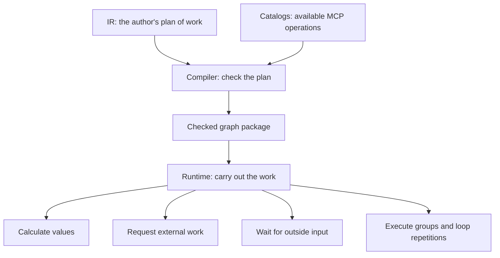
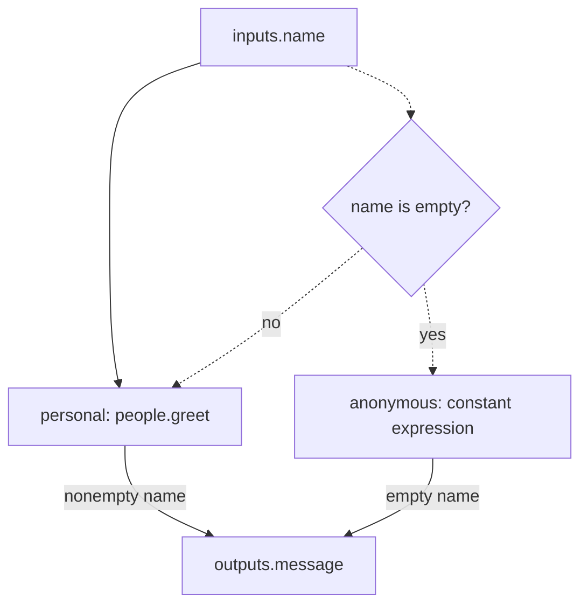
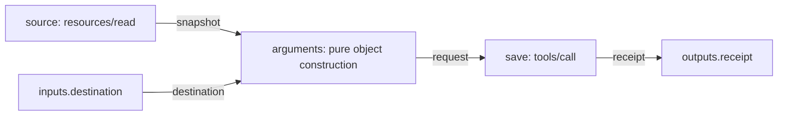
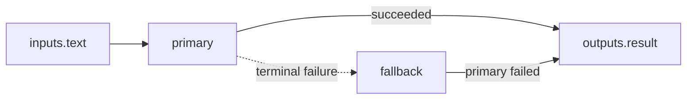
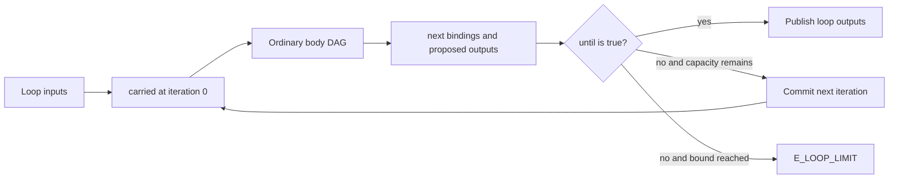
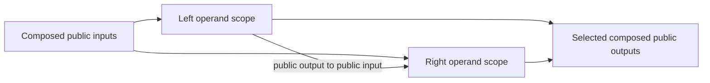

# HTLK IR Grammar and Language Specification

**Project:** HTLK (Harness Toolkit)\
**Language:** HTLK IR\
**Status:** Draft 0.1\
**Companions:** [User guide](htlk-ir-user-guide.md) · [Syntax reference](htlk-ir-syntax-reference.md) · [Compiler](compiler-spec.md) · [Runtime](runtime-spec.md) · [Changes](CHANGELOG.md)

## 1. Purpose and guarantees

HTLK is the **Harness Toolkit** project. **HTLK IR** is its language for describing work that a program should carry out. IR stands for *intermediate representation*: a structured description between an author's intent and execution.

A **graph** describes named steps and the information passed between them. Imagine a workflow that receives a question, gathers evidence, drafts an answer, and reviews it. The steps are **nodes**. Their named entry and exit points are **input ports** and **output ports**. An **edge** says that one complete value supplies one destination port.

A **task** is a reusable group of nodes with its own input and output ports. For example, a research task can contain query construction, retrieval, and result extraction. Using that task twice creates two occurrences of the same procedure, each with its own values.

This document defines what those constructs mean. The syntax reference defines their exact spelling. You can read this document without first knowing a programming language, MCP, or the runtime's storage design; each is introduced when needed.

### 1.1 From a request to an execution

An author writes IR to describe the intended work. The **compiler** checks that the description is internally consistent and that referenced operations exist. It produces an **executable package**, a checked graph document read by the **runtime**, the program that carries out the work. One execution is a **run**.

An **LLM**, or *large language model*, can help draft a plan or generate IR. It does not directly change execution rules. The **natural-language frontend** is the application that turns a person's request into candidate IR; it can itself be built from manually authored HTLK graphs. The compiler receives IR and operation catalogs, not a natural-language request to invent the graph.

### 1.2 What an external operation is

HTLK uses **MCP**, the *Model Context Protocol*, to communicate with connected services. A **protocol** defines how requests and replies are represented. An MCP **server** is a program providing operations or material through that protocol. An MCP **catalog** is an inventory describing what such servers offer.

| MCP category | Meaning | Example |
|---|---|---|
| Tool | An operation that accepts arguments and returns a result. | Draft an answer or write a file. |
| Resource | Material that can be read using an identifier. | A project document. |
| Resource template | A pattern for constructing a resource identifier from supplied variables. | Select a document by project ID. |
| Prompt | Instructions or messages prepared for use with a model. | Retrieve a reusable review prompt. |

**Arguments** are the named values sent to an operation. A **schema** states which arguments or results are valid—for example, that `question` must contain text. A **descriptor** is the operation's advertised description, including its schemas.

### 1.3 The small set of execution mechanisms

| Mechanism | What happens |
|---|---|
| Pure evaluation | Calculate a value from supplied inputs without contacting another system or changing outside data. |
| MCP request | Ask a connected service to do work or return material. |
| Scope | Execute a group of nodes behind its own public inputs and outputs. |
| Loop | Repeat a group, carrying explicit values between repetitions, with a fixed maximum count. |
| Wait | Pause a step until outside input arrives or a deadline is reached. |

A **condition** is a calculation that returns true or false. The same expression rules are used to decide whether nodes run, which edges supply values, whether inputs and outputs pass checks, and whether a loop should stop. An **expression** is a calculation written in the language, such as checking whether text is empty.



**Diagram 1 — The plan, the check, and the execution are separate.** A model may help author a plan, but the compiler checks its references and structure before the runtime executes it. Each group of nodes follows the same value and condition rules.

Verification establishes that the structure is legal, names resolve to known operations, and value boundaries have applicable checks. It does not establish that a model's answer is true, a server will respond, or the plan will achieve its human author's objective. A **contract** is a declared input/output acceptance check; it is not a guarantee about every real-world consequence.

MUST, MUST NOT, SHOULD, and MAY express the specification's requirements, often called its normative rules: MUST and MUST NOT are mandatory, SHOULD is recommended unless a justified reason applies, and MAY permits a choice. A **version** names a particular set of rules. All HTLK-owned formats in this baseline use `"0.1"`, including source, package manifests and bundles, catalogs, canonical executables, and runtime records. Earlier drafts require explicit migration and recompilation; the compiler does not reinterpret them by changing a version label. The runtime also requires an exact execution-profile match. External protocol and schema versions are separate identities and retain their actual values. See the [explicit version table](htlk-modules-spec.md#11-version-boundary).

The syntax reference owns concrete syntax, this document owns language semantics, the compiler specification owns canonical representation and static checks, and the runtime specification owns execution and persistence. Examples marked as fragments need their referenced declarations and catalogs. The [change log](CHANGELOG.md) records corrected contradictions rather than asking implementations to detect conflicts between prose documents.

## 2. Core model

| Entity | Meaning |
|---|---|
| Task definition | Reusable graph with public input and output ports. |
| Entry graph | The outermost graph, also called the root, where execution begins. A compilation selects one entry module with one graph. |
| Module | One source file with local names and explicitly exported task, type, or prompt definitions. |
| Source package | A manifest-described collection of modules and exactly pinned package dependencies. |
| Node | A named occurrence of an operation in a scope. |
| Scope | A graph/task's group of nodes, or the group executed during one loop repetition. |
| Port | A named input or output declaring what kind of value it accepts and whether a value must be supplied. |
| Edge | Named conditional binding from one complete source port to one complete destination port. |
| Outcome | A node's final status—succeeded, failed, skipped, or cancelled—which does not later change. |
| Artifact | An accepted value saved with information about its origin and access permissions. The accepted value does not later change. |
| Invocation | One execution occurrence of a node within a particular executing group. |
| Attempt | One sending of an MCP request; retry attempts keep that invocation's inputs unchanged. |

A **definition** is the reusable written description; an **instance** is one occurrence of it during execution. A **parent** is the containing group, and a **child** is a node inside that group. These terms describe containment, not the order in which nodes run.

A graph and a task use exactly the same scope rules. The entry graph differs only in how its inputs enter from the **host**, the application that starts the run. A `use(task)` node creates an instance of a task body. **Binary graph composition** means combining two graphs; those two graphs are its operands. Their roots become instances inside a new containing graph, using the same scope mechanism.

**Read-only** means the receiving node cannot replace its supplied input. **Immutable** means an accepted value or final outcome is not changed later. **Atomic publication** means all of a node's accepted outputs become available together, with its success status, rather than one at a time.

Inputs are read-only. A node can propose only its declared outputs. Publication is atomic for the whole output **manifest**, the inventory of accepted values and explicitly absent optional outputs. To **commit** a result means to save it as the official result. Graph inputs, outputs, loop-carried values, and terminal outcomes never change once committed.

### 2.1 Scope and names

An **identifier** is a name used in the program. **ASCII** is a basic character set that includes the Latin letters and digits used for these names. **snake_case** uses lowercase words joined by underscores, such as `find_evidence`; **PascalCase** joins capitalized words, such as `EvidenceList`. A **namespace** groups names under a prefix, as `planner` does in `planner.decompose_prompt`.

All authored value identifiers use ASCII `snake_case`; user type names use `PascalCase` with optional `snake_case` namespace components. Quoted external names and record keys preserve their exact spelling. Examples include `planner.decompose_prompt`, `planner.PromptList`, and the MCP property `"customerId"`.

Inside any scope:

| Reference | Meaning |
|---|---|
| `inputs.prompt` | Current scope input. This also applies at the graph root. |
| `worker.outputs.value` | Complete sibling output port. |
| `worker.inputs.arguments` | A destination port; never an expression read. |
| `outputs.result` | A public output destination; readable by the scope's postcondition. |
| `carried.draft` | Current loop iteration value. |
| `next.draft` | Next-iteration destination; readable by the loop's termination expression. |
| `status(@worker)` | Sibling's terminal status; pending until terminal. |
| `error(@worker)` | Sibling's terminal error or `null`; pending until terminal. |

Parents cannot address child internals. Child scopes cannot reach into their parents. A node guard is evaluated in its containing scope; its pure operation and pre/postconditions read its own declared ports. Runtime identities use structured scope IDs, not string concatenation of display paths.

Source-file visibility is separate from execution scopes. A module imports public declarations with `import research from "research/search"`, then can instantiate an exported task with `use(research.find_evidence)`. Importing creates no node, shared state, permission, or access to task internals. Declarations are private unless marked `export`. The [module specification](htlk-modules-spec.md) defines exact lookup, package identity, cycle checks, and generated interfaces for bounded-context authoring.

### 2.2 One binding model

A **binding** answers the question, “Which source supplies this destination?” An edge is a candidate for that answer. Its **guard** is an optional true/false condition. A **binding reducer** is the runtime procedure that turns the candidates into one selected source, no source, or an error.

An edge's destination is a node input, a public scope output, or a loop `next` port. All three use the same binding reducer. There is no `exports` block, output-only `choose` expression, or recovery-time input mutation.

```htlk
edge publish {
    from = solve.outputs.value
    to = outputs.answer
}
```

An edge connects complete ports. Use `eval` for field selection, constructing argument objects, list operations, prompt rendering, or any other pure transformation. Edges never hide transformations.

For every destination, all relevant edge guards must settle before selecting a source. No true guard means absence; one true guard selects that source; more than one true guard is `E_BINDING_CONFLICT`. An omitted guard is `true`. A selected source may still be pending. A failed selected source is an error; it never silently becomes absence.

An absent required node input skips that node. An absent required public output or `next` value fails the containing scope. Optional destinations accept absence. This distinction follows the role of the destination: an inactive consumer branch may be skipped, but a scope cannot claim to have produced a required result that is absent.

Every required destination has at least one declared candidate edge. Optional destinations may have none. Two unconditional writers are rejected statically. Arbitrary conditional overlap is not assumed provable: the runtime enforces uniqueness before any dependent work executes. The compiler reports possibly overlapping candidates in its analysis. Authors can make exclusivity explicit with `p` and `not p`.

### 2.3 Presence is distinct from null

A **type** describes the values a port or field accepts; `T` below means any permitted underlying type. A **record field** is a named piece of a grouped value, such as `title` in a document record. **Absence** means no value was supplied. `null` is different: it is an explicit value that can be supplied when the declared type permits it.

`optional(T)` allows a port or record field to be omitted. It is not a value constructor and cannot appear inside a list, map value, or union. `null` is a real value with type `null`. A present nullable string has type `union(string, null)`; a field that may be omitted or explicitly null has declaration `optional(union(string, null))`.

The scheduler also distinguishes pending from permanently unavailable. A predicate never receives a scheduler placeholder as an application value. Reading a failed node's ordinary output is unavailable; inspect its terminal outcome to route recovery.

## 3. A complete graph without MCP dependencies

In a code example, quotes enclose text, braces group related declarations or named fields, and a dot selects a name within a group. `=` connects a declaration to its description; it is not permission to mutate a running node. `inputs` and `outputs` declare the named ports. An `eval` node calculates a value, and `render` fills a prompt template from supplied values.

This complete program illustrates a reusable task, a named prompt, conditional branches, pure computation, and output binding.

```htlk
ir_version = "0.1"

prompt greeting = "Hello {name}"

task people.greet {
    inputs = { name = string }
    outputs = { message = string }

    nodes {
        format = eval(string, render(&greeting, { name = inputs.name })) {
            inputs = { name = string }
        }
    }
    edges {
        edge name { from = inputs.name to = format.inputs.name }
        edge message { from = format.outputs.value to = outputs.message }
    }
}

graph welcome {
    inputs = { name = string }
    outputs = { message = string }

    nodes {
        personal = use(people.greet) {
            when = inputs.name != ""
        }
        anonymous = eval(string, "Hello there") {
            when = inputs.name == ""
        }
    }
    edges {
        edge name { from = inputs.name to = personal.inputs.name }
        edge personal_message {
            from = personal.outputs.message
            to = outputs.message
            when = inputs.name != ""
        }
        edge anonymous_message {
            from = anonymous.outputs.value
            to = outputs.message
            when = inputs.name == ""
        }
    }
}
```



**Diagram 2 — Syntax mapped to routing.** Solid arrows are named value edges. Dashed arrows are dependencies of node guards. The public output uses the same binding rule as any node input.

A node-level `when` controls whether the operation starts, including an operation with zero inputs. An edge-level `when` controls only its binding. Gating an outgoing edge does not suppress the producer's effects.

## 4. Types and pure expressions

A **structural type** describes the shape of data. A **type alias** gives that shape a reusable name without introducing a separate kind of value. Thus `type Customer = record { id = string }` names records with a text field called `id`; compatible records do not need conversion just because they came from an MCP response.

Some storage terms are needed to state type limits precisely. A **byte** is eight binary digits. **Unicode** assigns numbers to text characters; a Unicode scalar is a valid character code point excluding reserved surrogate values. **Binary64** is a 64-bit floating-point format; many decimal fractions are approximate in it. **Finite** excludes infinity and the special not-a-number value. A **Boolean** is true or false. **JSON** is a text-based data format for objects, lists, text, numbers, Booleans, and null. A **map** associates string keys with values; a **list** preserves item order.

| Type | Meaning |
|---|---|
| `string` | Unicode scalar text; no implicit normalization. `text` is an alias. |
| `integer` | A whole number from −9,223,372,036,854,775,808 through 9,223,372,036,854,775,807. Exceeding the range is an error called overflow. |
| `float` | Finite binary64; negative zero normalizes to positive zero. |
| `boolean`, `null` | Boolean and explicit null values. |
| `bytes` | Octets, serialized as native CBOR bytes. |
| `json` | JSON-compatible values under the compiler's documented numeric profile. |
| `regex` | Validated `{ pattern, flags }` value under the executable's pinned Rust regex profile; compiled automata are not serialized. |
| `list(T)` | Ordered homogeneous values. |
| `map(T)` | Arbitrary string keys and values of type T. |
| `record { ... }` | Structural record; declared fields are checked and extra fields are permitted. |
| `union(A, B)` | Value satisfying at least one member. |
| `enum("a", "b")` | One of the listed strings. |
| `ResourceSnapshot` | Ordered normalized MCP resource content with provenance. |
| `McpPromptResult` | Validated MCP prompt result data. |

A **URI**, or Uniform Resource Identifier, names material such as a resource; it is not necessarily an address that can be opened on the web. A **timestamp** represents a time. A **snapshot** is the contents accepted from one read, not a continually updating view. **Provenance** records where a value came from. An **artifact** is an accepted value plus separate provenance and access information.

URI and timestamp values use strings plus explicit library validation where required. Catalog URI keys are exact protocol identifiers; the compiler does not rewrite them with a universal URI normalizer. `ArtifactRef(T)` is removed from the source type system. Host input transport can reference an authorized immutable artifact containing T; graph computations see the T value. Runtime artifact resolution during a graph is an MCP operation.

There is no implicit numeric conversion between `integer` and `float`. JSON Schema `number` accepts JSON integers and fractional numbers, so its structural approximation is their union. Destination schema validation is always applied to actual MCP arguments.

### 4.1 One pure node

A **pure function** calculates from its supplied arguments without reading clocks, files, networks, randomness, or mutable outside state. **Coercion** means automatically converting a value to another representation, such as a number to text. An output annotation specifies a required type; it is not a request for coercion.

`eval(T, expression)` has one output, `value: T`, and optionally declared inputs. Its output annotation checks the result; it does not coerce it.

```htlk
nodes {
    effort = eval(string, "xhigh")
    temperature = eval(float, 0.0)
    first = eval(string, inputs.prompts[0]) {
        inputs = { prompts = list(string) }
        preconditions = length(inputs.prompts) > 0
    }
    arguments = eval(json, {
        prompt = inputs.prompt,
        "maxTokens" = 2000,
    }) {
        inputs = { prompt = string }
    }
}
```

Indexes are zero-based. A missing declared optional field yields absence; a missing required field, undeclared field lookup, missing map key, or out-of-range index is an expression error. Optional access must use `present` and lazy Boolean guards, or a typed library function that explicitly accepts absence. Pure functions cannot inspect clocks, files, randomness, secrets, network services, or mutable process state.

The operator core is `not`, `and`, `or`, scalar comparisons, `length`, `present`, `status`, `error`, and `render`. Everything richer is a pinned built-in Rust library call. The same function may be used in an `eval` node, edge condition, or contract when its result type is appropriate.

### 4.2 Libraries and regular expressions

A **library** is a collection of reusable functions. HTLK's extra pure functions must already be built into the compiler and runtime; the source cannot load arbitrary code. Rust is the programming language used to implement these functions. A **registry** is the built-in list of available libraries and their signatures, where a **signature** says which argument and result types a function accepts.

A **manifest** selects a library by name, version, and a **digest**, a fixed-size summary used to identify its exact implementation. The digest uses SHA-256, HTLK's selected hash algorithm. A **pin** records an exact selection rather than choosing whichever version is newest. A **regex**, short for regular expression, is a pattern for matching text; flags are options that adjust its interpretation.

```htlk
predicate_library text_ops = predicates.library("htlk.text") {
    version = "0.1"
    digest = "sha256:dddddddddddddddddddddddddddddddddddddddddddddddddddddddddddddddd"
}
```

This is a manifest fragment; the digest must match an actual linked library. The compiler's built-in registry supplies its complete typed signatures. IR selects and pins the library; it does not redeclare signatures or invent null policies. There is no fourth compiler catalog and no dynamic plugin loader.

A library may expose strings, regex matching/capture/replacement, collections, schema checks, arithmetic, supplied-time calculations, or domain rules. Generic higher-order filters may accept static function references such as `collections.any(inputs.findings, &finding.is_critical)`. Arbitrary function bodies and closures are absent.

The library manifest is the authority for names and signatures; the examples do not promise that a particular library is shipped. A minimal conforming core supplies only the fixed functions listed in the syntax reference. Any additional pure function must be present in the pinned linked registry before compilation can succeed.

Regex literals use `/.../ims` with unique flags. The exact Rust regex syntax, Unicode data, match semantics, and dependency versions are part of the linked library profile recorded in the executable. HTLK does not claim that a vaguely “RE2-compatible” label specifies these details. Unsupported patterns fail compilation; dynamic regex values undergo the same validation when bound. Pattern size, output size, and deterministic operation counts are bounded.

### 4.3 Pending, absent, and expression errors

**Pending** means the answer is not known yet because required work has not finished. **Unavailable** means the source finished without an ordinary output because it failed or was cancelled. An **expression error** means the requested calculation or access could not be performed as written. Neither pending nor unavailable is an application value such as null.

Expressions return a value, legitimate absence, pending, or an error. Absence can be observed only through optional references and functions that accept optional arguments. `present(x)` is false for settled absence, true for a present value including null, pending for unresolved x, and an error for unavailable x.

**Lazy evaluation** means the evaluator does not calculate an expression branch whose result is unnecessary. For example, a false left side already determines the result of `and`, so the right side is not read.

Boolean expressions evaluate left to right. `false and x` and `true or x` do not evaluate x. If the left side is pending, evaluation waits. This is one rule across all expression sites; there is no separate three-valued truth table or failure-handler evaluation mode.

Thus `status(@work) == "succeeded" and work.outputs.value.accepted` safely waits for work and avoids reading its failed output. `error(@work)` returns `null` for succeeded/skipped/cancelled and an `Error` record for failed. Status and error reads are explicit dependency edges in the compiler's analysis.

### 4.4 Dynamic prompts

A **template** is text with named insertion positions, called placeholders. **Interpolation** or **substitution** means replacing those placeholders with supplied values. Defining a local template and rendering it calculates text; neither action calls a model.

`prompt greeting = "Hello {name}"` infers string parameters. Explicit parameters may also be strings, integers, or booleans. `render(&greeting, { name = inputs.name })` performs one literal substitution pass. Integers use base-10 digits without padding; booleans use `true`/`false`. Floats, optional values, records, and collections require explicit formatting to string.

`{{` and `}}` produce literal braces. Inserted text is never parsed again. Quoted and triple-quoted strings preserve decoded text, including multiline whitespace. Template rendering is subject to output-size limits.

## 5. MCP operations

An MCP **server alias** is the convenient name used in source, such as `research`. The compiler resolves it to the configured deployment and implementation identity. **Structured content** is an MCP result's machine-readable object, rather than a free-form display message. A tool's `inputSchema` and `outputSchema` describe its complete argument and result objects.

MCP names resolve only through the supplied catalogs. Source aliases resolve to compound server identities: deployment ID, transport kind, and server implementation identity. Identity, descriptor, and schema digests are exact-pinned. A source `pin` asserts an expected descriptor digest; omitting it still pins the selected catalog descriptor.

The three protocol operations share one runtime request/validation mechanism:

| Source operation | Inputs | Outputs |
|---|---|---|
| `call(mcp.tool("server", "tool"))` | `arguments`: complete object constrained by input schema | `value`: complete structured object constrained by output schema |
| `read(mcp.resource("server", "uri"))` | None | `value: ResourceSnapshot` |
| `read(mcp.template("server", "template"))` | `arguments`: object of string template variables | `value: ResourceSnapshot` |
| `fetch(mcp.prompt("server", "prompt"))` | `arguments`: object of required/optional string parameters | `value: McpPromptResult` |

One full argument object prevents protocol-owned property names from colliding with HTLK ports. Even a tool with no arguments receives an explicit empty object, normally from `eval(json, {})`. Catalog schemas validate required and forbidden properties. Whole results preserve undeclared-but-permitted properties.

HTLK requires every callable tool to supply `outputSchema` and every successful tool response to supply object-valued `structuredContent`. `isError: true` is an attempt failure. The protocol envelope is diagnostic material; `outputs.value` contains the validated structured object. These constraints follow HTLK's typed execution contract and the selected [MCP tools protocol](https://modelcontextprotocol.io/specification/2025-11-25/server/tools).

### 5.1 Copying a resource between servers

This fragment assumes a sandbox `write_file` descriptor accepting `path` and `content` strings and returning an object receipt.

```htlk
task context.copy_to_sandbox {
    inputs = { destination = string }
    outputs = { receipt = json }
    nodes {
        source = read(mcp.resource("context", "context://workspace/brief"))
        arguments = eval(json, {
            path = inputs.destination,
            content = inputs.snapshot.contents[0].text,
        }) {
            inputs = {
                destination = string,
                snapshot = ResourceSnapshot,
            }
            preconditions = length(inputs.snapshot.contents) == 1
                and inputs.snapshot.contents[0].kind == "text"
        }
        save = call(mcp.tool("sandbox", "write_file"))
    }
    edges {
        edge destination { from = inputs.destination to = arguments.inputs.destination }
        edge snapshot { from = source.outputs.value to = arguments.inputs.snapshot }
        edge request { from = arguments.outputs.value to = save.inputs.arguments }
        edge receipt { from = save.outputs.value to = outputs.receipt }
    }
}
```



**Diagram 3 — Resource copy and every value edge.** The explicit expression node extracts the text and builds the complete write request. The destination MCP call is the visible cross-server transfer.

A resource's **MIME type** is an advertised media label, such as `text/plain`; it does not prove an application's data shape. **Decoding** translates stored or transmitted data into usable values. **Authorization** checks whether the authenticated caller is allowed to read or transfer them.

Resources have no redundant top-level declaration. Their content may be text or bytes and may contain multiple returned URIs. `ResourceSnapshot` preserves that ordered set; it does not infer one homogeneous type from MIME or require every returned URI to equal the requested URI. Access policy checks every returned entry. Text-to-JSON parsing and decoding are explicit pure library calls.

Resource writes use MCP tools. Resource notifications start new runs through host trigger configuration. A same-run notification response must address an explicit open wait. A normal read never subscribes or changes an accepted snapshot. See the selected [MCP resources protocol](https://modelcontextprotocol.io/specification/2025-11-25/server/resources).

### 5.2 Dynamic model-produced arguments

An LLM tool's validated output is ordinary data. Route it through an `eval` node to construct the next tool's argument object, then bind that object to `inputs.arguments`. The next input schema is checked before dispatch, even if static compatibility was established. The LLM cannot create ports or select an uncompiled operation.

## 6. Recovery and scope completion

A **terminal outcome** is a node's final status: succeeded, failed, skipped, or cancelled. **Recovery** means arranging additional work in response to failure. A **fallback** is that alternative work; it does not erase or change the original failure. A **precondition** (`preconditions`) checks supplied inputs before work starts. A **postcondition** (`postconditions`) checks proposed results before success is accepted.

Each contract field is optional, appears at most once, and contains one Boolean expression. Combine checks with `and` or `or`, using parentheses when grouping would otherwise be unclear. Omission means `true`; plural field names do not introduce lists or blocks. These checks use the same pure, lazy expression rules as edge predicates. A failed postcondition prevents output publication but cannot undo an external effect that already occurred.

Recovery is graph structure. A fallback node uses `when = status(@primary) == "failed"`, receives its inputs through edges, and contributes to the ordinary public-output binding group.

```htlk
ir_version = "0.1"

graph recover_example {
    inputs = { text = string }
    outputs = { result = string }
    nodes {
        primary = eval(string, inputs.text) {
            inputs = { text = string }
            preconditions = length(inputs.text) > 0
        }
        fallback = eval(string, "No text was provided") {
            when = status(@primary) == "failed"
        }
    }
    edges {
        edge request { from = inputs.text to = primary.inputs.text }
        edge success {
            from = primary.outputs.value
            to = outputs.result
            when = status(@primary) == "succeeded"
        }
        edge recovery {
            from = fallback.outputs.value
            to = outputs.result
            when = status(@primary) == "failed"
        }
    }
}
```



**Diagram 4 — Recovery uses ordinary graph dependencies.** The primary's immutable outcome gates fallback execution and selects the public result. No handler changes an input after binding.

Every scope waits for all instantiated child nodes to settle. It then resolves public outputs and checks `postconditions`. Success means required outputs exist and `postconditions` is true. A failed child is not automatically an unhandled scope failure: its outcome may be the intended input to recovery.

The compiler rejects a child with no dependency path to a public output or the scope's `postconditions` expression. To require a side effect that does not produce an exported value, write `postconditions = status(@save) == "succeeded"`. Empty-output graphs with such postconditions are valid. This makes completion requirements explicit and prevents a disconnected write from being silently ignored or optimized away.

Scope `preconditions` reads its inputs before children start. Scope `postconditions` may read its inputs, proposed outputs, and direct children's terminal outcomes. It cannot read arbitrary child data except through declared outputs. `eval` and MCP node contracts see only their own inputs and proposed outputs.

Retries apply only to MCP requests, with one node-local `retry` block. They repeat the same operation and immutable arguments. Composite nodes and pure nodes have no replay-style retry. Repairing data, repeating an evaluation, and compensating effects are explicit nodes or loop iterations. The runtime still needs an attempt journal for MCP dispatch and crash ambiguity.

## 7. Durable waits and approvals

A wait makes a request available to an outside participant and records enough information to resume later. **Durable** means that saved progress can be recovered after the runtime process restarts. An **API** is the set of operations another application can request. **Authenticated** means the host establishes who submitted the request or reply, rather than trusting an identity field in ordinary data.

`wait(T)` is a typed external-input node. It accepts one `request: json` input, has `value: T` output, and requires `topic` and a positive `timeout_ms`. The runtime creates a unique wait ID for the invocation. The host presents the request and submits a response addressed to that ID through the authenticated runtime API.

```htlk
nodes {
    question = eval(json, { question = "Which region should I use?" })
    region = wait(string) {
        topic = "user_input"
        timeout_ms = 86400000
    }
}
edges {
    edge ask { from = question.outputs.value to = region.inputs.request }
}
```

A **worker** is a component performing assigned work. A **lease** is its temporary right to own that work. A wait retains no worker lease. Duplicate identical replies are idempotent; conflicting, unauthorized, expired, or ill-typed replies cannot change its result. Scheduling time, webhooks, resource updates, and durable remote-job completion can all be bridged by an authorized host to an explicit wait.

Approval is authorization for an exact action. A Boolean returned by an LLM or user-input node does not grant runtime authority. Deployment policy can use the same durable wait infrastructure for an approval record pinned to the server, operation, arguments, principal, invocation, expiry, and policy. Its signed/authenticated disposition is consumed by the policy gate.

Ordinary input uses `submit_reply`; approval uses a separate authenticated `submit_approval` API. Approval renewals receive fresh generation-specific wait IDs without changing the node's frozen inputs. No adapter may insert an idempotency argument into those inputs after approval.

MCP task protocol variants do not add another scheduler lifecycle. An adapter may expose start/query/cancel tools and completion events that the authored graph coordinates through these existing operations.

## 8. Bounded loops

An **iteration** is one repetition. A **loop body** is the group of nodes repeated. The original loop inputs stay fixed, while **carried values** supply explicit information from the previous repetition. **Next values** are the values proposed for the following repetition. A **bound** is a maximum allowed amount, here the number of iterations.

A loop has normal public ports. Its `carried` initializers reference its own inputs. The body contains ordinary nodes and edges. Edges targeting `next.x` use the same reducer as every other destination. The type and requiredness of x come from its initializer input. Each iteration also computes the proposed loop output manifest.

```htlk
ir_version = "0.1"

graph bounded_example {
    inputs = { initial = string }
    outputs = { final = string }
    nodes {
        settle = loop {
            inputs = { initial = string }
            outputs = { final = string }
            carried = { text = inputs.initial }
            body {
                nodes {
                    copy = eval(string, inputs.text) {
                        inputs = { text = string }
                    }
                }
                edges {
                    edge current { from = carried.text to = copy.inputs.text }
                    edge feedback { from = copy.outputs.value to = next.text }
                    edge result { from = copy.outputs.value to = outputs.final }
                }
            }
            until = next.text == carried.text
            max_iterations = 3
        }
    }
    edges {
        edge initial { from = inputs.initial to = settle.inputs.initial }
        edge final { from = settle.outputs.final to = outputs.final }
    }
}
```



**Diagram 5 — One bounded feedback boundary.** The body is acyclic within an iteration. Only committed next values initialize the next iteration. There is no ordinary back-edge.

The loop executes at least once. Iterations are numbered from zero. Every iteration settles its children, validates next values and proposed outputs, then evaluates `until`. True publishes the outputs after the loop postcondition. False advances if another iteration fits the bound; otherwise the loop fails. A true termination test on the last permitted iteration succeeds.

`max_iterations` is mandatory and positive. Token, cost, or tool-call budgets alone cannot bound a loop containing only pure nodes. Timeouts and budgets further restrict work; exhausting them never turns into a successful early return. To accept an intermediate result, author an explicit termination condition that says so.

Each iteration is a fresh scope with its own invocation identities. Committed iterations survive restart. An MCP retry stays within its current iteration; the runtime never restarts an entire effectful loop as one attempt.

## 9. Composition and long-running work

**Composition** means building a larger graph from smaller ones. A **canonical document** is the compiler's normalized graph description with its required definitions included. **Self-contained** means none of those definitions is missing. A **join** connects the two documents' public interfaces; the documents are the **operands** of that join.

The compiler accepts two self-contained canonical documents and a join specification. Join edges connect only public outputs to public inputs. Explicit maps define the new public interface. The compiler lifts operand roots into ordinary scope definitions; there is no special executable `graph_instance` kind.



**Diagram 6 — Binary composition.** Operands keep their complete definitions and resolved dependencies. Joining adds a new parent scope and ordinary boundary edges.

Both inputs remain immutable and may be reused in later compositions. A fresh run may execute any valid acyclic composition. Extending a live run additionally requires the currently active root to be an unchanged operand with unchanged already-bound inputs. New work may depend on that operand; it cannot become a new prerequisite of existing work. The runtime preserves the existing scope and invocation identities. It does not perform semantic node diffs, invalidation, or speculative artifact reuse.

This preserves long-running additive planning without a graph-patch abstraction. A changed computation starts a new run with explicitly selected prior artifacts. A terminal run never resumes. A host must install an extension while the run is still open, using an explicit planning wait when it needs a durable installation window. The runtime specification defines the atomic window-closing operation.

A **tree** describes containment: each nested group has a parent. A **directed acyclic graph (DAG)** describes prerequisites without a circular chain inside an iteration. They answer different questions, so a decomposition can be a tree of scopes while its dependencies form a DAG. Search is a bounded graph application: planning tools emit candidates, evaluation tools produce evidence, pure expressions select candidates, and the host invokes the compiler. Dynamic fan-out can be represented by bounded loops or another compiled subgraph.

## 10. Capability coverage

This table maps desired behavior to existing language constructs. **Fan-in** means several inputs feed one computation; **fan-out** means one result supplies several consumers. A **quorum** requires enough results from a group to satisfy a rule. An **arbiter** is a service responsible for choosing among competing results. These names describe coordination patterns, not additional IR keywords.

| Desired outcome | 0.1 representation |
|---|---|
| Sequential or parallel tasks | Typed edges within a scope. |
| Conditions on input, output, or failure | The same expression language over values and terminal outcomes. |
| Supply an input using an LLM | MCP output → pure argument construction → input binding. |
| Multiple MCP calls in one task | Multiple visible child request nodes. |
| Success/failure fallback | Node guards plus conditional edges to a common destination. |
| AND fan-in | Separate required input ports. |
| Collection, filtering, ranking, reduction | Pure `eval` with built-in libraries, or typed MCP computation. |
| Prompt interpolation and regex filters | Named templates and pinned pure functions. |
| Iterative repair or sequential search | Bounded loop with carried values. |
| Human input or external event | Typed wait plus authenticated host response. |
| Approval | Exact-action policy gate backed by durable wait records. |
| Graph growth | Compiler join plus append-only live extension. |
| Large programs across files and packages | Static imports, exported definitions, and exact source snapshots; ordinary scopes after compilation. |
| Prior data reuse | Explicit artifact references at run/extension input boundaries. |
| First-result race or early quorum | An MCP arbiter that owns those concurrent operations, or a host orchestration service connected through a wait. |

A first-result race among arbitrary sibling HTLK nodes is not provided by ordinary AND fan-in. A task that must wait for all inputs cannot select the first result before the remaining inputs settle. The same application outcome is available through an explicitly scoped external arbiter, but it does not imply a new local scheduler operator.

## 11. Serialization and implementation scope

**Serialization** converts a graph document into bytes that can be stored or transferred. **CBOR**, or Concise Binary Object Representation, is the chosen compact format. **Deterministic encoding** selects one permitted byte representation for the same normalized structure. A **fingerprint** is a hash used to identify those contents; it does not prove who authored them or that a model will give the same answer on a fresh run. A **signature** can separately provide evidence from a trusted signer. An **index** is a rebuildable lookup aid, such as an output-to-consumer table.

The executable is deterministic CBOR under [RFC 8949 core deterministic encoding](https://www.rfc-editor.org/rfc/rfc8949.html#section-4.2.1). One semantic payload contains the normalized graph and exact referenced dependencies. Its SHA-256 digest is the executable fingerprint. Source maps, build timestamps, signatures, and audit provenance are stored alongside it. Derived indexes are rebuilt from authoritative graph records.

This separation removes the redundant semantic-document/payload pair and the possibility that different executable tables claim one semantic fingerprint. The compiler specification and its companion CDDL define the complete envelope and record shapes.

The minimum implementation is one Rust coordinator, a shared pure evaluator and verifier, an MCP adapter, durable transactional storage, and immutable artifact storage. Multiple workers and indexes are implementation choices. Optimizations must preserve logical evaluation and deterministic work accounting for the same recorded inputs and external/scheduler decisions. Fresh executions can differ because effects, deadlines, and contested capacity are timing-sensitive; deterministic serialization does not make those events deterministic. Required effect ordering belongs in explicit graph dependencies.
