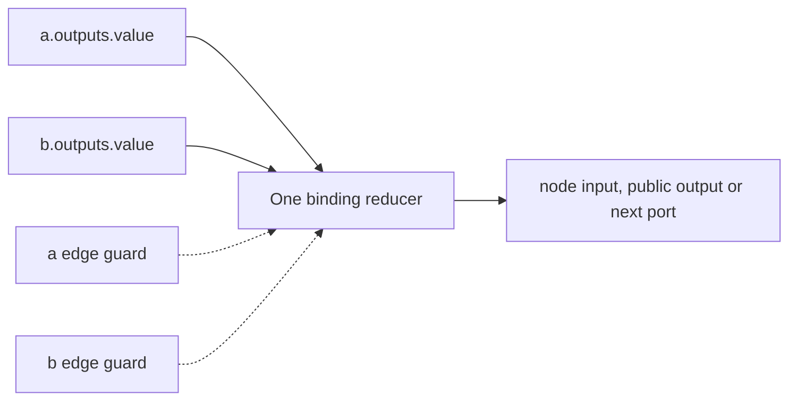

# HTLK IR Syntax Reference

**Project:** HTLK (Harness Toolkit)\
**Status:** Draft 0.1\
**Companions:** [Language semantics](htlk-grammar-spec.md) · [Compiler](compiler-spec.md) · [Runtime](runtime-spec.md) · [Migration](CHANGELOG.md)

## 1. Reading this reference

**Syntax** means the exact text you may write: names, punctuation, declarations, and expressions. This reference explains HTLK IR from that starting point. IR means *intermediate representation*, the structured language describing work between an author's intent and execution.

A **graph** is a plan of connected work steps. A **node** is one named step. An **input port** or **output port** is a named place where a value enters or leaves a step. An **edge** connects one complete source port to one destination port. A **task** groups steps behind its own public ports so the procedure can be reused.

The **compiler** reads and checks the source text. The **runtime** carries out the checked graph. One execution is a **run**. A **scope** is a group with its own names and ports, such as a task body. A **value** is data; a **type** describes which data is allowed. For example, `inputs = { question = string }` declares an input named `question` that must contain text. It does not supply the question's value.

This document defines source syntax. [htlk-ir.ebnf](htlk-ir.ebnf) is the machine-readable copy of the consolidated grammar below; both copies MUST match. Additional rules state how many declarations are allowed (cardinality), what data fits each port (types), and which names are visible in each group (scope). All examples labeled complete programs contain one `ir_version = "0.1"` header and exactly one entry graph. Other examples are fragments.

The source does not contain arbitrary executable code such as Lua or expand author-defined text macros. Draft 0.1 adds static imports resolved exclusively within a host-supplied source bundle; the compiler and runtime do not fetch source files. It cannot assign new values to already accepted inputs. Connections must be explicit edges rather than inferred relationships. [Modules and source packages](htlk-modules-spec.md) defines directory mapping, exact dependency pins, and generated interfaces.

**MCP**, the *Model Context Protocol*, is the request-and-response interface used to ask connected services for work or material. A **catalog** lists the available operations; the compiler selects them before execution. Source cannot calculate an MCP operation name from a model's answer.

An **expression** is a calculation such as a length check. A **pure** calculation uses supplied values and fixed functions without reading outside state or changing another system. **Static resolution** means a name is identified before execution, not searched for during a run. A **bound** limits how much work a calculation may perform.

### 1.1 How to read examples and notation

| Notation in source | Meaning |
|---|---|
| `"hello"` | A literal text value: the written text itself. |
| `name = description` | Declare or specify something; this is not mutation of an executing node. |
| `{ ... }` | Group fields or block members, depending on the construct. |
| `[a, b]` | A list with items in order. |
| `inputs.question` | Refer to the current expression context's input named `question`. |
| `string`, `integer`, `boolean` | Text, a whole number, or true/false, respectively. |
| `T` in explanatory prose | A placeholder for a permitted type, not a literal user-defined type that must exist. |

A **declaration** gives something a name and description. A **block** groups declarations or settings. **Cardinality** states how many times an item is allowed, such as exactly once or at most once. A **fragment** illustrates part of a document and is not necessarily complete on its own.

The grammar at the end uses its own explanatory symbols, called **EBNF**, rather than source-language punctuation. Section 9 explains that notation separately.

## 2. Lexical rules

**Lexical rules** describe the small pieces of text, or **tokens**, from which the parser builds a program. The **parser** recognizes how tokens fit the grammar. **Unicode** assigns numbers to characters; **UTF-8** encodes that text into bytes for storage. A byte has eight binary digits. A **byte-order mark** is a special marker some text files put at the beginning; this source format forbids it. **ASCII** names the basic character set containing the Latin letters and digits used for identifiers. CR and LF are the carriage-return and line-feed characters used for line endings.

Source is UTF-8 without a byte-order mark. Outside literals, whitespace consists of ASCII space, tab, carriage return, and line feed; it separates tokens and is otherwise ignored. `--` begins a line comment ending at CR, LF, or end of source; `--[[ ... ]]` is a non-nesting block comment recognized before line comments. Comment delimiters inside strings or regex literals are data.

An **identifier** is a source name. Lowercase words joined by underscores are called `snake_case`; capitalized joined words are called `PascalCase`. A **qualified name** has dot-separated parts such as `research.find_evidence`. The prefix is a **namespace**, a grouping for related names.

A **regular expression**, or regex, is a pattern that describes matching text. The patterns below use regex notation to specify allowed spelling. In these patterns, `[a-z]` means one lowercase letter, `[0-9]` means one digit, `*` means zero or more repetitions, `+` means one or more, `?` makes an item optional, and `|` separates alternatives. Parentheses group a pattern; `(?:...)` groups without separately saving the part of the text that matches the group. These are rules describing tokens, not operators available in ordinary IR expressions.

An `identifier` matches `[a-z][a-z0-9]*(?:_[a-z0-9]+)*`. A `type_identifier` matches `[A-Z][A-Za-z0-9]*`. Qualified value names contain identifiers separated by dots; qualified type names contain zero or more identifier namespaces followed by a type identifier. Names are case-sensitive. Node and edge names occupy separate namespaces within a scope; declarations share a document namespace. The reserved roots are exactly `inputs`, `outputs`, `carried`, `next`, `length`, `present`, `status`, `error`, `render`, `mcp`, and `predicates`. They cannot be node names, library aliases, or the first component of a value declaration name. Other grammar keywords are contextual rather than globally reserved. Built-in type names cannot be redeclared; quoted external keys are unaffected by these restrictions.

Unquoted record keys use identifiers. Quoted keys preserve arbitrary string spelling, including `"customerId"`, `"Content-Type"`, and the empty string. Duplicate decoded keys fail; no last-writer rule exists.

A **string** is text. **JSON** is a common text-based data format; its escape notation represents characters that cannot be written directly inside a quoted string. For example, `\"` represents a quote, `\\` a backslash, `\n` a line feed, and `\t` a tab. `\u0041` represents the character A using four hexadecimal digits. Hexadecimal uses `0`–`9` and `a`–`f` to write numbers.

Some Unicode characters use a pair of `\u` escapes called a **surrogate pair**. One half without its matching half is invalid. **Control characters** include line breaks and tabs; ordinary quoted strings must escape them. **Dedenting** would remove shared indentation from multiline text; HTLK does not do that automatically.

Strings use JSON escapes and reject unpaired surrogate escapes and unescaped control characters. Triple strings begin and end with `"""`; the first unescaped terminator ends the token. They use the same escapes, permit literal line endings, and preserve every decoded character. Escaping a quote as `\"` prevents it from participating in a terminator. A decoded carriage return remains a carriage return; the parser does not dedent or normalize line endings.

An **integer** is a whole number. **Signed 64 bits** permits values from −9,223,372,036,854,775,808 through 9,223,372,036,854,775,807. A **float** uses binary64, a 64-bit floating-point representation that approximates many fractional values. **Finite** excludes infinity and the special not-a-number value. In a float token, `e` or `E` introduces a decimal exponent: `1e3` denotes the floating-point number 1000. Normalizing negative zero means retaining its numeric type but using positive zero's representation.

Integers match `-?(0|[1-9][0-9]*)` and must fit signed 64 bits. Floats match `-?(0|[1-9][0-9]*)(\.[0-9]+([eE][+-]?[0-9]+)?|[eE][+-]?[0-9]+)` and must be finite binary64. `-0` and `-0.0` normalize to positive zero in their respective types. Signs are part of numeric tokens; there is no arithmetic operator syntax.

A **flag** changes how a regex pattern is interpreted: `i` ignores letter case, `m` lets the beginning/end markers `^` and `$` recognize line boundaries, and `s` allows the dot pattern `.` to match line endings. The selected regex implementation defines the precise behavior. A **character class** describes a set of characters, such as `[0-9]`.

A regex literal starts with `/`, ends at the first unescaped `/`, and has zero or more `i`, `m`, `s` flags. Repeated or unknown flags fail. Literal line endings are forbidden. `\/` denotes a literal slash in the pattern; other escapes are preserved for the regex engine. Character classes do not change delimiter recognition; a slash in a character class must also be escaped. Flags normalize in `ims` order.

Commas are mandatory between data-list, data-record, port-table, and call-argument entries; one trailing comma is allowed. Block members have grammar-delimited boundaries and no semicolons. Unknown members and duplicate singleton members are errors. Declaration and edge order are non-semantic; expression argument and list order are semantic.

## 3. Declarations and block cardinalities

A declaration defines a graph, reusable task, type name, prompt template, or selected function library. A **prompt template** is text with named insertion positions. A **library** is a collection of functions already built into the system; a **manifest** identifies the selected library and version. A **digest** is a hash—a calculated content identifier—used here to select an exact implementation.

A module has any number of `type`, `prompt`, `predicate_library`, and `task` declarations and zero or one `graph`. A standalone program or selected entry module has exactly one graph; an imported module has none. **Recursive containment** would make a task contain itself, directly or through other tasks; recursive types similarly refer back to their own definitions. Both fail across files as well as within a file. Unused valid declarations are checked but omitted from the executable dependency closure.

```htlk
type Document = record {
    title = string,
    subtitle = optional(union(string, null)),
    tags = list(string),
}

prompt greeting = "Hello {name}"

predicate_library strings = predicates.library("htlk.text") {
    version = "0.1"
    digest = "sha256:dddddddddddddddddddddddddddddddddddddddddddddddddddddddddddddddd"
}
```

The manifest above illustrates spelling, not a shipped implementation digest. Only an exact linked registry entry is accepted.

| Block | Required exactly once | Optional at most once |
|---|---|---|
| Graph or task | `inputs`, `outputs`, `nodes`, `edges` | `description`, `preconditions`, `postconditions`, `limits` |
| Loop | `inputs`, `outputs`, `carried`, `body`, `until`, `max_iterations` | `description`, `when`, `preconditions`, `postconditions`, `limits` |
| Loop body | `nodes`, `edges` | None |
| Edge | `from`, `to` | `when`, `description` |
| Library manifest | `version`, `digest` | None |
| Retry policy | `max_attempts`, `on`, `backoff_ms` | None |

Empty input, output, node, and edge blocks are legal. Every required node input, scope output, and carried successor has at least one candidate edge. Unbound optional destinations settle absent. A child with no dependency path to public outputs or a completion postcondition is rejected.

Graph/task `preconditions` and `postconditions` are each a single Boolean expression. Use `and` or `or` and parentheses to combine checks.

### 3.1 Module imports and exports

In 0.1, zero or more `import alias from "package_alias/module_path"` declarations appear immediately after the version header, before all other declarations. The alias is a local snake_case namespace, not a node. `self` selects the current source package; other package aliases must be direct manifest dependencies. Module-path segments are snake_case identifiers separated by `/`. Only the exact mapped module is selected; relative paths, wildcard imports, computed strings, and filesystem searching are forbidden.

Prefix a `task`, `type`, or `prompt` declaration with `export` to expose it to importers. Other declarations are private. There is no exported graph, library manifest, import, or wildcard. This is not the removed `exports` runtime block.

```htlk
import research from "research/search"
import shared from "self/types"

export type EvidenceList = list(shared.Evidence)
```

This fragment requires the corresponding bundle and an exported `Evidence` type. Imported declarations are selected by `use(research.find_evidence)`, `shared.Evidence`, or `&queries.greeting` in a render call. The suffix after the alias must exactly match an exported name of the correct kind.

Imports cannot shadow local declarations: an alias cannot equal any local declaration's first name component or a local library alias. Import aliases are unique and cannot use reserved roots. There are no implicit re-exports. All import cycles fail. Exported definitions resolve their dependencies in the defining module, not in the caller's namespace.

The same `document` grammar describes a standalone program and a module; graph cardinalities depend on compilation role. A complete module listing can have a header but no graph. A standalone string has one entry graph and cannot import because it supplies no source bundle; an `export` modifier on a task, type, or prompt is permitted but has no external consumer in that compilation. Both standalone source and every file in a source bundle use a `0.1` header and the current grammar.

## 4. Types and presence

A **structural type** checks data by its shape, not by a separate class identity. A **type alias** gives an existing shape a name. A **primitive type** is a basic type, such as a string or integer. A **record** groups named fields; a **map** uses arbitrary text keys. A **union** permits one of several types, and an **enum** permits one of a listed set of string values.

Named type declarations are structural aliases. The value type grammar includes primitives, lists, string-keyed maps, structural records, unions, and string enums. Type members of unions are **normalized**, by resolving aliases and consistent representation choices, and **deduplicated**, by removing repeated identical members; at least two distinct normalized types must remain. Enums must be nonempty and have unique members.

**Presence** asks whether a value was supplied at all. An omitted field is **absent**. `null` is an explicit value, not absence. For example, an omitted subtitle and a supplied null subtitle are different cases. **Nullable** means a type permits null; **optional** means a port or field may be omitted.

`optional(T)` is permitted only as a port/field declaration or the declared single output of `eval`. It permits absence while keeping the underlying value type T. Nested optionals are rejected. `union(T, null)` represents a present nullable value.

```htlk
inputs = {
    required_name = string,
    omitted_name = optional(string),
    nullable_name = union(string, null),
    omitted_or_null_name = optional(union(string, null)),
}
```

A **schema** adds detailed rules about data, such as requiring named fields or forbidding extra ones. JSON Schema is the schema language used in MCP descriptors. A **boundary check** validates a value when it enters an input or becomes an accepted output. **Coercion** would convert its representation automatically; HTLK's result type annotations check rather than coerce.

`record` permits extra fields. Exact JSON Schema restrictions are additionally enforced at an MCP boundary. A structural mismatch known at compile time fails. Where a source is `json` or schema refinements require actual values, the compiler records a checked binding and the runtime checks before dispatch. A declared `eval` result type is also a checked boundary; it never changes a value's representation.

An **index** selects a list item by position. **Zero-based** means the first item is numbered 0, the second 1, and so on. A **projection** selects a field or item from a larger value. A type is **opaque** here when the compiler cannot expose a more specific useful shape without checking actual data.

Lists use zero-based indexing. A record can be accessed with `.field` or `["exact key"]`; a map uses a quoted-key suffix or a library lookup function. Reading a missing declared optional field yields legitimate absence. Access to a missing required field, undeclared field, missing map key, or out-of-range index fails. A union of record variants exposes a field present in only some variants as optional; accessing it on a record variant without that field yields absence. If a union also contains non-record variants, a field projection is statically permitted when at least one record variant declares the field, but selecting a non-record value raises `E_EXPRESSION`. Thus `error(@worker).code` is legal behind a lazy failure guard and errors if evaluated when `error(@worker)` is null. No general flow-sensitive proof is required. Dynamic indexing, slicing, arithmetic, conversion, and collection transforms use library functions.

For `json` or an opaque schema type without a known field/item shape, a literal-key/index projection is runtime-checked and yields `json`. A missing key, out-of-range index, or wrong container kind is an expression error; optional absence is inferred only from an explicitly optional field or record-union rule. The result can be validated by an `eval` annotation or a typed library argument. This permits inspecting schema-open data without assuming that every arbitrary JSON value is an object.

## 5. Node operations and options

A **primitive operation** is one basic node action, such as a calculation or MCP request. A **composite node** contains a group of nodes, as a task use or loop does. MCP **tools** perform work; **resources** are retrievable material; server-side **prompts** are reusable instructions or messages. Retrieving a prompt does not itself invoke a model.

Every primitive operation produces one output named `value`. A composite node has its declared public output ports.

| Operation | Input declaration | Result |
|---|---|---|
| `eval(T, expr)` | Optional `inputs` table in node options, default empty | `value` with declaration T |
| `call(mcp.tool(server, name))` | Derived `arguments` object constrained by input schema | Validated structured object |
| `read(mcp.resource(server, uri))` | Empty | `ResourceSnapshot` |
| `read(mcp.template(server, template))` | Derived `arguments` record of required string variables | `ResourceSnapshot` |
| `fetch(mcp.prompt(server, name))` | Derived `arguments` record of string prompt parameters | `McpPromptResult` |
| `use(task_name)` | Referenced task's inputs | Referenced task's outputs |
| `wait(T)` | One `request: json` | `value: T` |
| `loop { ... }` | Declared loop inputs | Declared loop outputs |

`server`, tool/prompt names, URIs, templates, manifest version/digest, and wait topics are string literals. Task and prompt references are statically resolved declaration names. No operation name is computed from an input.

A node **guard**, written `when`, is a condition controlling whether that node runs. A **precondition** (`preconditions`) checks inputs before work starts. A **postcondition** (`postconditions`) checks proposed results before success is accepted. These checks are collectively called **contracts**. A **retry** sends the same MCP operation again with the same frozen inputs; an **attempt** is one sending.

All non-loop node options allow `description`, `when`, `preconditions`, `postconditions`, and `limits`. The following additions are closed:

| Option | Legal operations | Rule |
|---|---|---|
| `inputs` | `eval` | Defines expression inputs; no input values are assigned here. |
| `retry` | `call`, `read`, `fetch` | Policy for additional MCP dispatch attempts. |
| `pin` | `call`, `read`, `fetch` | Expected exact descriptor digest. |
| `topic` | `wait` | Required host routing label; never an authorization grant. |
| `timeout_ms` | `wait` | Required positive finite wait deadline offset. |

A `use` node's local pre/postconditions are additional to those of its task definition. Both sets must pass. Local limits narrow enclosing and task-definition limits.

```htlk
nodes {
    request = eval(json, {})
    query = call(mcp.tool("research", "search")) {
        retry {
            max_attempts = 3
            on = ["MCP_TRANSPORT", "MCP_TIMEOUT"]
            backoff_ms = [1000, 5000]
        }
        limits { attempt_timeout_ms = 30000 }
    }
}
edges {
    edge arguments { from = request.outputs.value to = query.inputs.arguments }
}
```

This syntax fragment is valid only if the catalog accepts empty search arguments. A retry count includes the initial attempt; `backoff_ms` has exactly `max_attempts - 1` nonnegative entries. The delay before attempt k, numbered from one, is entry k−2. No inherited retry block, implicit exponential policy, jitter, or task-level replay is defined.

A **deadline** is the latest permitted completion time; a timeout is its allowed duration. A **budget** limits total work, while **concurrency** limits how much can be active simultaneously. A **token** is a unit used by a model service to measure text processing; exact accounting comes from the trusted service/adapter. **Metering** is that usage measurement. A **policy** is configuration defining limits or permissions. **Ancestor** limits come from containing tasks, loops, and the entry graph.

The language recognizes exactly these limit fields:

| Field | Value and scope |
|---|---|
| `timeout_ms` | Positive elapsed deadline for a node/scope once admitted. |
| `attempt_timeout_ms` | Positive ceiling per MCP attempt; inherited through scopes. |
| `max_mcp_calls` | Nonnegative integer dispatch budget shared by the scope and descendants. |
| `max_tokens` | Nonnegative metered token budget when trusted accounting supports it. |
| `max_cost_units` | Nonnegative cost in the unit defined by the pinned deployment profile. |
| `max_concurrency` | Positive limit on concurrent descendant MCP dispatches. |

Compiler/deployment policy provides finite defaults for time and evaluator limits. A graph can only narrow ceilings. Specifying unsupported hard token/cost enforcement is an error; mere best-effort usage reports do not enforce a hard budget. Loop `max_iterations` is always explicit.

## 6. Ports, edges, and guards

```htlk
edge result {
    from = primary.outputs.value
    to = outputs.answer
    when = status(@primary) == "succeeded"
}
```

A **source** supplies a whole port value; a **destination** receives it. A **binding** is the selection of a source for that destination. Each incoming edge is a candidate and may have its own guard. **Settled** means the result is no longer waiting on unfinished work. A **binding reducer** is the procedure that combines the candidate conditions into a single decision.

Sources are `inputs.x`, `node.outputs.x`, or loop `carried.x`. Destinations are `node.inputs.x`, scope `outputs.x`, or loop `next.x`. A public input may pass directly to a public output. Edge endpoints have no indexing, field suffix, expression, constant, or arbitrary URI.

All candidate guards are resolved before a destination is committed. All false means absent, exactly one true selects its source, and multiple true fail with `E_BINDING_CONFLICT`. Guards do not choose by declaration or completion order. Node guards can skip even zero-input operations.



**Diagram 7 — One reducer for every destination.** Conditions select zero or one complete source value. The destination role determines whether settled absence is permitted, skips a consumer, or fails a scope.

## 7. Expressions and scope checks

An **operator** combines or changes expression values, as `and` combines conditions. **Precedence** specifies which operation groups first when parentheses do not decide. **Postfix** means written after a value, as `.field` is. A **function call** supplies arguments to a named calculation. **Positional arguments** match parameters by their order rather than by labels.

The precedence order, highest first, is: postfix field/index access, function calls and primary values, one optional comparison, `not`, `and`, `or`. `not a == b` means `not (a == b)`. Chained comparisons such as `a < b < c` fail; write two comparisons with `and`.

A **reference** names something declared elsewhere. A **static reference** is resolved by the compiler. A **node handle** such as `@worker` identifies a sibling node for status/error inspection; it is not the node's output data. An **artifact** is an accepted value with its identity and history saved separately. Handles are not artifacts.

Arguments are positional; record arguments provide explicit named structures where needed. Static function/template references use `&qualified_name`. Sibling node handles use `@node` and are accepted only by `status` and `error`. These handles cannot be emitted as artifacts, serialized as application values, or passed to MCP.

Explicit prompt parameters must exactly equal the distinct placeholder names and must have type string, integer, or boolean after alias normalization. The short form infers string parameters. Template references are legal only as the first operand of `render`, whose second operand must be a record literal of argument expressions; library function references are legal only where a linked function signature accepts them. Render argument expressions evaluate in decoded key UTF-8 order, independently of map storage order.

| Expression location | Allowed roots |
|---|---|
| Node `when` or edge `when` | Containing-scope `inputs`; sibling outputs/outcomes; `carried` in a loop body |
| `eval` expression | Its own `inputs` and static literals/functions/templates |
| Any node or scope `preconditions` | Its own `inputs` |
| Primitive node `postconditions` | Its own `inputs` and proposed `outputs` |
| Task/root scope `postconditions` | Its own `inputs`, proposed `outputs`, direct-child `status`/`error` |
| `use` node wrapper `postconditions` | Its own `inputs` and proposed `outputs` |
| Loop `until` | Loop `inputs`, `carried`, proposed `next`, proposed `outputs`, body outputs/outcomes |
| Loop `postconditions` | Loop `inputs` and final proposed `outputs` |

A loop node's `when` sees the parent scope. A body child node's `when` sees the loop iteration scope. `next` is a sink during body execution and readable only by `until`. Public `outputs` are readable only by postconditions and loop `until`. These rules prevent a binding from reading its own unresolved destination.

The compiler builds a dependency graph from data edges and every referenced guard/outcome. Any intra-iteration cycle fails even if a runtime branch could avoid it.

A node's **terminal status** is its final outcome: succeeded, failed, skipped, or cancelled. A **Boolean** expression returns true or false. **Lazy evaluation** reads only the branch required by the left-hand result, so `false and rhs` does not evaluate `rhs`, and `true or rhs` does not evaluate `rhs`. This allows a failure guard to avoid reading an unavailable normal output.

`preconditions` and `postconditions` are each optional and may occur at most once on a node or scope. Each field is one Boolean expression; omission means `true`. The plural spelling does not introduce a list, repeated field, or contract block. A list or record literal may parse as an expression, but it is not Boolean and therefore fails contract type checking. Earlier spellings such as `requires` and `ensures` are not aliases for these fields.

For example, these **scope-member fragments** combine several checks into one expression per field:

```htlk
preconditions = length(inputs.question) > 0 and (inputs.mode == "draft" or inputs.mode == "final")
postconditions = length(outputs.answer) > 0 and outputs.accepted == true
```

The containing scope must declare string inputs `question` and `mode`, a string output `answer`, and a Boolean output `accepted`. Parentheses make the alternative modes explicit; without them, `and` groups more tightly than `or`. Preconditions are checked before work starts. Postconditions check the proposed result before publication; they cannot reverse an external effect that already happened.

Core functions have fixed meanings:

| Function | Signature and behavior |
|---|---|
| `length(x)` | String Unicode scalar count, byte length, list length, or map/record key count; returns integer. |
| `present(x)` | Tests settled optional presence; true for a present null. |
| `status(@node)` | Terminal status string enum; waits until terminal. |
| `error(@node)` | `union(Error, null)`; error only for failed. |
| `render(&prompt, record)` | Exact template-argument coverage; returns string. |

`Error` is the built-in record `{ code: string, message: string }`. Error codes do not confer retry or execution authority. Transport diagnostics can be retained separately without making them graph inputs.

Equality and inequality support strings (including enum members), integers, floats, booleans, and null. Two non-null operands must have the same scalar representation; integer/float cross-comparison requires explicit conversion. Comparing null to a present nullable operand tests nullness and does not inspect that operand's contents. Ordering supports only strings, integers, and floats of the same representation; Boolean, null, bytes, regex, list, and record ordering is invalid. Strings compare by Unicode scalar sequence, which agrees with lexicographic UTF-8 ordering for valid scalar strings. Compound-value and byte equality use library functions. Statically disjoint operands fail compilation; union/JSON operands that cannot be decided statically receive an actual-value check and yield `E_EXPRESSION` if incompatible when evaluated.

Absent operands produce `E_EXPRESSION_ABSENT` outside functions that explicitly accept optional arguments. `present` propagates an unavailable-source error; it cannot turn a failed producer into ordinary absence. Record construction omits a member when its expression returns legitimate absence; list construction rejects absent elements.

A function **signature** describes its argument and result types. **Generic** parameters let a single signature work with several consistent types, such as lists of different item types. **Rank-one** limits those generic parameters to the named function's signature instead of allowing arbitrarily nested generic function values. **Fuel charging** counts calculation work under defined limits; it is not a monetary payment. **Overload resolution** would choose among several signatures with one name; HTLK does not do that.

Generic library signatures support rank-one type parameters and static function parameters. Actual signatures and deterministic fuel charging come from the exact linked registry. There is one name/signature per function; there is no overload resolution or runtime extension loading.

## 8. Loops and explicit waits

An **iteration** is one repetition of a loop's body, the group of nodes being repeated. **Carried values** are the explicit inputs from the preceding repetition. **Initializers** choose their first values from the loop's own inputs. **Next values** are the proposed values for the following repetition. The loop publishes its final output only when its stopping condition succeeds.

Loop carried initializers are `field = inputs.port` entries. Literals and expressions belong in an upstream `eval` node. Every `next.field` is a typed destination with at least one candidate when required. Body bindings to `outputs.port` compute this iteration's proposed loop results.

The body completes before `until` evaluates. `until` must return Boolean and cannot remain pending after the body has settled; unavailable data is an error. A positive `max_iterations` bounds repeat-until execution. Nested loops are ordinary nodes in an iteration scope.

A `wait(T)` response is validated as T. T is a value type, not an optional port declaration; responding with explicit null requires a nullable T. `topic` selects a host integration. The runtime issues the correlation ID; source cannot reuse a global key to capture another wait's response.

## 9. Consolidated grammar

The notation below is **Extended Backus–Naur Form (EBNF)**, a compact way to specify which sequences of tokens form valid source. It is a grammar *about* HTLK, not HTLK code to execute.

| EBNF notation | How to read it |
|---|---|
| `name = ... ;` | Define a grammar rule named name; the semicolon ends that grammar rule. |
| `"graph"` | The literal source token `graph`. Quotes here describe the token and are not part of that token. |
| `a, b` | Match a followed by b. This comma is EBNF sequencing, not necessarily a source comma. |
| `a \| b` | Match either alternative. |
| `[ a ]` | Match a zero or one time. |
| `{ a }` | Match a zero or more times. |
| `( a \| b )` | Group alternatives. |
| `identifier` | Use the named lexical rule from section 2. |
| `"{"` or `","` | Match an actual source brace or comma because the symbol is quoted. |
| `EOF` | End of input: no additional source token may remain. |

For example, `qualified_name = identifier, { ".", identifier } ;` says to read an identifier, then zero or more dot-and-identifier pairs. It admits both `research` and `research.find_evidence`.

These are syntax rules only. A document can match the grammar and still fail a rule such as “exactly one graph” or “this tool must exist in the catalogs.” Those additional checks are described throughout this reference.

Lexical terminals are defined in section 2. `EOF` means no trailing token. `integer`, `float`, `string`, `triple_string`, and `regex` below name lexer token classes only when used as nonterminals.

```ebnf
document = version_decl, { import_decl }, { declaration }, EOF ;
version_decl = "ir_version", "=", string ;
import_decl = "import", identifier, "from", string ;
declaration = export_decl | type_decl | prompt_decl | library_decl | task_decl | graph_decl ;
export_decl = "export", ( type_decl | prompt_decl | task_decl ) ;

qualified_name = identifier, { ".", identifier } ;
qualified_type = { identifier, "." }, type_identifier ;
type_decl = "type", qualified_type, "=", value_type ;
value_type = primitive_type | qualified_type
           | "list", "(", value_type, ")"
           | "map", "(", value_type, ")"
           | "union", "(", value_type, ",", value_type, { ",", value_type }, [ "," ], ")"
           | "enum", "(", string, { ",", string }, [ "," ], ")"
           | "record", port_table ;
primitive_type = "string" | "text" | "integer" | "float" | "boolean"
               | "null" | "bytes" | "json" | "regex"
               | "ResourceSnapshot" | "McpPromptResult" | "Error" ;
port_type = value_type | "optional", "(", value_type, ")" ;
port_table = "{", [ field, { ",", field }, [ "," ] ], "}" ;
field = record_key, "=", port_type ;
record_key = identifier | string ;

prompt_decl = "prompt", qualified_name, [ prompt_parameters ], "=", template ;
prompt_parameters = "(", [ parameter, { ",", parameter }, [ "," ] ], ")" ;
parameter = identifier, "=", value_type ;
template = string | triple_string ;
library_decl = "predicate_library", identifier, "=", "predicates.library",
               "(", string, ")", "{", { library_member }, "}" ;
library_member = "version", "=", string | "digest", "=", string ;

task_decl = "task", qualified_name, scope ;
graph_decl = "graph", qualified_name, scope ;
scope = "{", { scope_member }, "}" ;
scope_member = description | inputs | outputs | nodes | edges
             | preconditions | postconditions | limits ;
description = "description", "=", string ;
inputs = "inputs", "=", port_table ;
outputs = "outputs", "=", port_table ;
preconditions = "preconditions", "=", expression ;
postconditions = "postconditions", "=", expression ;
when = "when", "=", expression ;

nodes = "nodes", "{", { node }, "}" ;
node = identifier, "=", ( operation, [ node_options ] | loop ) ;
operation = "eval", "(", port_type, ",", expression, ")"
          | "call", "(", tool_ref, ")"
          | "read", "(", resource_ref, ")"
          | "fetch", "(", prompt_ref, ")"
          | "use", "(", qualified_name, ")"
          | "wait", "(", value_type, ")" ;
tool_ref = "mcp.tool", "(", string, ",", string, ")" ;
resource_ref = ( "mcp.resource" | "mcp.template" ), "(", string, ",", string, ")" ;
prompt_ref = "mcp.prompt", "(", string, ",", string, ")" ;
node_options = "{", { node_member }, "}" ;
node_member = description | when | preconditions | postconditions | limits | inputs | retry
            | "pin", "=", string | "topic", "=", string | "timeout_ms", "=", integer ;
retry = "retry", "{", { retry_member }, "}" ;
retry_member = "max_attempts", "=", integer
             | "on", "=", string_list
             | "backoff_ms", "=", integer_list ;
limits = "limits", "{", { limit }, "}" ;
limit = identifier, "=", integer ;
string_list = "[", [ string, { ",", string }, [ "," ] ], "]" ;
integer_list = "[", [ integer, { ",", integer }, [ "," ] ], "]" ;

edges = "edges", "{", { edge }, "}" ;
edge = "edge", identifier, "{", { edge_member }, "}" ;
edge_member = "from", "=", source | "to", "=", destination | when | description ;
source = "inputs", ".", identifier
       | identifier, ".", "outputs", ".", identifier
       | "carried", ".", identifier ;
destination = identifier, ".", "inputs", ".", identifier
            | "outputs", ".", identifier | "next", ".", identifier ;

loop = "loop", "{", { loop_member }, "}" ;
loop_member = description | inputs | outputs | when | preconditions | postconditions | limits
            | carried | body | "until", "=", expression | "max_iterations", "=", integer ;
carried = "carried", "=", "{", [ initializer, { ",", initializer }, [ "," ] ], "}" ;
initializer = identifier, "=", "inputs", ".", identifier ;
body = "body", "{", nodes, edges, "}" ;

expression = disjunction ;
disjunction = conjunction, { "or", conjunction } ;
conjunction = negation, { "and", negation } ;
negation = "not", negation | comparison ;
comparison = primary, [ comparison_operator, primary ] ;
comparison_operator = "==" | "!=" | "<" | "<=" | ">" | ">=" ;
primary = atom, { suffix } ;
atom = literal | value_reference | call | static_reference | node_handle
     | list | record | "(", expression, ")" ;
literal = string | triple_string | integer | float | regex | "true" | "false" | "null" ;
value_reference = "inputs", ".", identifier
                | "outputs", ".", identifier
                | identifier, ".", "outputs", ".", identifier
                | "carried", ".", identifier | "next", ".", identifier ;
suffix = ".", identifier | "[", ( integer | string ), "]" ;
call = qualified_name, "(", [ expression, { ",", expression }, [ "," ] ], ")" ;
static_reference = "&", qualified_name ;
node_handle = "@", identifier ;
list = "[", [ expression, { ",", expression }, [ "," ] ], "]" ;
record = "{", [ record_entry, { ",", record_entry }, [ "," ] ], "}" ;
record_entry = record_key, "=", expression ;
```

The parser uses longest-token matching. Literal dotted built-ins such as `mcp.tool` and `predicates.library` are reserved sequences. Parser implementations may resolve `qualified_type`/primitive ambiguity by reserving built-in type names. Public port keys must be identifiers; quoted record-field keys are allowed only inside value types. A negative index token parses but fails static index validation.

## 10. Serialization and composition

**Serialization** converts the checked graph to bytes for storage or transfer. **CBOR**, or Concise Binary Object Representation, is the chosen format. A **canonical document** is the normalized graph structure from which those bytes are made. **Composition** combines existing graphs through public ports; a **join** is the host compiler operation that connects two such graphs. These are not new source blocks hidden from the grammar above.

The source grammar describes authored IR. Compiled executables use the versioned deterministic CBOR contract in [compiler-spec.md](compiler-spec.md) and [htlk-executable.cddl](htlk-executable.cddl). Canonical documents remain self-contained when passed back to the compiler for composition.

Binary joins are host API records, not a second source language. The compiler accepts two documents plus named public-output-to-public-input edges and explicit result-interface maps. Joined graphs lower to ordinary scope instances. The runtime has no special graph-join execution opcode.

Source 0.1 imports and exports are resolved away before serialization. The canonical execution vocabulary, envelope, and runtime records also use version 0.1. Contract record keys are `preconditions` and `postconditions`, matching the source fields. Source package pins, module names, and interface reports are compiler input/report metadata, not new runtime records. See the [version table](htlk-modules-spec.md#11-version-boundary).

The [change log](CHANGELOG.md) describes the unified 0.1 baseline, contract keyword changes, and migration of source and content identifiers.
