# Composing LLM Workflows with HTLK IR

**A practical user guide for HTLK IR Draft 0.1**\
**Project:** HTLK — Harness Toolkit\
**Companion references:** [Language](htlk-grammar-spec.md) · [Syntax](htlk-ir-syntax-reference.md) · [Compiler](compiler-spec.md) · [Runtime](runtime-spec.md)

## Before you begin

You do not need to know HTLK, graph programming, or a particular model service to start. The basic roles are:

| Name | Plain-language meaning |
|---|---|
| HTLK | Harness Toolkit, the project described by these documents. |
| IR | Intermediate representation: the structured language used to describe the work before it executes. |
| Graph | A plan of named steps connected by the values they pass to one another. |
| Node and task | A node is one occurrence of an operation. A task is a reusable group of nodes with named inputs and outputs. |
| Compiler | The program that checks the plan and prepares a package for execution. |
| Runtime and run | The runtime carries out a checked plan; a run is one execution of that plan. |
| LLM | Large language model: the external model service used here to draft and assess text. |
| MCP | Model Context Protocol: the standard request-and-response interface through which HTLK contacts services. |
| Catalog and schema | A catalog lists available operations. A schema describes the allowed shape of their input or result data. |
| Host | The surrounding application that supplies inputs, starts runs, and presents results. |

A code block shows text written in the IR, example data, or explanatory notation; its surrounding paragraph tells you which. You will first learn a small graph, then build larger ones. The specifications introduce storage and format details separately, so you do not need to understand them before composing your first example.

An input or output **port** is a named place where a value enters or leaves a step. An **edge** connects a complete source port to a destination port; a **binding** is the decision about which source supplies that destination. **Public** ports are the ones a containing graph may connect to, not information published on the internet. A **subgraph** is a graph used as part of a larger graph; **composite** means made from several steps.

An **API**, or application programming interface, describes operations one program can request from another. An **SDK**, or software development kit, is a package of code and tools for using an implementation. **Pseudocode** illustrates an algorithm or interaction without claiming to be runnable code. These distinctions matter here because HTLK is specified in these documents, but no installed implementation is assumed.

## What you will build

Imagine that a colleague asks:

> Compare two approaches to maintaining our engineering documentation. Recommend a small pilot, explain the tradeoffs, and identify what we still need to learn.

A single model call might produce a convincing answer. But convincing is not the same as well-supported. Where did the evidence come from? Were both approaches considered? What happens if retrieval fails? How many revisions are worth attempting? Can the process pause for a person without losing its work?

HTLK IR lets you make those decisions visible.

In this guide, you will build a decision-brief workflow that gathers two complementary bodies of evidence, drafts a brief, reviews it, and revises it within an explicit bound. It will return either a reviewed brief or a clear request for attention. Along the way, you will learn how to turn larger problems into reusable tasks, connect their ports, add human input, handle resources, and grow a running computation through the compiler.

The aim is not to make an LLM infallible. It is to make a complicated process understandable, checkable, and recoverable.

### How to use this guide

Read sections 1–6 for the mental model and basic syntax. Sections 7–10 build the working example. Sections 11–16 cover the patterns you will need as a workflow becomes more demanding. Sections 17–19 cover execution, debugging, and a repeatable design method.

The downloadable companions are:

- [Complete decision-brief IR](examples/decision_brief.htlk).
- [Illustrative MCP catalogs for that IR](examples/decision_brief.catalogs.json).
- [Example host inputs](examples/decision_brief.inputs.json).
- [Example notes and behavioral test cases](examples/README.md).

**Example status.** This is a guide to a draft specification, not documentation for a released SDK. The MCP servers and tools used here are illustrative contracts, not installed services. The companion IR is a complete source document, but execution requires an HTLK implementation and connected tools that satisfy the supplied catalogs. No command-line executable or runtime SDK is assumed.

Code labeled **fragment** belongs inside a larger document or replaces the stated block. Host pseudocode illustrates the specification's logical APIs; it is not IR. The specification remains authoritative if explanatory wording here is less detailed.

Diagrams in this guide have their own numbering, starting with **Guide diagram 1**. Solid arrows represent value flow unless a caption says otherwise. Dashed arrows represent conditions, observations, or explanatory relationships—not extra source-language edge types.

### Choose your path

| If you want to… | Start here |
|---|---|
| Understand the basic syntax | [Read your first graph](#3-read-your-first-graph) |
| Learn the complete LLM workflow | [Tool contracts](#4-define-the-external-tool-contracts-before-wiring-calls), then [the main graph](#9-assemble-the-main-graph) |
| Add review and revision | [Bounded refinement](#7-refine-an-answer-without-hiding-a-retry-loop) |
| Include documents or human input | [Resources and prompts](#11-bring-resources-and-reusable-prompts-into-the-workflow), then [missing values](#13-let-an-llm-or-a-person-supply-a-missing-value) |
| Grow a graph as new work is discovered | [Compiler-assisted expansion](#14-expand-a-plan-through-the-compiler) |
| Diagnose a stalled or failed workflow | [Debugging](#18-debug-the-graph-you-actually-wrote) |

## 1. Think in deliverables, not states

Start with the thing another person or computation needs to receive.

For our example, the deliverable is not “the model finished thinking.” It is a decision brief with enough evidence and review to support a pilot discussion. That difference changes how you compose the graph.

A useful task description answers four questions:

1. What does this task receive?
2. What does it produce?
3. What checks make that output acceptable?
4. What should happen when it cannot produce an acceptable output?

A task is a reusable composite subgraph. A node is one occurrence of an operation inside a graph or task. An edge is a named binding from one complete source port to one complete destination port.

These are different levels of description. “Research the alternatives” might be a task containing a request-building node, an MCP call, and a result-extraction node. Two occurrences of that task can research different questions without sharing mutable variables.

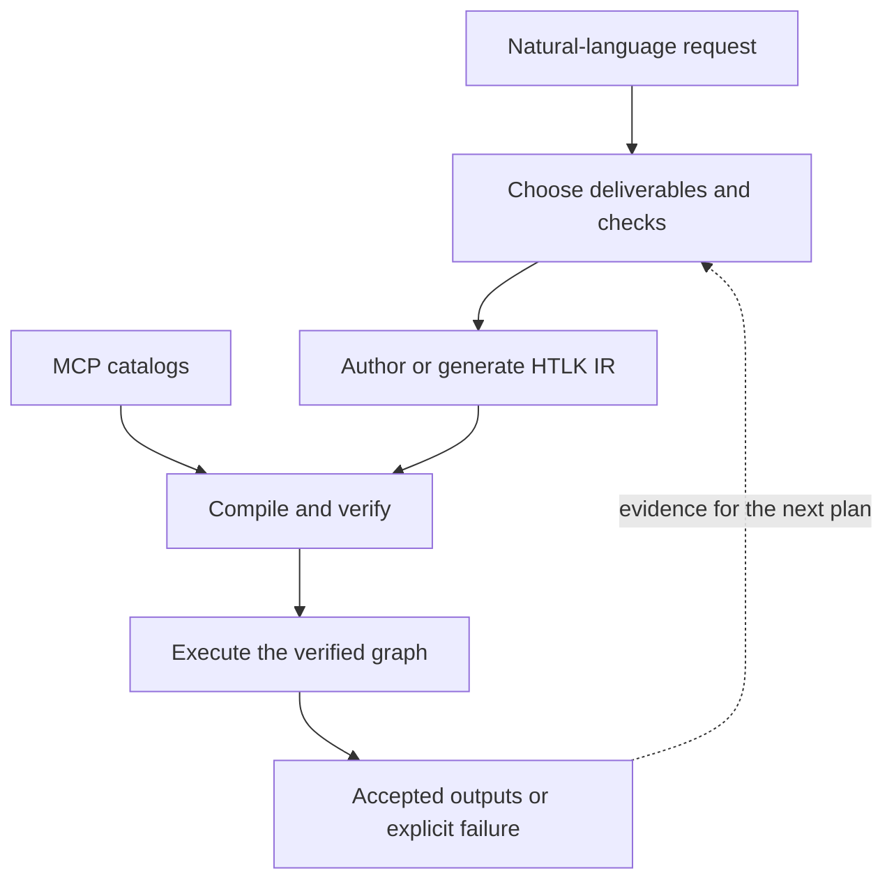

**Guide diagram 1 — Planning and execution are separate responsibilities.** Natural language guides the author or planning application. The compiler receives IR and catalogs, not an unstructured request to invent a workflow. Planning can iterate, but executable changes pass through verification.

### What belongs where?

| You need to… | Use… | Why |
|---|---|---|
| Construct a request, select a field, or format a prompt | `eval` | It is a pure calculation over declared inputs. |
| Ask an LLM, retrieve evidence, or write a file | An MCP operation | The work crosses an external-system boundary. |
| Reuse a multi-step procedure | `task` and `use` | The public ports hide the procedure's internal wiring. |
| Improve a result repeatedly | `loop` | Feedback crosses an explicit, bounded iteration boundary. |
| Ask a person or await an external event | `wait` | The run can pause durably without holding a worker. |
| Add a new subgraph | Compiler composition and a host installation step | The added work must be checked before execution. |

There are no embedded scripts such as Lua blocks and no shared `context` object that nodes can modify. An operation receives values through its inputs and proposes its own outputs. Accepted values do not change later. A **durable** wait saves its request and progress so it can survive a process restart; it does not need to keep a worker, the component performing work, occupied while waiting.

## 2. Decompose a problem until a task has a clear contract

“Make every task small” is useful advice only up to a point. A graph with hundreds of tiny, vaguely specified tasks can be harder to understand than a graph with ten well-defined ones.

A better stopping rule is:

> Stop decomposing when you can identify the inputs, describe the output, choose a credible execution mechanism, and explain how you will check the result within a useful budget.

For our documentation question, a first decomposition might be:

| Task | Receives | Produces | Check |
|---|---|---|---|
| Gather opportunities | The decision question | Evidence about expected benefits | Retrieval returned usable evidence. |
| Gather risks | The same question | Evidence about costs and limitations | Retrieval returned usable evidence. |
| Draft a brief | Question and both evidence sets | A proposed brief | Nonempty text and the expected structure. |
| Review the brief | Question, evidence, and draft | Review decision and actionable feedback | A structured review result; content checks are explicit. |
| Revise if necessary | Previous draft and feedback | A new draft | Another review, within a fixed iteration bound. |

“Gather opportunities” and “gather risks” are independent. Drafting depends on both. Reviewing depends on the draft. The decomposition is a hierarchy of responsibilities; the execution dependencies form a directed acyclic graph within each iteration.

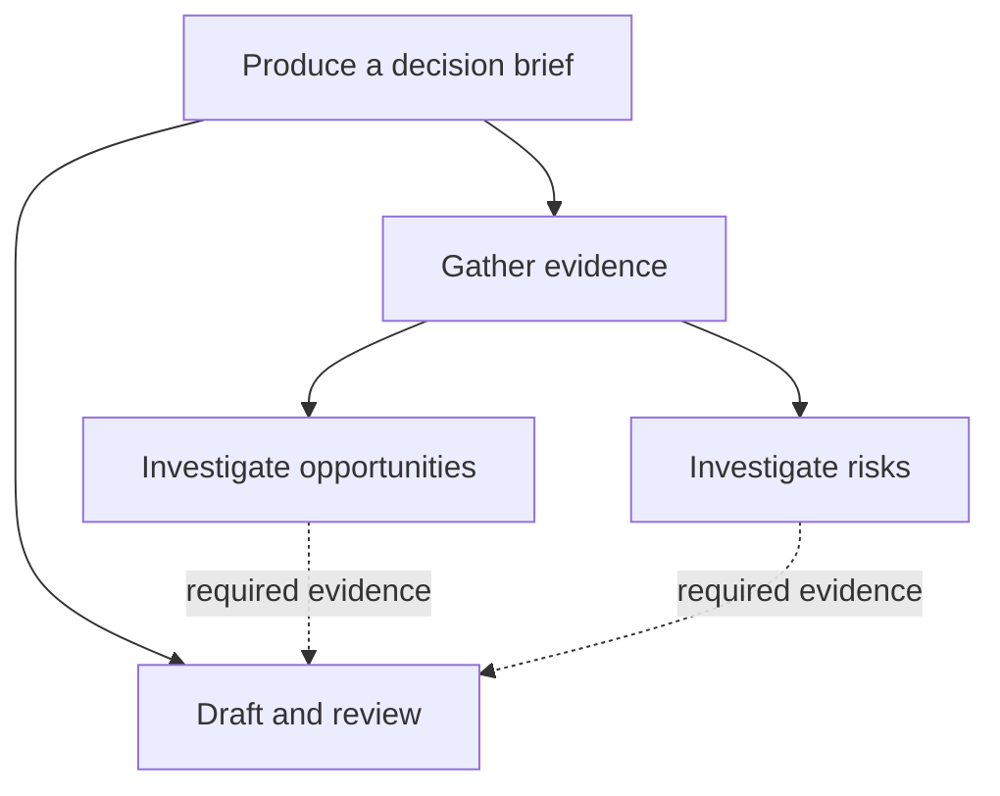

**Guide diagram 2 — A task hierarchy is not the whole execution graph.** Solid lines show decomposition in this conceptual diagram. Dashed lines show dependencies between the resulting responsibilities. The two research tasks need not execute in the order they appear on a page.

### Ask about readiness, not comfort alone

When a person will perform a task, “Is this small enough for you to tackle?” can be a productive question. With an LLM, a statement of confidence is weaker evidence. Ask it to expose the reasons a task is or is not ready.

A planning prompt can say:

> For each proposed task, identify its required inputs, expected output, prerequisites, available tool, acceptance checks, and unresolved questions. If a task cannot be attempted with the available inputs and tools, mark what is missing. Do not invent a tool or assume that missing evidence exists.

Then inspect those answers. A task can be self-contained without repeating every detail of the original conversation: its required shared context should be explicit in its input contract.

Avoid decomposing forever. Repeatedly obtaining the same number of subtasks does not establish that the task definitions are stable or useful. A planner may have changed their meaning while preserving the count. Use explicit readiness criteria, a bound on planning iterations, and comparison of relevant content through a suitable pure library or evaluation task.

### Decomposition is not search

Decomposition asks, “What work must be done?” Search asks, “Which candidate approach should we pursue?”

A research task and a drafting task can both be required. Two competing recommendations may instead be alternatives to evaluate. Mixing those relationships produces graphs that accidentally execute every alternative or wait for results they intended to choose between.

HTLK does not implicitly run Monte Carlo tree search because a graph looks like a tree. A search application must represent candidates, evaluation evidence, selection, and its budget explicitly. A bounded loop can explore candidates sequentially; a fixed graph can evaluate a known set in parallel. Dynamic parallel expansion requires additional compiled structure or an external service that owns that behavior.

## 3. Read your first graph

Before introducing an LLM, start with a complete graph whose behavior you can predict exactly.

```htlk
ir_version = "0.1"

prompt brief_request = "Prepare a decision brief about: {question}"

graph prepare_request {
    inputs = { question = string }
    outputs = { prompt_text = string }

    nodes {
        format_request = eval(string, render(&brief_request, {
            question = inputs.question,
        })) {
            inputs = { question = string }
        }
    }

    edges {
        edge question {
            from = inputs.question
            to = format_request.inputs.question
        }
        edge prompt_text {
            from = format_request.outputs.value
            to = outputs.prompt_text
        }
    }

    preconditions = length(inputs.question) > 0
}
```

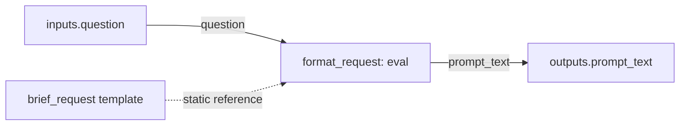

**Guide diagram 3 — Every solid arrow has an edge declaration.** The `question` edge supplies the pure node's input. The `prompt_text` edge publishes its result. The template is a static dependency, not a runtime input edge.

Notice the two appearances of `inputs.question`. At the graph level, it is the graph's input. Inside `format_request`'s expression, it is that node's own declared input. They have the same spelling but belong to different scopes. The edge is what connects them.

The `inputs` table declares a shape; it does not assign a value. Likewise, `outputs` declares the public interface. Its values come from edges.

The source is intentionally explicit. When a request is wrong, you can inspect the value sent through the `question` edge and the accepted output of `format_request` without guessing which surrounding variables a function happened to capture.

### Three small rules that prevent large mistakes

- `eval(string, expression)` checks the result as a string. It does not stringify an arbitrary object.
- `render` performs one substitution pass. Inserted text is not reparsed as another template.
- Graph node declaration order does not establish execution order. Dependencies do.

Literal braces in a template are written as `{{` and `}}`. Complex records, collections, and floats need explicit formatting before insertion; template rendering does not choose a serialization for you.

## 4. Define the external tool contracts before wiring calls

Our complete example uses three tools:

| Catalog alias and tool | Argument object | Structured result object |
|---|---|---|
| `research / lookup` | `query: string` | `evidence_text: string` |
| `models / revise_brief` | `question, evidence, previous_draft, feedback`, all strings | `draft: string` |
| `models / review_brief` | `question, evidence, draft`, all strings | `accepted: boolean, feedback: string` |

The [catalog fixture](examples/decision_brief.catalogs.json) provides the complete example descriptors and their input/output schemas. The research tool represents an evidence-retrieval service. The other two represent LLM-backed services with different responsibilities. The fixture identifies their contracts; it does not implement those services or configure credentials.

The two model tools may share an underlying LLM. Separate tool contracts give drafting and reviewing different, statically known output schemas; they do not by themselves make the reviewer an independent source of truth.

In this example, model selection and model-specific settings belong to the deployed MCP tools. HTLK has no special `model` or `temperature` node option. If your real tool exposes such arguments, construct them inside the tool's argument object according to its actual schema.

A call looks like this **node fragment**:

```htlk
nodes {
    lookup = call(mcp.tool("research", "lookup"))
}
```

The node receives exactly one `arguments` input and produces exactly one `value` output. Its individual protocol properties do not become HTLK ports.

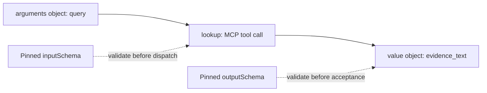

**Guide diagram 4 — The MCP boundary validates whole objects.** An argument is not accepted merely because an LLM proposed it. The runtime validates the exact request object and, on success, the returned structured object against the pinned schemas.

A successful text-only tool response is insufficient for this example. HTLK requires `outputSchema` and object-valued `structuredContent` for a called tool. A tool result containing `isError: true` is a failed attempt, not a successful object to pass downstream.

### Do not mistake a schema for a quality guarantee

The schema can establish that `accepted` is a Boolean. It cannot establish that the reviewer carefully checked the evidence.

Define the reviewer tool's behavioral rubric as well as its schema. For this workflow, a useful rubric asks whether the brief addresses the question, represents both evidence sets, separates evidence from speculation, proposes a bounded pilot, and identifies uncertainties. Rejection feedback should explain what to change.

That rubric is an application requirement for the LLM-backed service. It is not an extra compiler proof. For consequential decisions, add independent evidence checks or human review appropriate to the task.

## 5. Build one reusable research task

A reusable task should expose the information its caller needs, rather than every detail of its internal MCP request.

The following **task declaration fragment** is included in the complete example:

```htlk
task research.find_evidence {
    inputs = { query = string }
    outputs = { evidence = string }

    nodes {
        arguments = eval(json, { query = inputs.query }) {
            inputs = { query = string }
        }
        lookup = call(mcp.tool("research", "lookup"))
        extract = eval(string, inputs.response.evidence_text) {
            inputs = { response = json }
            postconditions = length(outputs.value) > 0
        }
    }

    edges {
        edge query { from = inputs.query to = arguments.inputs.query }
        edge request { from = arguments.outputs.value to = lookup.inputs.arguments }
        edge response { from = lookup.outputs.value to = extract.inputs.response }
        edge evidence { from = extract.outputs.value to = outputs.evidence }
    }

    preconditions = length(inputs.query) > 0
}
```

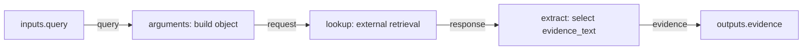

**Guide diagram 5 — Encapsulation gives the caller a stable interface.** The caller supplies `query` and receives `evidence`. Request construction and response extraction remain inside the task.

Why have an extraction node? Because an edge transfers a complete port. This is not a legal edge source:

```text
from = lookup.outputs.value.evidence_text
```

The field selection belongs in an expression. The extraction node also gives the selected value its own acceptance check.

A parent invokes the task with `use(research.find_evidence)`. It cannot reach inside that occurrence to read its `lookup` node. If callers need citations as structured objects later, add a public port or revise the public output type deliberately.

## 6. Represent parallel work with independent dependencies

Our two research questions share the original decision question but have different purposes. Named prompt templates produce those questions; two occurrences of the same task retrieve the evidence.

Here is the **template declaration fragment** used by the example:

```htlk
prompt opportunities_query = """
Investigate opportunities and expected benefits relevant to this decision.
Report evidence and its sources, and identify uncertainties.
Decision question: {question}
"""

prompt risks_query = """
Investigate risks, costs, and limitations relevant to this decision.
Report evidence and its sources, and identify uncertainties.
Decision question: {question}
"""

prompt evidence_bundle = """
OPPORTUNITIES AND BENEFITS
{opportunities}

RISKS AND LIMITATIONS
{risks}
"""
```

The main graph, shown in section 9, wires the two occurrences independently.

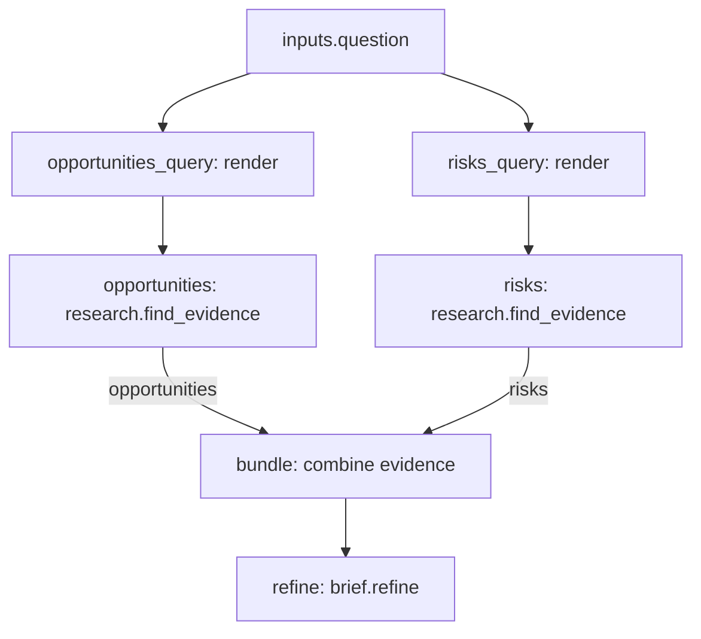

**Guide diagram 6 — Parallelism comes from the absence of a dependency.** Neither research task needs the other's output. They may run concurrently within policy and capacity limits. The bundle node has two required inputs and waits for both.

“May run concurrently” is not “must launch at exactly the same time.” The runtime can schedule eligible work according to available capacity. If one operation must precede another for correctness, add an actual dependency.

Two different producers do not automatically combine just because they target the same destination. Two unconditional edges to one port are a conflict. For an AND-style join, give the combining node separate required inputs, then explicitly construct the combined value.

The example uses evidence text to keep the source approachable. A production evidence task can instead return records containing source IDs, excerpts, and retrieval metadata. Carry that structure through your drafting and checking tools rather than expecting a prose label to prove citation validity.

## 7. Refine an answer without hiding a retry loop

There are two different reasons to repeat work:

- A request suffered a transient operational problem.
- The request succeeded, but the answer needs improvement.

The first can be an MCP retry. The second requires a new computation with changed inputs.

Our refinement task carries a draft and reviewer feedback between iterations. On the first iteration both are empty strings, so the drafting tool creates an initial brief. On later iterations it receives the prior draft and feedback.

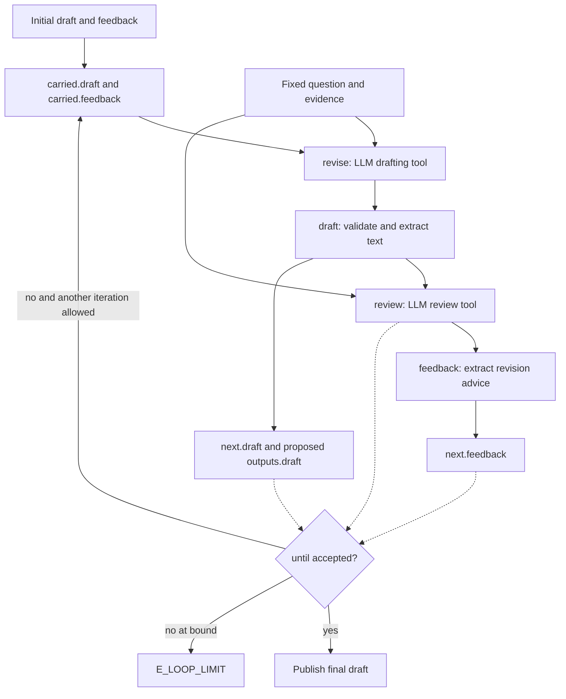

**Guide diagram 7 — Feedback belongs at an explicit iteration boundary.** This diagram summarizes iteration mechanics as well as body value edges. Within one iteration, drafting precedes review. Only committed `next` values become the following iteration's `carried` values.

Here is the complete **refinement task declaration fragment**. Its tool contracts are in the companion catalog.

```htlk
task brief.refine {
    inputs = {
        question = string,
        evidence = string,
        initial_draft = string,
        initial_feedback = string,
    }
    outputs = { draft = string }

    nodes {
        improve = loop {
            inputs = {
                question = string,
                evidence = string,
                initial_draft = string,
                initial_feedback = string,
            }
            outputs = { draft = string }
            carried = {
                draft = inputs.initial_draft,
                feedback = inputs.initial_feedback,
            }

            body {
                nodes {
                    draft_arguments = eval(json, {
                        question = inputs.question,
                        evidence = inputs.evidence,
                        previous_draft = inputs.draft,
                        feedback = inputs.feedback,
                    }) {
                        inputs = {
                            question = string,
                            evidence = string,
                            draft = string,
                            feedback = string,
                        }
                    }

                    revise = call(mcp.tool("models", "revise_brief"))

                    draft = eval(string, inputs.response.draft) {
                        inputs = { response = json }
                        postconditions = length(outputs.value) > 0
                    }

                    review_arguments = eval(json, {
                        question = inputs.question,
                        evidence = inputs.evidence,
                        draft = inputs.draft,
                    }) {
                        inputs = {
                            question = string,
                            evidence = string,
                            draft = string,
                        }
                    }

                    review = call(mcp.tool("models", "review_brief"))

                    feedback = eval(string, inputs.response.feedback) {
                        inputs = { response = json }
                    }
                }

                edges {
                    edge draft_question { from = inputs.question to = draft_arguments.inputs.question }
                    edge draft_evidence { from = inputs.evidence to = draft_arguments.inputs.evidence }
                    edge prior_draft { from = carried.draft to = draft_arguments.inputs.draft }
                    edge prior_feedback { from = carried.feedback to = draft_arguments.inputs.feedback }
                    edge draft_request { from = draft_arguments.outputs.value to = revise.inputs.arguments }
                    edge draft_response { from = revise.outputs.value to = draft.inputs.response }

                    edge review_question { from = inputs.question to = review_arguments.inputs.question }
                    edge review_evidence { from = inputs.evidence to = review_arguments.inputs.evidence }
                    edge review_draft { from = draft.outputs.value to = review_arguments.inputs.draft }
                    edge review_request { from = review_arguments.outputs.value to = review.inputs.arguments }
                    edge review_response { from = review.outputs.value to = feedback.inputs.response }

                    edge next_draft { from = draft.outputs.value to = next.draft }
                    edge next_feedback { from = feedback.outputs.value to = next.feedback }
                    edge candidate { from = draft.outputs.value to = outputs.draft }
                }
            }

            until = review.outputs.value.accepted
            max_iterations = 3
            limits { max_mcp_calls = 6 }
        }
    }

    edges {
        edge question { from = inputs.question to = improve.inputs.question }
        edge evidence { from = inputs.evidence to = improve.inputs.evidence }
        edge initial_draft { from = inputs.initial_draft to = improve.inputs.initial_draft }
        edge initial_feedback { from = inputs.initial_feedback to = improve.inputs.initial_feedback }
        edge final_draft { from = improve.outputs.draft to = outputs.draft }
    }
}
```

### Read the loop in four passes

First, find its fixed inputs: question and evidence. These remain unchanged throughout the invocation.

Second, find the carried values: draft and feedback. Their initializers name the loop's own input ports. They are not assignments to shared variables.

Third, find the edges to `next`. They define exactly what the next iteration will receive. Even the final iteration must produce valid required next values under the 0.1 rules.

Fourth, read `until` and `max_iterations` together. The reviewer can accept any of the three drafts. If the third is still rejected, the loop fails with `E_LOOP_LIMIT`. It does not quietly publish the last draft as though it passed review.

A reviewer response with `accepted = false` is a successful tool result containing a negative assessment. That is what permits another iteration. By contrast, a transport error or malformed review response fails the relevant computation. This example does not reinterpret infrastructure failure as editorial feedback.

### What the budget really bounds

Each completed iteration contains two MCP calls. Three iterations therefore permit six drafting/review dispatches, with no automatic retries in this example. The two initial research calls bring the complete graph's authored maximum to eight dispatches.

Ancestor limits and deployment policy can be tighter. A call budget does not bound every other resource, and adding retries changes the required call allowance. Finite deadlines and evaluator limits still apply. Hard token or cost ceilings require actual runtime enforcement support; do not treat a model's estimated usage as a hard guarantee.

## 8. Choose a result without disguising failure

Define an application result that can tell the truth about both outcomes:

```htlk
type BriefOutcome = record {
    status = enum("accepted", "needs_attention"),
    brief = union(string, null),
    message = string,
}
```

This is a **type declaration fragment** used in the complete document.

An accepted brief contains text. A needs-attention result contains `null` and an explanation. The field is always present: `union(string, null)` is not an optional field.

The main graph creates two result-producing nodes. Their node guards control whether they execute. Corresponding edge guards choose which value supplies the public output.

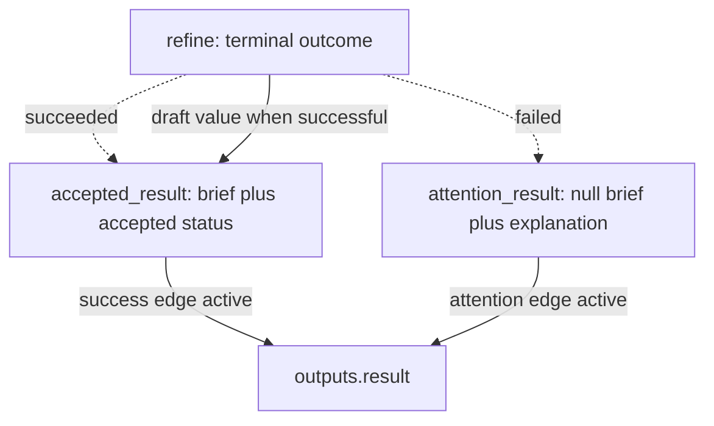

**Guide diagram 8 — Failure recovery is ordinary graph structure.** Terminal status controls the two routes. A failed refinement task has no successful draft output, so the attention branch never reads one.

An important distinction follows: the runtime can successfully complete a graph that returns `status = "needs_attention"`. The graph fulfilled its contract to report an outcome. The application did not obtain an accepted brief. Consumers should inspect that application status before publishing or acting.

If your application must treat every rejected workflow as a failed run, use a stricter public contract instead. Do not conflate “returned an honest result” with “achieved the original business objective.”

## 9. Assemble the main graph

The following **entry-graph fragment**, combined with the declarations in sections 5–8, forms the [complete downloadable program](examples/decision_brief.htlk). The file already includes the version header and all declarations; you do not need to stitch the excerpts together.

```htlk
graph decision_brief {
    inputs = { question = string }
    outputs = { result = BriefOutcome }

    nodes {
        opportunities_question = eval(string, render(&opportunities_query, {
            question = inputs.question,
        })) {
            inputs = { question = string }
        }

        risks_question = eval(string, render(&risks_query, {
            question = inputs.question,
        })) {
            inputs = { question = string }
        }

        opportunities = use(research.find_evidence)
        risks = use(research.find_evidence)

        bundle = eval(string, render(&evidence_bundle, {
            opportunities = inputs.opportunities,
            risks = inputs.risks,
        })) {
            inputs = { opportunities = string, risks = string }
        }

        empty_text = eval(string, "")
        refine = use(brief.refine)

        accepted_result = eval(BriefOutcome, {
            status = "accepted",
            brief = inputs.draft,
            message = "The configured reviewer accepted this brief.",
        }) {
            inputs = { draft = string }
            when = status(@refine) == "succeeded"
        }

        attention_result = eval(BriefOutcome, {
            status = "needs_attention",
            brief = null,
            message = "No reviewed brief was produced. Inspect the run for the cause.",
        }) {
            when = status(@refine) == "failed"
        }
    }

    edges {
        edge opportunities_question { from = inputs.question to = opportunities_question.inputs.question }
        edge risks_question { from = inputs.question to = risks_question.inputs.question }
        edge opportunities_query { from = opportunities_question.outputs.value to = opportunities.inputs.query }
        edge risks_query { from = risks_question.outputs.value to = risks.inputs.query }
        edge opportunities_evidence { from = opportunities.outputs.evidence to = bundle.inputs.opportunities }
        edge risks_evidence { from = risks.outputs.evidence to = bundle.inputs.risks }

        edge refine_question { from = inputs.question to = refine.inputs.question }
        edge refine_evidence { from = bundle.outputs.value to = refine.inputs.evidence }
        edge seed_draft { from = empty_text.outputs.value to = refine.inputs.initial_draft }
        edge seed_feedback { from = empty_text.outputs.value to = refine.inputs.initial_feedback }

        edge accepted_draft { from = refine.outputs.draft to = accepted_result.inputs.draft }

        edge success {
            from = accepted_result.outputs.value
            to = outputs.result
            when = status(@refine) == "succeeded"
        }
        edge attention {
            from = attention_result.outputs.value
            to = outputs.result
            when = status(@refine) == "failed"
        }
    }

    preconditions = length(inputs.question) > 0
    limits { max_mcp_calls = 8 }
}
```

The same empty string artifact initializes two distinct loop inputs. That is ordinary fan-out, not shared mutable state.

The success and attention conditions cannot both be true for one immutable terminal outcome. The compiler may still report its conservative conditional-writer warning; runtime uniqueness is enforced regardless of whether the compiler recognizes this particular exclusivity pattern.

This graph deliberately does not offer an attention result for every possible way a run can stop. An empty root input violates the graph precondition before child work starts. Cancellation, an enclosing deadline, or a policy stop can terminate the run rather than finish the ordinary fallback path. Recovery nodes are not privileged handlers that override the runtime.

### Walk through a successful run

| Moment | What becomes available | What can happen next |
|---|---|---|
| Root admission | Valid question | Both question-formatting nodes and the empty seed can execute. |
| Research completes | Two evidence strings | The bundle can construct its value. |
| Refinement begins | Question, evidence, empty draft, empty feedback | Iteration zero can draft and review. |
| First review rejects | `accepted: false` and feedback | Valid next values initialize iteration one. |
| Second review accepts | `accepted: true` | The loop publishes its final draft. |
| `refine` succeeds | Its public draft and terminal outcome | The accepted-result branch executes; the attention branch skips. |
| Root completion | One selected `BriefOutcome` | The host receives the committed result. |

At no point does the graph mutate the first draft. The second draft belongs to a different iteration and has its own provenance.

### Walk through a failed retrieval

If one research call fails, its task cannot produce required evidence. The bundle's selected failed dependency is an error, not absence. Refinement then fails to bind its required evidence. The attention branch can return its explicit result once `refine` has failed.

The other research task is not automatically cancelled just because this path cannot succeed. A scope settles its instantiated children before completion. This is predictable AND-style coordination, not first-result or first-failure racing.

## 10. Put checks at the boundary they protect

Checks serve different purposes depending on where you place them.

| Mechanism | Question it answers | Example |
|---|---|---|
| Type or MCP schema | Does this value have the required representation? | The review result contains a Boolean `accepted`. |
| `preconditions` | Is this operation ready to make a meaningful attempt? | A lookup query is not empty. |
| `postconditions` | Is this proposed result acceptable at this boundary? | Extracted draft text is not empty. |
| Node `when` | Should this operation run at all? | Produce the attention result only after refinement fails. |
| Edge `when` | Should this source supply this destination? | Select the accepted result after refinement succeeds. |
| Loop `until` | Should iteration stop successfully? | The current review accepts the current draft. |

A model's review is data. The loop's pure termination expression reads that data. The contract itself does not call the model.

Write each contract as one expression. For example, `preconditions = length(inputs.question) > 0 and length(inputs.evidence) > 0` checks two inputs together. Use `or` for alternatives and parentheses to show grouping. A field may appear only once, and leaving it out means `true`. The names `preconditions` and `postconditions` are plural for readability, not because they contain lists or blocks.

Be careful where you place a quality check. Adding `postconditions = outputs.value.accepted` to the reviewer call would turn every negative review into a failed node. Our loop needs successful negative reviews so it can extract feedback and try again.

For stronger validation, create explicit checking tasks: resolve cited source identifiers, compare claims with retrieved excerpts, run tests against generated code, or request independent review. Such tasks must use real tools or linked pure functions; a persuasive rubric alone is not an implemented check.

### Optional is not null, and neither means failure

A useful memory aid is:

| Situation | Meaning |
|---|---|
| An optional field is omitted | No value was supplied for that field. |
| A nullable field contains `null` | A value was supplied, and that value is null. |
| A producer is still running | The value is pending. |
| A producer failed | Its ordinary output is unavailable. |

Use `present` for legitimate optional absence. Use `status(@node)` and, in allowed guard/contract contexts, `error(@node)` for outcomes. `present` does not hide a failed producer.

The 0.1 expression scope rules are intentionally narrow: a pure node's expression reads its own inputs, not arbitrary sibling outputs or errors. The attention node therefore emits a stable explanation and directs the operator to inspection APIs. It does not pretend that `error(@refine)` is an ordinary source port that an edge can transfer.

## 11. Bring resources and reusable prompts into the workflow

A resource is material you can read, such as a project brief, a design document, or a stored evidence bundle. Reading it is an explicit operation. Merely mentioning its URI inside prompt text does not fetch it.

For a fixed catalog resource, use `read(mcp.resource(...))`. For a catalog resource template, use `read(mcp.template(...))` and supply the required string variables through its `arguments` input.

This **task declaration fragment** assumes a fixed text resource and a sandbox tool named `write_file` accepting `path` and `content` strings and returning an object receipt. Those extra descriptors are not part of the decision-brief catalog fixture.

```htlk
task context.copy_brief {
    inputs = { destination = string }
    outputs = { receipt = json }

    nodes {
        source = read(mcp.resource("context", "context://project/brief"))

        write_arguments = eval(json, {
            path = inputs.destination,
            content = inputs.snapshot.contents[0].text,
        }) {
            inputs = {
                destination = string,
                snapshot = ResourceSnapshot,
            }
            preconditions = length(inputs.snapshot.contents) == 1
                and inputs.snapshot.contents[0].kind == "text"
        }

        save = call(mcp.tool("sandbox", "write_file"))
    }

    edges {
        edge destination { from = inputs.destination to = write_arguments.inputs.destination }
        edge snapshot { from = source.outputs.value to = write_arguments.inputs.snapshot }
        edge request { from = write_arguments.outputs.value to = save.inputs.arguments }
        edge receipt { from = save.outputs.value to = outputs.receipt }
    }
}
```

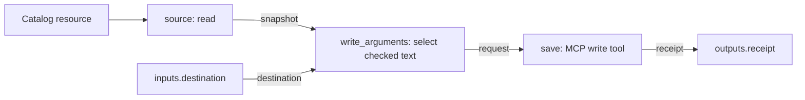

**Guide diagram 9 — Resource access and writing are visible operations.** The resource read produces a snapshot. A checked expression constructs the write request. The receipt makes the write part of the task's public completion path.

The check matters. Resource snapshots can contain multiple entries, text, or bytes. The example supports exactly one text entry; it rejects other valid resource shapes instead of guessing how to flatten them. Lists are zero-indexed, so the first entry is `[0]`.

For broader support, add an explicit decoding or selection step with a suitable pure library or MCP tool. Do not infer an arbitrary application's data shape from MIME metadata alone.

Resource updates do not mutate the accepted snapshot. A notification normally starts another run through host trigger configuration. To receive a later event in the same run, use an explicit wait and a host integration that submits the event to it.

### Local templates and MCP prompts solve different problems

| Construct | What it does | What it does not do |
|---|---|---|
| `prompt name = "…{parameter}…"` | Declares a local template in the IR document. | Call a model or fetch a server-side prompt. |
| `render(&name, { … })` | Produces a string from that local template. | Interpret substituted text as new IR. |
| `fetch(mcp.prompt("server", "name"))` | Retrieves a catalog-resolved MCP prompt result. | Invoke an LLM automatically. |

A fetched prompt produces `McpPromptResult`, not an assumed plain string. Build the next tool's argument object according to its actual expected message/content shape. Even a prompt with no parameters needs the explicit empty `arguments` object.

Treat retrieved documents, fetched prompts, and model outputs as data with an identified origin. Their text cannot grant the runtime permission to call additional tools. Keep task instructions separate from supplied evidence in your tool's argument schema where practical, and preserve sensitivity labels across transfers.

## 12. Use pure libraries for richer checks and filters

The fixed core keeps common operations small: presence, length, scalar comparison, terminal outcome inspection, and prompt rendering. Richer transformations come from pinned Rust libraries already linked into the compiler/runtime.

Suppose your deployment provides a library `htlk.text` with this signature:

```text
matches(text: string, pattern: regex) -> boolean
```

Then this **declaration and node fragment** illustrates the syntax:

```htlk
predicate_library text_ops = predicates.library("htlk.text") {
    version = "0.1"
    digest = "sha256:dddddddddddddddddddddddddddddddddddddddddddddddddddddddddddddddd"
}

nodes {
    valid_reference = eval(boolean,
        text_ops.matches(inputs.reference, /^DOC-[0-9]+$/)
    ) {
        inputs = { reference = string }
    }
}
```

The digest is deliberately a placeholder. Replace it with the exact implementation digest in your linked registry. `matches` is an assumed example signature, not a function this guide claims is shipped by HTLK.

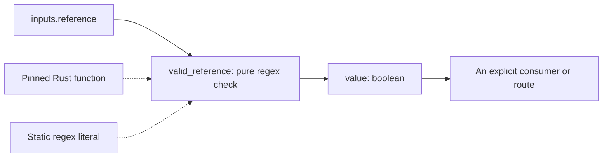

**Guide diagram 10 — A predicate computes evidence for a decision.** The check produces a Boolean. To use it, connect that value to a consumer or refer to its accepted output in an allowed guard. A disconnected check is not a hidden global contract.

Regex literals support the unique flags `i`, `m`, and `s`. Escape a delimiter slash as `\/`. The exact engine behavior is pinned. A matching document-ID pattern only proves that the string has the expected form; it does not prove that the referenced document exists or supports a claim.

Collection filters, deduplication, ranking, arithmetic, and dynamic indexing follow the same pattern: select a real linked function with a known signature, declare inputs, compute a value, and bind that value explicitly.

There are no inline lambdas or Lua callbacks. Higher-order functions, when supplied by a library, use static function references. If your desired operation is not in the registry, it must be implemented and linked in Rust, or exposed as an MCP tool. Naming a function in IR does not install it.

## 13. Let an LLM or a person supply a missing value

“Let the LLM fill this input” means producing data upstream—not granting the model permission to mutate a node that is already running.

If a planning tool returns a proposed query, the normal path is:

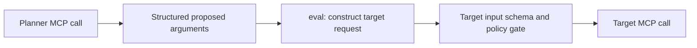

**Guide diagram 11 — Model-produced inputs still cross checked boundaries.** The target operation is statically selected. The model supplies values that must satisfy its argument schema and authorization policy before dispatch.

For a human choice, use a durable wait. Here is a **complete standalone program**, separate from the decision-brief example:

```htlk
ir_version = "0.1"

graph choose_audience {
    inputs = { question = string }
    outputs = { audience = string }

    nodes {
        request = eval(json, {
            question = inputs.question,
            instruction = "Who should the decision brief be written for?",
        }) {
            inputs = { question = string }
        }

        audience = wait(string) {
            topic = "brief_audience"
            timeout_ms = 3600000
            postconditions = length(outputs.value) > 0
        }
    }

    edges {
        edge context { from = inputs.question to = request.inputs.question }
        edge ask { from = request.outputs.value to = audience.inputs.request }
        edge answer { from = audience.outputs.value to = outputs.audience }
    }
}
```

The host presents the request and submits a reply addressed to the runtime-issued `wait_id`. The string is type-checked; the postcondition then checks that it is nonempty. If the postcondition fails after reply acceptance, the node fails—it does not silently reopen the same question. Model a follow-up question as new graph work when that behavior is needed.

The one-hour wait timeout is also constrained by enclosing deadlines and deployment policy. A longer wait option cannot extend a shorter run-wide deadline.

### Human input is not action approval

Choosing an audience is application data. Authorizing a consequential external action is policy.

A `wait(boolean)` response of `true` does not authorize a file write, publication, or data transfer. Exact-action approval uses the runtime's separate authenticated approval API, tied to the actual operation and frozen inputs. The user guide's workflow can request data from a person; it cannot bypass the policy gate by calling that data “approval.”

## 14. Expand a plan through the compiler

The complete decision-brief example has a known shape. A much larger problem may not.

An initial research phase might discover that one alternative needs a security assessment while the other needs a migration study. That is a reason to propose additional work, not a reason for a model to rewrite live variables.

A useful planner output describes tasks as data:

| Suggested field | Purpose |
|---|---|
| `task_id` | Stable planner-side label for the proposed task. |
| `deliverable` | What the task should produce. |
| `required_inputs` | What must exist before it can start. |
| `depends_on` | Other proposed task IDs whose results are needed. |
| `acceptance_checks` | How the result will be evaluated. |
| `unresolved_questions` | Information or authority still missing. |

These are an application schema, not additional HTLK keywords. Your frontend can use such a plan to author a complete IR document. A list of task descriptions does not automatically instantiate nodes.

### Keep the compiler's role precise

A planning application can itself be manually authored IR that calls an LLM. The host receives its candidate IR and invokes the compiler with the three catalogs. The compiler checks the resulting computation; it does not interpret the original natural-language goal.

When compilation fails, feed the structured diagnostics back into an explicitly bounded repair process. Ask for a corrected complete candidate and compile it again. Do not accept an LLM's claim that an error is harmless as a substitute for verification.

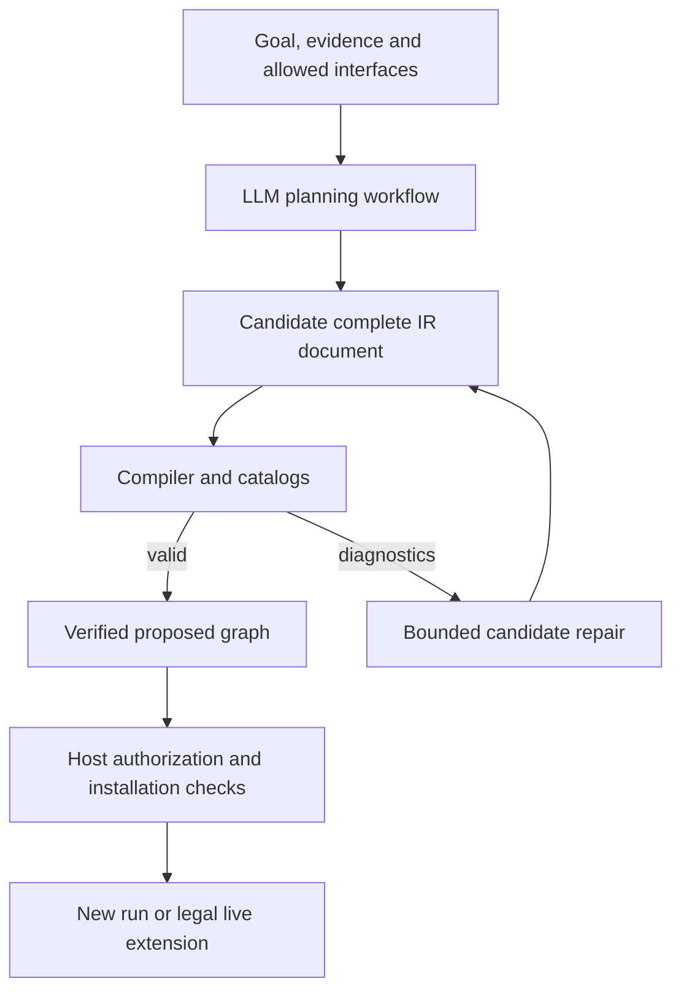

**Guide diagram 12 — Trial and error changes candidates, not running work.** A planner can revise a proposal repeatedly within its budget. Each proposal must independently compile. Runtime installation has additional constraints beyond source validity.

### Join public interfaces, not internal implementation details

Suppose one compiled graph produces `evidence: string`. Another accepts `evidence: string` and `question: string` and produces `brief: string`.

The host can supply this **JoinSpec JSON example**:

```json
{
  "id": "research_then_brief",
  "left_alias": "research",
  "right_alias": "writer",
  "edges": [
    {
      "id": "evidence",
      "from": { "graph": "left", "port": "evidence" },
      "to": { "graph": "right", "port": "evidence" }
    }
  ],
  "inputs": [
    {
      "name": "question",
      "to": [
        { "graph": "left", "port": "question" },
        { "graph": "right", "port": "question" }
      ]
    }
  ],
  "outputs": [
    {
      "name": "brief",
      "from": { "graph": "right", "port": "brief" }
    }
  ]
}
```

This example assumes exactly those operand interfaces, with the left graph accepting `question: string`. It is not a JoinSpec for the downloaded decision-brief graph, whose public output is `result`.

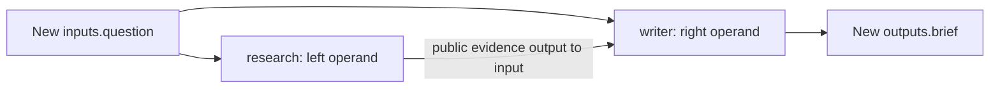

**Guide diagram 13 — Composition adds a parent around complete operands.** The join names only public ports. It introduces no conversion, recovery handler, or access to a nested node's output.

The two documents must use the same profile and resolve their dependencies consistently. Different pinned versions of one live tool are not made compatible merely by joining their graphs.

### Live extension needs an installation window

For a fresh run, the compiler can accept any valid acyclic join. For a live run, existing work is already admitted and its inputs are frozen. The currently active root must remain an exact preserved operand with unchanged inputs.

To keep a run open while the host plans, include an explicit planning wait on a required completion path. Supply the planning context in its request: root public outputs remain uncommitted while the root is still waiting.

The runtime specification contains a [complete planning-window example](runtime-spec.md#121-durable-installation-window). The essential sequence is:

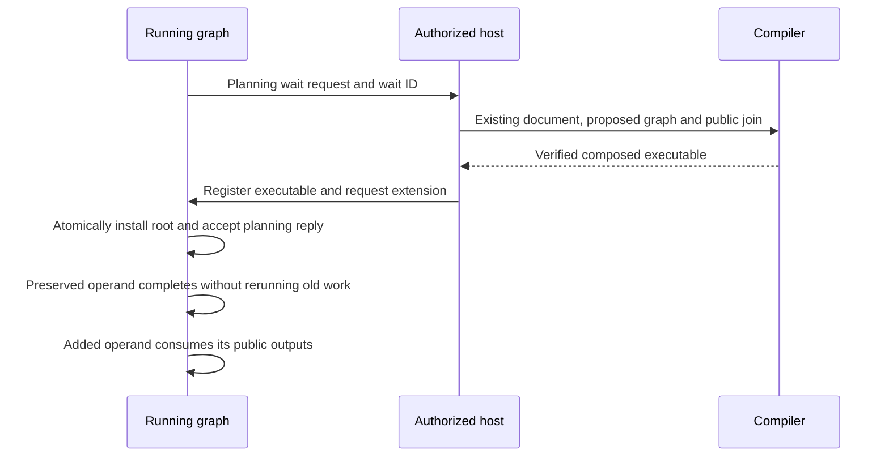

**Guide diagram 14 — Install before releasing the planning window.** The host can use `extend_run` with `close_wait` so installation and the input-wait reply commit together. Sending the reply first would create an avoidable race with root completion.

The host must supply the full composed-root input map, the expected current fingerprint, and the registered composed fingerprint. The runtime verifies preserved inputs, labels, limits, and profile compatibility. Neither the diagram nor a successful compile bypasses those checks.

Live extension is additive. It cannot replace a running draft node, add a new prerequisite to admitted work, or reopen a terminal run. Start a new run for a changed computation, explicitly reusing authorized prior artifacts where appropriate.

## 15. Separate retry, revision, fallback, and reconciliation

These four words describe different graph-design decisions.

| Situation | Response | What changes? |
|---|---|---|
| A transient request failure is safe to replay | MCP retry | Attempt number; operation and inputs stay fixed. |
| A draft is valid data but needs improvement | Another loop iteration | Inputs can contain a new draft and feedback. |
| A computation has terminally failed | Guarded fallback | Another node executes under its own contract. |
| A write may have happened, but the response was lost | Explicit reconciliation | New work investigates the external effect. |

Here is a **replacement node fragment** adding a retry policy to a lookup:

```htlk
nodes {
    lookup = call(mcp.tool("research", "lookup")) {
        retry {
            max_attempts = 3
            on = ["MCP_TRANSPORT", "MCP_TIMEOUT"]
            backoff_ms = [1000, 5000]
        }
        limits { attempt_timeout_ms = 30000 }
    }
}
```

There are three total attempts, not three retries after the first. The two delays precede attempts two and three.

This is a variant, not the policy in the downloadable example. Its enclosing call budget must account for the extra dispatches. Trusted runtime policy must also permit replay for the actual delivery state. A source retry block does not prove that an operation is safe to repeat.

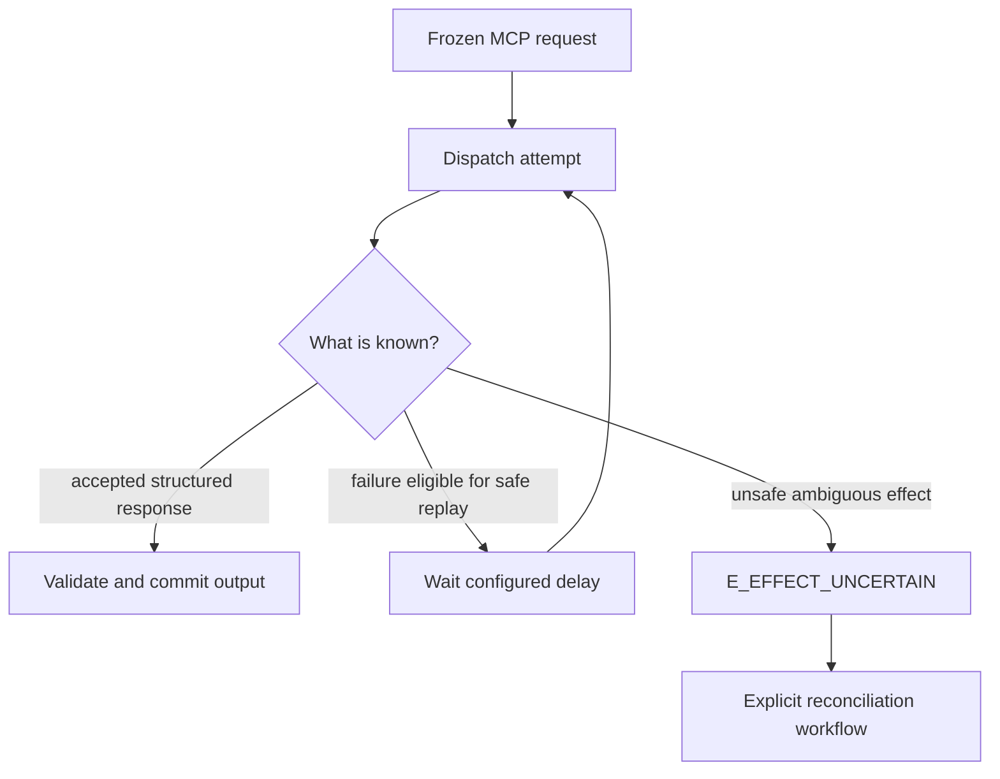

**Guide diagram 15 — Delivery uncertainty is not an ordinary retry signal.** The runtime can fence local result acceptance but cannot undo an action already sent to another system. Reconciliation belongs in visible graph work.

For writes, an external idempotency mechanism must actually be enforced. If a tool requires an idempotency argument, author it in the request before inputs are frozen and approved. An adapter must not secretly insert or replace it afterward.

Terminal outcomes remain immutable. A fallback does not convert the original failed node into a successful one. That stability is what makes status-based routing and audit trails understandable after recovery.

## 16. Keep large graphs navigable

A graph with a thousand nodes should not require a person to reason about all thousand at once.

Use task boundaries to organize responsibilities, not merely to shorten a source file. At each boundary, the reader should be able to understand the public contract before opening the internal graph.

For example:

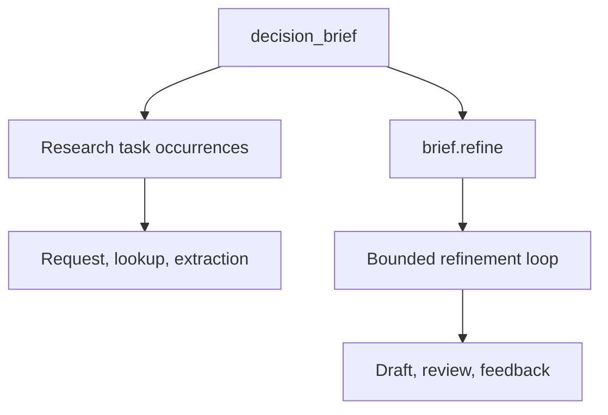

**Guide diagram 16 — Zoom levels are part of the design.** This conceptual hierarchy omits value edges to emphasize ownership. Inspect the parent to understand the deliverable, then open one task to diagnose its implementation.

### Put independently understandable work in modules

Draft 0.1 makes the file boundary explicit. A module exports selected task, type, and prompt declarations; other files import those declarations by a local alias. A source package groups modules with an exact manifest. Neither creates another running scope. The existing `use` node still creates the actual task occurrence.

```htlk
import research from "research/search"
import brief from "writing/refine"
import shared from "self/types"
```

This import fragment is used with the rest of a source module. In a source bundle, the package manifest resolves `research` and `writing` to exact dependencies; `self` refers to this package. Calls such as `use(research.find_evidence)` work through exported public ports exactly as in the single-file tutorial.

The [multi-file version of this same program](examples/modules/README.md) separates the entry graph, types, prompts, research task, and refinement task into five files across three packages. The [module specification](htlk-modules-spec.md) maps that directory structure to source imports and to the resulting execution graph.

For one LLM edit, supply the target module and compiler-generated interfaces for only the imported symbols it needs. Include applicable MCP descriptors if that module directly calls tools. The compiler still receives the complete pinned source bundle and checks the actual implementations. An interface is a concise view of checked source, not a missing-body placeholder that can be executed.

Keep the exact source identity with each report. If an imported task changes privately, its port signature may remain the same while its implementation digest changes. Refresh the checked dependency; do not use unchanged ports as evidence that an old body is still current.

### Use names that explain intent

| Kind | Prefer | Avoid |
|---|---|---|
| Reusable task | `research.find_evidence` | `step_17` |
| Task occurrence | `opportunities`, `risks` | `task_a`, `task_b` |
| Pure transformation | `review_arguments` | `helper` |
| Result selection | `accepted_result` | `final_final` |
| Public port | `evidence`, `draft`, `receipt` | `data` everywhere |
| Edge | `review_evidence` | `edge_42` |

Use `snake_case` for authored value identifiers and `PascalCase` for user-defined types. Preserve external field names exactly when constructing MCP arguments; quote names such as `"customerId"` rather than renaming them.

Do not encode execution order into numbering unless the number carries domain meaning. Edges determine execution order. Task names also need not contain run IDs or iteration numbers; the runtime supplies distinct occurrence identities.

### Make completion meaningful

Every child should contribute to a public output or an explicit completion check. A write whose receipt nobody consumes can otherwise be easy to overlook.

For an unexported essential effect, a scope can require `postconditions = status(@save) == "succeeded"`. For a reusable graph intended for public-port joins, expose a receipt that the joined computation can consume or publish. Joins do not invent hidden completion edges.

Avoid passing one huge `json` context object everywhere by default. Named ports and smaller structural records reveal actual dependencies. Use `json` when the data is genuinely open or the example needs a protocol-shaped object, then validate before a more specific use.

### Be honest about forms of parallelism

Static independent nodes can execute concurrently. A list returned by an LLM does not turn itself into one node per list item. Choose a bounded sequential loop, a newly compiled graph for dynamic parallel work, or an MCP service that owns the internal fan-out.

Similarly, ordinary bindings are not a “first acceptable result” operator. All relevant candidate guards settle before a destination is selected, and scopes settle their instantiated children. Early races and quorums require an explicitly scoped external arbiter or host service under this draft.

## 17. Compile, inspect, and run

There is no CLI command specified by Draft 0.1. The host integration uses logical interfaces such as these:

```text
compiled = compile_ir(source_text, catalogs)
if compilation failed:
    present diagnostics
    do not start work

registered = register_graph(compiled.executable_bytes, attestations)
run = start_run(registered.fingerprint, input_values, idempotency_key)

view = inspect_run(run.run_id)
```

This is **host pseudocode**, not an SDK invocation you can paste into Rust unchanged. The host supplies authenticated caller context, catalog acquisition, connection configuration, and any required attestations.

The [input fixture](examples/decision_brief.inputs.json) is the map passed as `input_values`:

```json
{
  "question": {
    "kind": "inline",
    "value": "Compare a docs-as-code workflow with a shared knowledge-base workflow for our engineering documentation. Recommend a small pilot, explain tradeoffs, and identify unanswered questions."
  }
}
```

To reuse a prior value, supply the documented `kind: "artifact"` transport variant with an authorized artifact ID. The computation receives the validated value, not an ambient handle that can read arbitrary storage.

The compiler emits a self-contained deterministic-CBOR executable and its fingerprint. This gives the host a precise identity for the graph it is registering. It does not make fresh model responses deterministic, and it does not prove that two different programs with equivalent outputs have the same fingerprint.

### Inspect before diagnosing

Start at the public result and trace the path that should have produced it.

- `inspect_graph` shows scopes, ports, data dependencies, guard dependencies, tool descriptors, and completion checks.
- `inspect_run` shows the active fingerprint, root status, open waits, usage, and result manifests.
- `inspect_node` shows one invocation's guard, bindings, admitted inputs, attempts, outputs, and failure causes.
- `read_artifact` retrieves an accepted value subject to authorization.

A draft from an intermediate iteration can be available for authorized inspection without having been published as the loop's successful public output. Inspection is not a license for downstream nodes to bypass a failed parent boundary.

## 18. Debug the graph you actually wrote

Many apparent “LLM problems” are binding, contract, or lifecycle problems.

| Symptom | First question | Likely correction |
|---|---|---|
| A node never starts | Is its guard pending, false, or erroneous? | Trace the guard's named dependencies. |
| A required consumer skips | Did its input settle absent? | Check inactive edges and skipped producers. |
| A fallback fails immediately | Does it read the failed producer's ordinary output? | Route on terminal status and use independent inputs. |
| Two branches produce a conflict | Can both edge guards be true? | Write mutually exclusive conditions or separate input ports. |
| A loop stops after a rejected review | Did rejection become a failed contract? | Keep editorial rejection as structured data if it should drive revision. |
| A loop reaches its bound | Did any iteration satisfy `until`? | Inspect draft/feedback history; improve the process or escalate deliberately. |
| A tool call is rejected | Does the full argument object match the pinned schema? | Inspect the constructed object, including casing and nullability. |
| A graph seems done but is still running | Is another instantiated child active or waiting? | Inspect all completion paths, not just the visible result branch. |
| A pure loop fails a policy check | Does it have an explicit iteration bound? | Add positive `max_iterations`; call budgets alone are insufficient. |
| An extension is rejected | Did the root finish or did preserved inputs change? | Use a planning window or start a new run. |
| A retry could duplicate an action | Was the request possibly sent? | Reconcile unless trusted policy establishes replay safety. |
| A compiler cycle appears without a data back-edge | Do guards or status checks wait on each other? | Redesign the complete dependency chain. |

A disciplined debugging sequence is: inspect the selected binding, inspect its guard, inspect the source outcome, then inspect the accepted source value or dispatch record. Do not begin by rewriting the prompt when the node never received the intended input.

### Test outcomes, not only the happy path

For the example workflow, test at least:

1. Both research calls succeed and the first draft is accepted.
2. The first review rejects and the second accepts.
3. Every permitted review rejects.
4. One research call fails.
5. A model returns an invalid structured result.
6. A reviewer returns `accepted: false` with usable feedback.
7. The root question is empty.
8. A run is cancelled while a model request is active.
9. A response was durably recorded before a runtime restart.
10. A hard enclosing budget is lower than the workflow needs.

The [example notes](examples/README.md) map these cases to expected results. The supplied document checker parses source examples; it is not a substitute for executing those behavioral tests against a conforming runtime.

## 19. A repeatable composition method

When the next problem is more complicated than a decision brief, use the same sequence.

**Name the public deliverable.** Decide what a caller should receive when the work succeeds and what honest reporting looks like when it does not. A vague output contract produces vague stopping conditions.

**Work backward through dependencies.** Ask what each deliverable needs. Separate independent evidence gathering from dependent synthesis. Identify places where a person, an external system, or new planning must intervene.

**Define interfaces before internals.** Choose task inputs, outputs, and acceptance checks. Then select actual catalog tools and linked pure functions that can implement them.

**Build one vertical slice.** Get one meaningful request through request construction, a tool call, validation, and public output. Inspect the values. Expand only after that path is understandable.

**Make uncertainty explicit.** Distinguish missing input, rejected content, failed operations, and uncertain external effects. They do not all deserve the same retry or fallback.

**Bound repetition and protect effects.** Put revision in loops, operational retries on MCP leaves, and human input in waits. Ensure that writes have a completion path and proper runtime authorization.

**Compose through public ports.** Reuse task definitions, and use compiler joins when you have separately compiled graphs. Preserve live work only under the additive-extension rules.

**Test the failure paths.** A workflow is not well-designed merely because a good model response can pass through it. Try malformed outputs, rejected reviews, unavailable evidence, cancellation, and exhausted budgets.

The result should read like an executable explanation of the work: what is needed, what happens next, why a branch is selected, and what evidence allows the process to finish.

That is the central advantage of composing with HTLK IR. The LLM can help reason about the problem, but the graph makes the commitments visible.

## Further reading

| Reference | Use it when… |
|---|---|
| [Language specification](htlk-grammar-spec.md) | You need the exact meaning of a task, binding, outcome, or loop. |
| [Syntax reference](htlk-ir-syntax-reference.md) | You need legal forms, option placement, or expression scope rules. |
| [Compiler specification](compiler-spec.md) | You need catalog DTOs, join rules, type checks, or executable identity. |
| [Runtime specification](runtime-spec.md) | You need dispatch safety, waits, approvals, recovery, or live extension. |
| [Change log](CHANGELOG.md) | You are migrating older ideas or syntax to Draft 0.1. |
