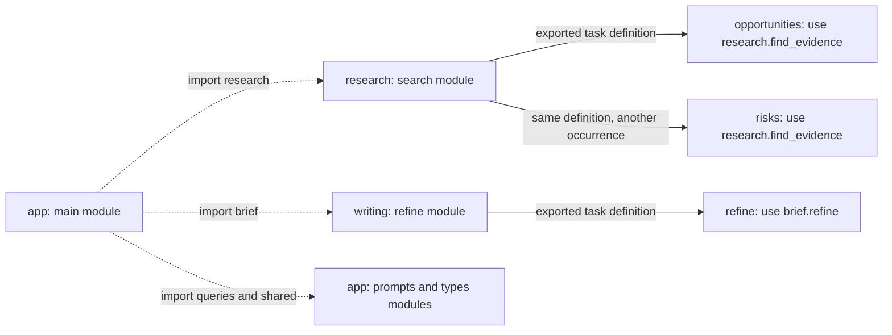
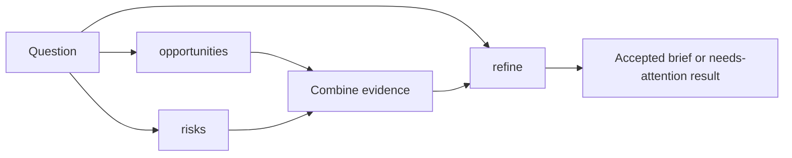
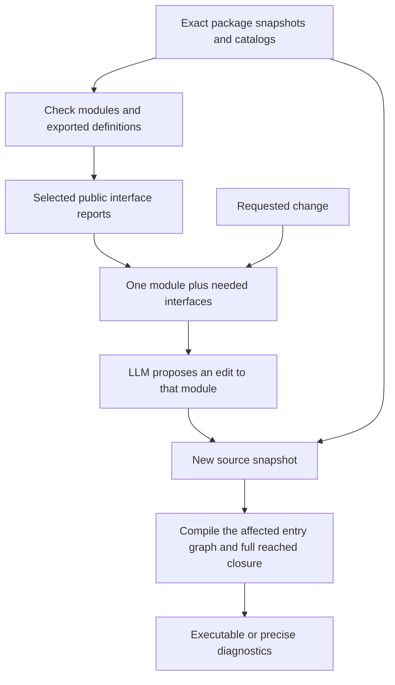
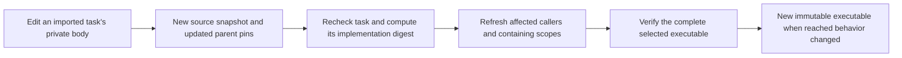

# HTLK IR Modules and Source Packages

**Status:** Draft 0.1\
**Companions:** [Compiler](compiler-spec.md) · [Syntax](htlk-ir-syntax-reference.md) · [Language](htlk-grammar-spec.md) · [Worked package](examples/modules/README.md)

## 1. The problem this design solves

A large program should not have to fit into one file, or into one conversation with a language model. Its author should be able to understand a research task's inputs, outputs, and acceptance checks without reading every retrieval and extraction step inside it.

HTLK already has the execution boundary needed for that: a **task** is a reusable composite graph. This revision adds an authoring boundary around its written definitions. A **module** is one source file with its own declaration names. A **source package** is a named, exactly identified collection of modules and dependencies, normally kept in a directory. A **dependency** is another source package explicitly selected by that package's manifest. A **manifest** is a small data file describing the package's contents and selections.

These boundaries answer different questions:

| Construct | What it organizes | Does it create running work? |
|---|---|---|
| Source package | Modules, their file locations, and exact package dependencies | No |
| Module | Names and visibility in one source file | No |
| Export | A declaration other modules may refer to | No |
| Import | A local name for another module's exported declarations | No |
| Task definition | A reusable composite graph | Not by itself |
| `use(task_name)` | One occurrence of that task inside a graph | Yes, when admitted |
| Edge | A complete value binding between ports | It supplies a dependency, not an import |

Importing a file never executes it. Importing the same task in two files never creates shared mutable state. Each `use` still creates a separate runtime occurrence under the existing scope rules.

The word **package** also occurs in *executable package*. They are not interchangeable. A source package contains editable files; an executable package contains the self-contained, checked graph produced from selected source definitions.

### 1.1 Version boundary

Draft 0.1 is the unified baseline for every HTLK-owned format in this specification. A format version selects the rules for interpreting its contents; matching version strings alone do not replace validation of those contents or the exact execution profile.

| Versioned item | Version in this release |
|---|---|
| Specification release and current source `ir_version` | `0.1` |
| Source bundle, source manifest, module interface report | `0.1` |
| Canonical document `ir_version`, executable `version`, evaluator core | `0.1` |
| MCP catalog and runtime journal record format | `0.1` |

The source header, every package manifest and bundle, module interface reports, and the canonical document all use `0.1`. The compiler accepts the current 0.1 rules, whether the program is supplied as standalone source, a source bundle, or a canonical document. Earlier drafts require explicit migration; changing a header alone does not migrate a program.

This baseline also names contract fields `preconditions` and `postconditions` in both source and canonical records. The version labels and record keys affect encoded bytes and content identifiers, so previous executable fingerprints, package pins, and saved runtime records cannot simply be relabeled. Recompile migrated source and recalculate its package pins. The execution mechanisms and contract evaluation order are retained. The runtime still consumes checked executables, not source files, and requires the exact recorded execution profile.

External identities are not HTLK format versions: MCP protocol versions, JSON Schema dialect identifiers, and third-party implementation versions retain their actual values. Illustrative HTLK source packages and built-in function libraries use `0.1` in this bundle.

## 2. Source layout and an example

Here is the [downloadable multi-file decision-brief example](examples/modules/README.md). It performs the same intended work as the single-file tutorial: two research requests followed by bounded drafting and review.

```text
modules/
  app/
    htlk_package.json
    src/
      main.htlk
      prompts.htlk
      types.htlk
  research/
    htlk_package.json
    src/search.htlk
  writing/
    htlk_package.json
    src/refine.htlk
  source_bundle.json
```

Each directory with an `htlk_package.json` is a separate source package. A nested ordinary directory is just a file grouping; it does not automatically introduce another package, another module namespace, or another runtime scope.

The beginning of `app/src/main.htlk` is this **module fragment**:

```htlk
ir_version = "0.1"

import queries from "self/prompts"
import shared from "self/types"
import research from "research/search"
import brief from "writing/refine"
```

`self` means this source package. `research` and `writing` are dependency aliases in the app's manifest. `search` and `refine` are module keys in those dependency packages, not filenames guessed from the importing file's directory.

The entry graph can then use these **scope-member fragments**:

```htlk
outputs = { result = shared.BriefOutcome }

nodes {
    opportunities = use(research.find_evidence)
    risks = use(research.find_evidence)
    refine = use(brief.refine)
}
```

The complete example supplies every required edge and the other nodes; this fragment alone is not a runnable graph. Notice that `research` in `use(research.find_evidence)` names an imported module. `opportunities` and `risks` name two different runtime occurrences.



**Module diagram 1 — Source references are not value edges.** Dashed arrows select modules during compilation. Solid arrows here associate definitions with their uses; they are not executable data bindings. The next diagram shows the actual runtime dependencies.



**Module diagram 2 — File boundaries disappear from execution.** This overview groups argument-building and result-selection nodes. The compiled graph retains the same task occurrences, loop, guards, and named port bindings as the single-file example; it does not execute a package or an import.

## 3. Import and export rules

### 3.1 Explicit public declarations

Declarations are private to their module unless prefixed with `export`. Exactly three declaration kinds can be exported: `task`, `type`, and `prompt`.

```htlk
export type Evidence = record { text = string }

export prompt greeting = "Hello {name}"

export task pass_evidence {
    inputs = { evidence = Evidence }
    outputs = { evidence = Evidence }
    nodes {}
    edges {
        edge result { from = inputs.evidence to = outputs.evidence }
    }
}
```

An export exposes a definition, not a port value. It is unrelated to the removed runtime `exports` block. Ordinary `outputs` and edges remain the only public value-binding mechanism.

An exported task may use private tasks, types, prompts, and pinned Rust libraries. Their definitions are still included when needed to execute the task; callers cannot name those private declarations. Privacy controls legal source references, not secrecy of executable contents. Exporting a type keeps structural typing: two equal shapes do not become incompatible because they came from different packages.

Graphs and `predicate_library` selections cannot be exported. A graph is an entry point, not a reusable source declaration selected by `use`; use a task for reuse. Rust library selections remain local declarations resolved against the compiler's fixed registry. Packages do not provide executable Rust plugins or new pure functions.

### 3.2 Exact lookup

An import has exactly this form:

```htlk
import evidence from "research/search"
```

The decoded string is `<package_alias>/<module_path>`. A module path has one or more slash-separated snake_case identifiers, such as `search` or `review/refine`. `self` selects the current package; every other package alias must be a direct key in that package's `dependencies` map. Transitive dependencies are not implicitly visible.

The compiler looks up that exact module key in the selected package's `modules` map. There is no relative-directory search, extension inference, index module, wildcard, fallback package, environment variable, URL fetch, or computed import string. `../search`, `/search`, backslashes, empty segments, and `self/search.htlk` are invalid import paths.

`evidence.find_evidence` selects the exported declaration named `find_evidence`. If a module exports `research.find_evidence`, its imported spelling is `evidence.research.find_evidence`; the part after the alias is an exact declaration name. Dotted declaration names are namespaces within one file, not instructions to load another file.

The same rule gives imported types such as `evidence.Evidence` and prompt references such as `render(&queries.greeting, { name = inputs.name })`. A referenced declaration must also have the right kind for its use. Importing a type does not make it callable.

### 3.3 No ambiguous names or initialization

Imports appear after the version header and before declarations. They are visible throughout that file and never inside a task or graph body. Each import alias is unique, is not a reserved root, and cannot equal the first component of any local declaration or library alias, including type namespaces. Local declaration names remain unique within a module. Resolution never chooses a name by search order or silently shadows another declaration.

Import aliases in different files are independent. A node's local ID does not become a module declaration; node references and static declaration references retain their distinct expression contexts. Importing a module twice under different aliases is legal, but does not duplicate its definitions or initialize it twice.

An import does not re-export its target. There is no `export import` or `export *`. An author may deliberately export a local type alias, or write and export a wrapper task with explicit ports and edges. Such a wrapper is an ordinary additional scope, not an invisible forwarding exception.

Every module has zero or one graph. The selected entry module must have exactly one. Imported modules must have no graph. A package may contain several independent entry modules; the host chooses one for each compilation. A standalone source string must contain exactly one graph and no imports. It can contain export modifiers in 0.1, but those modifiers do not create consumers or retain otherwise unused definitions.

All module-import cycles fail, even if one import appears unused or only exposes a type. Task-containment and type-alias cycles also fail across files. The import dependency graph, the task-definition graph, and each scope's execution-dependency graph are different graphs, and all must satisfy their own existing or specified acyclicity rules.

## 4. Source package and bundle records

These are compiler input records, not additional declarations in the IR. All record fields below are required; unknown fields and duplicate decoded JSON keys fail. `map(T)` means exact string keys containing T values. A `Digest` is `sha256:` followed by 64 lowercase hexadecimal digits.

```text
SourcePackageManifest {
    manifest_version: "0.1",
    package_name: qualified_name,
    package_version: nonempty_string,
    modules: map(SourcePath),
    dependencies: map(Digest)
}

SourcePackage {
    manifest: SourcePackageManifest,
    sources: map(SourceText)
}

ModuleRef {
    package_digest: Digest,
    module_path: ModulePath
}

SourceBundle {
    format: "htlk_source_bundle",
    format_version: "0.1",
    entry: ModuleRef,
    packages: map(SourcePackage)
}
```

`modules` maps logical module paths to package-relative source paths. For example, `"review/refine": "src/review/refine.htlk"` is an explicit mapping, not a naming convention the compiler guesses. A source path consists of zero or more snake_case directory identifiers and a snake_case filename ending in `.htlk`, separated by `/`. The maps are case-sensitive. Absolute paths, dot segments, backslashes, and alternate spellings are rejected rather than normalized.

Each manifest has at least one module. Module source paths are unique. Their set must exactly equal the keys of `sources`, and every source is valid UTF-8 text without a byte-order mark. Non-source files such as a README, tests, or illustrations are not included in `sources` or the source package digest. This is a compilation snapshot, not a hash of every file on a disk.

`package_name` is a qualified snake_case name. `package_version` is a nonempty descriptive label; the compiler does not interpret version ranges or choose upgrades. Dependency keys are snake_case aliases other than `self`. Each value selects one exact supplied package digest. The target's own manifest supplies its name and version; those fields are not duplicated in the dependency map.

The bundle contains exactly the entry package and the transitive closure of its manifest dependencies. Following dependencies must find every selected package, with no cycles and no extra package entries. A dependency's own aliases are resolved in that dependency's manifest, never in the caller's manifest. Two exact versions of one named source package may coexist through different selections. Their reached MCP bindings and linked-library requirements must still be compatible under the shared compiler/runtime profile.

### 4.1 Exact source identity

A source package digest binds the complete manifest and the exact source text, including comments and line endings:

```text
source_package_digest(package) =
    "sha256:" + lowercase_hex(SHA256(deterministic_cbor([
        "htlk.source_package", "0.1", package.manifest, package.sources
    ])))
```

Use the existing core deterministic CBOR rules for this array, its text strings, and its maps. Decode JSON first with duplicate-key rejection. Manifest layout and JSON map order do not affect the digest, but decoded source characters do. The formula is separate from the executable's `record_digest` formula; `source_package` is not a new executable record kind. Recompute every package-map key and reject any mismatch.

Dependency digests are part of the manifest. Updating a dependency requires a new parent snapshot and pin. There is no automatic selection of a new package because it has the same name or version label. A digest establishes content identity, not trusted authorship or permission to call a tool.

### 4.2 The host reads directories; the compiler reads the snapshot

The **host** is the application invoking the compiler. It reads each selected directory's `htlk_package.json`, reads only the mapped source files, resolves exact dependency snapshots, and builds the bundle before calling the compiler. A filesystem adapter must reject symlink source files or symlink components beneath a selected package root, non-regular files, and paths escaping that root. It must capture stable contents: a file changed while being collected must be reread consistently or cause collection to fail. Never let verification hash one file revision and parsing read another.

The compiler receives the snapshot as its IR argument plus the same three MCP catalogs as before. It does not access directories, consult a package registry, download dependencies, discover MCP servers, or run package initialization/build scripts. A registry or local cache can be added to a host later without changing these language rules.

MCP server aliases remain aliases in the supplied catalogs. They are not module import aliases or source-package dependencies. The literal `mcp.tool("research", "lookup")` is resolved in those catalogs even when its file also imports a module named `research`. This release adds no per-package catalog overrides or silent server remapping. Incompatible selections fail compilation; source package pins do not grant runtime authority.

## 5. Compiler checks and generated interfaces

### 5.1 Compile a selected entry point

`compile_ir(ir, catalogs)` now accepts `SourceBundle` in addition to standalone source and canonical documents. Bundle validation checks all package records, digests, source UTF-8, and 0.1 version headers. Header checking does not require parsing the rest of a file. Starting at `entry`, source analysis visits only that module and its transitive imports. It parses every visited module and validates all declarations in those visited modules, including private and unused declarations. Unvisited module bodies are not syntax/type checked by this compilation; their presence in a correctly hashed snapshot is not a claim that they compile.

Resolution proceeds from imported modules to their importers. It checks visibility, declaration kind, type aliases, prompt parameters, task contracts, MCP selections, and the existing graph invariants. The final executable contains exactly the selected entry graph's reached definition closure, not every export of every imported module. Unused valid declarations are checked but omitted from executable identity.

Compiler front-end configuration must set finite ceilings for total source bytes, package count, total mapped module count, and dependency/import depth, and enforce them before unbounded allocation or traversal. Exceeding a ceiling is an error, not permission to omit imports or return a partially checked executable. These collection limits are not new runtime execution capabilities or source-granted budgets.

### 5.2 Ask for a module's public interface

An **interface report** is a compiler-generated description of exported declarations. Its purpose is to let a person or LLM compose a caller without receiving the implementation source. It is supporting report data, not an executable and not a substitute for verification.

```text
inspect_module(
    ir: SourceBundle,
    module: ModuleRef,
    symbols: list(string),
    catalogs: MCPCatalogInputs
) -> ModuleInspectionSuccess | CompilationFailure

ModuleInspectionSuccess {
    interface_version: "0.1",
    module: ModuleRef,
    profile: Profile,
    available_exports: list({ name: string, kind: "type" | "prompt" | "task" }),
    exports: list(ExportSummary),
    diagnostics: list(Diagnostic)
}

ExportSummary =
    { kind: "type", name: string, type: CanonicalType }
  | { kind: "prompt", name: string,
      parameters: map(CanonicalType), template_digest: Digest }
  | { kind: "task", name: string, description: string,
      inputs: map(Port), outputs: map(Port), scope_digest: Digest,
      preconditions: CanonicalExpression, postconditions: CanonicalExpression,
      limits: Limits }
```

`Profile`, `CanonicalType`, `Port`, `CanonicalExpression`, and `Limits` are the existing compiler/CDDL forms. The profile records the exact validation and execution interpretation used for inspection. Task descriptions default to an empty string. Omitted contracts normalize to true and omitted local limits to an empty map. Prompt parameter types are resolved, including inferred string parameters. No prompt body or task body appears in this report. Types are structural, so resolving a private type alias does not require exporting that alias.

The module must belong to the validated bundle. `available_exports` lists the names and kinds of all its exported declarations. `symbols` is a unique list of exact exported names whose full summaries should be returned; an empty list requests only the index. Unknown or private names fail. This lets a host first discover names, then request only the interfaces needed for an edit, without asking an LLM to read the implementation.

The compiler validates the requested module and its import closure, including all declarations there, before filtering the report. The selected module may have zero or one graph; a graph is checked but is never an export. The bundle entry only selects the package dependency closure for this inspection; it is not additionally compiled as an entry graph. Both returned lists are sorted by name. No implicit truncation, wildcard expansion, inferred behavioral guarantee, or LLM-authored interface is accepted as verified report data.

Task `preconditions` checks public inputs. Task `postconditions` may mention direct-child outcomes under the existing language rules; that expression is included as a completion requirement, not offered as a predicate executable by the caller without the task body. Local `limits` can be tightened by enclosing scopes and runtime policy. A report therefore does not promise that every valid input will succeed or that a task has no external effects. The exact implementation and its reached MCP requests remain subject to compiler and runtime checking.

The report's `ModuleRef` ties it to an exact source package snapshot. `scope_digest` ties a task summary to its complete normalized implementation closure. A host must match the source identity and profile when using a report to prepare an edit, and regenerate the report when a selected catalog descriptor/schema or linked implementation changes. The compiler always resolves actual definitions against the catalogs supplied for the current request; a report does not override them. There is no handwritten interface file that can disagree with its implementation, no stub that authorizes missing definitions, and no interface-only path to a runnable executable.

### 5.3 Keep the LLM's context small without weakening verification

An LLM's **context** is the material supplied to it for one request. The compiler's available source is a separate concern: it can verify many files that were never placed in that model request.

For one edit, the host should supply the selected module, the relevant exported-symbol reports from its direct imports, the applicable tool descriptors if the edit makes direct MCP calls, the objective, and targeted diagnostics. A package/module index can help the model discover a relevant component; open its implementation only when that component must be changed or investigated.



**Module diagram 3 — Small authoring context, complete verification.** The model sees a selected view. The compiler still checks the actual implementations and their connections before an executable can be produced. A model proposal does not install itself into a running graph.

This limits implementation text in a model request; it cannot guarantee that every public interface fits every model. Huge port records and enormous contracts are still huge interfaces. Split responsibilities, select fewer exported symbols, and use explicit typed boundaries. Do not silently remove checks or substitute an invented summary merely to meet a token budget.

Source context is also different from the data sent to an LLM tool during execution. Splitting a graph across files does not shorten a giant prompt or evidence object passed to that tool. Author those runtime inputs explicitly with suitable selection, retrieval, or summarization nodes; module imports do not perform those transformations.

## 6. Identity, incremental work, and runtime composition

A **cache** stores previously calculated results to avoid repeating work. A **reverse-dependency index** records who depends on a definition, so a change can find its affected callers. Neither is an additional source of truth.

Source package digests are conservative: changing a comment changes the snapshot and requires its parent pins to be updated. Executable identity is narrower. Paths, package names/versions, module aliases, import order, and export markers are erased after resolution. With the same graph ID, normalized reached definitions, catalogs, and profile, a valid single-file and multi-file program MUST produce identical executable bytes.

Changing a private prompt used by a task changes that task's reached implementation and the executable, even if its public ports remain identical. A cached type check based only on the unchanged port signature is not a license to retain the old task body. Conversely, an unrelated valid module edit can change source snapshot digests while leaving the selected executable unchanged.

Implementations may cache parsed modules and checked definitions, but keys must account for source content, source-language version, all resolved imported identities, selected catalog/schema content, and the fixed validation profile. Rebinding a dependency alias must invalidate a resolution based on its old target. Whole-program checks, including containment cycles, complete schema resolution, linked-library compatibility, and expanded-node limits, still apply to the selected result. A reference implementation may initially recheck everything; caching is optional.



**Module diagram 4 — A stable signature is not a stable implementation.** Reverse dependencies identify affected compilation work. This does not invalidate accepted artifacts or mutate any existing run.

Binary `join_graphs` remains available for combining already compiled graph documents through public output-to-input bindings. Imports compose source definitions before execution; joins compose complete executable graphs. Both lower to the existing scope operation. Editing a package, updating a pin, or compiling new source does not modify a live run. A live extension must still satisfy the existing append-only installation rules; replacement work starts a new run.

## 7. Locations, diagnostics, and required tests

Multi-file source locations add a `source` field to the existing byte spans:

```text
SourceLocation =
    { kind: "inline" }
  | { kind: "module", package_digest: Digest,
      module_path: ModulePath, source_path: SourcePath }

SourceSpan {
    source: SourceLocation,
    start_byte: nonnegative_integer,
    end_byte: nonnegative_integer
}

DiagnosticLocation =
    { kind: "source_span", span: SourceSpan }
  | { kind: "source_bundle_path", pointer: JSONPointer }
  | { kind: "canonical_record_path", pointer: JSONPointer }
```

Offsets are UTF-8 byte offsets within that one source file, with an exclusive end; they must lie within its encoded length and begin/end at character boundaries. Compiler `SourceMapEntry` records add the same `source` field. Canonical-input compilation still has an empty source map. `JSONPointer` is an RFC 6901 pointer, with the empty string identifying the whole document. A manifest or bundle error points into the supplied bundle instead of pretending to have a source-text span. A canonical-record pointer identifies the submitted or proposed canonical graph document; join diagnostics identify the relevant operand or composed result in the message. These report locations are not executable fields and do not affect fingerprints.

Name/type errors should point to the use site and relate the exported declaration's location. An import cycle diagnostic includes the involved import locations; a package dependency cycle relates the manifest dependency paths. Deterministic diagnostic ordering uses location kind, package digest, module path, start offset or document pointer, then code, all in bytewise string order where applicable.

Add `C_SOURCE_BUNDLE`, `C_PACKAGE_PIN`, `C_IMPORT`, `C_IMPORT_CYCLE`, `C_VISIBILITY`, and `C_SOURCE_LIMIT` to the existing diagnostic families. Wrong declaration kinds continue to use `C_NAME`; cross-module type errors use `C_TYPE`; existing task-containment and wait-dependency errors keep their existing families. Failures return no partial executable or purportedly verified interface report.

Required implementation tests include:

| Case | Required result |
|---|---|
| Split the worked single-file program into its supplied modules | Identical canonical document and executable bytes under the same profile/catalogs |
| Import a private declaration or traverse a child's internal node | Reject; neither module import nor task use weakens scope privacy |
| Two imports, local namespace collision, wrong symbol kind | Resolve exact noncolliding aliases; reject collisions and wrong kinds |
| Missing file/module/package, modified pinned contents, duplicate JSON key | Reject before producing an executable |
| Import a graph-bearing module; use an indirect dependency without a direct pin | Reject |
| Directory traversal, symlink escape, extension inference, computed import | Reject; never probe or fetch a guessed target |
| Module/type/task cycles crossing files | Reject with related locations |
| A private implementation changes but exported ports do not | Update the reached implementation and callers; never link stale bodies |
| Comments or file locations change but normalized reached work does not | Source digest changes; executable identity stays the same |
| Two versions of a source package are selected | Permit distinct exact identities; still reject incompatible MCP/profile requirements |
| A module passes inspection but its caller connects incompatible ports | Reject the caller; inspection is not whole-program verification |
| An old interface report accompanies a new source pin | Reject its use as a report for the new snapshot; regenerate |
| New compilation while a run is active | Existing run remains unchanged absent a separately valid installation |

The supplied document checker validates syntax, example splitting, source-bundle digests, links, and captions. It is not an implementation of the semantic compiler, an incremental build system, or the runtime. The behavioral and byte-equivalence tests above remain implementation acceptance requirements.
