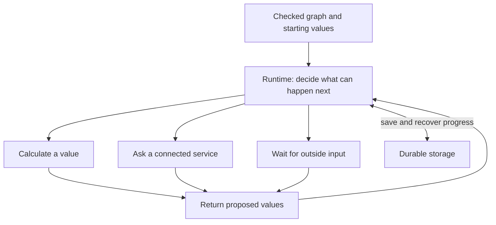
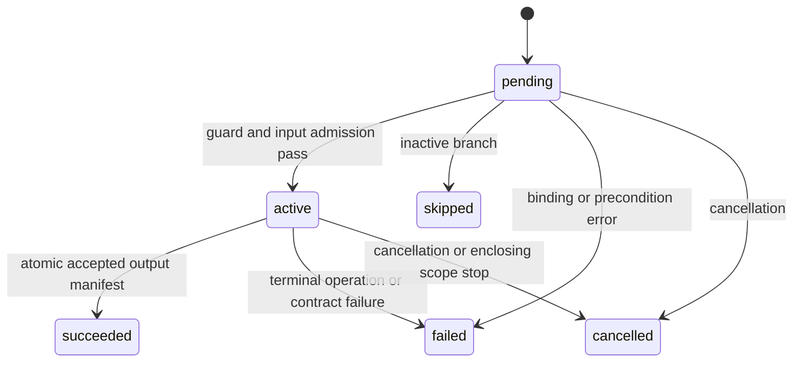
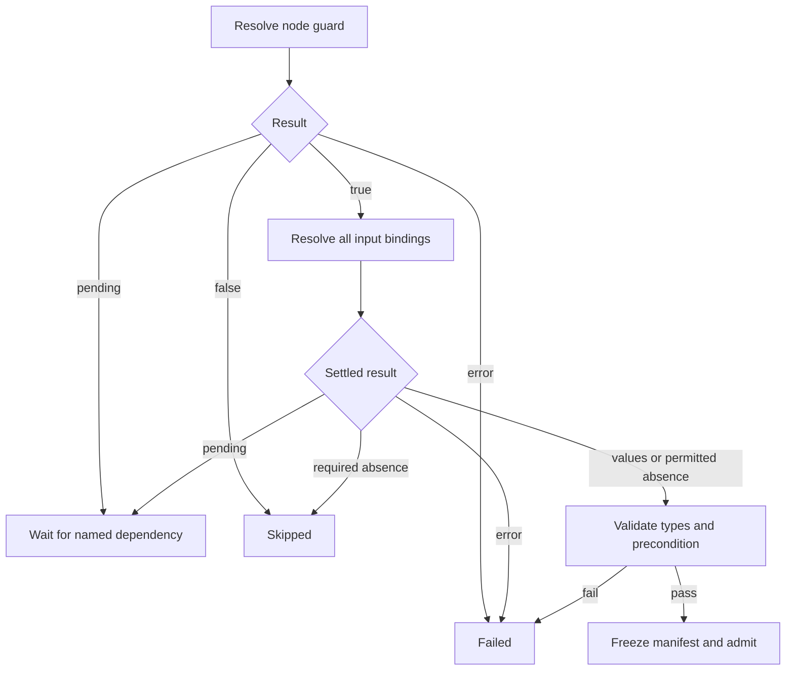
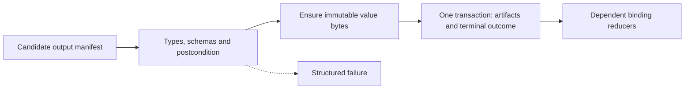
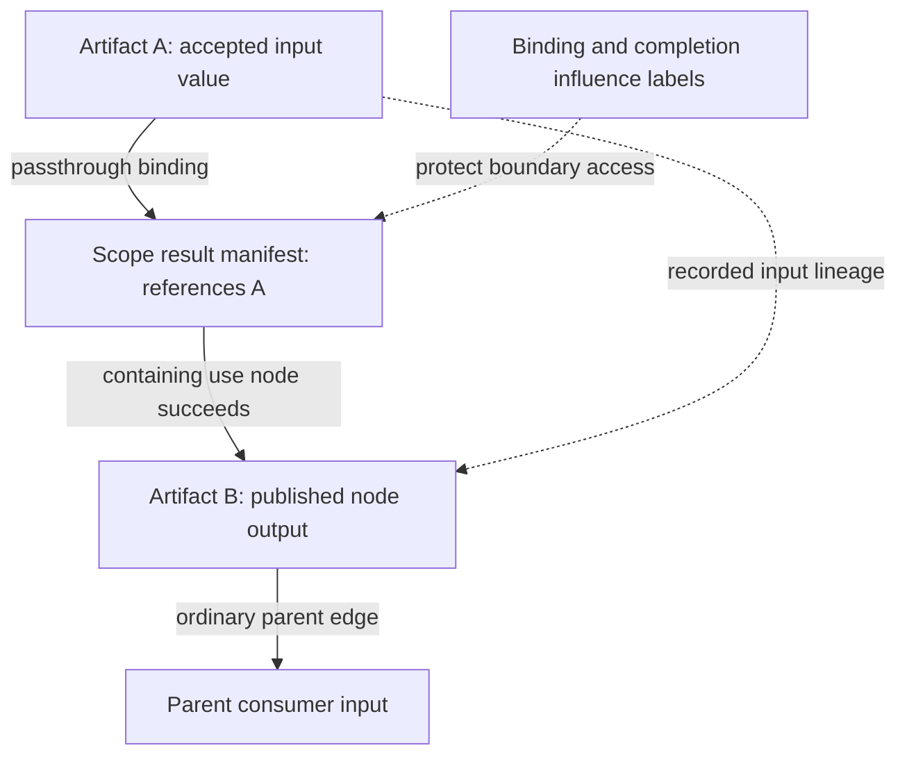
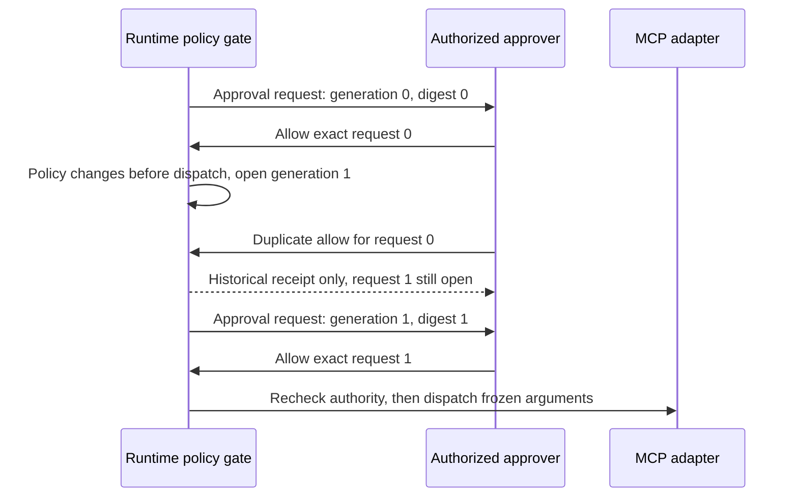
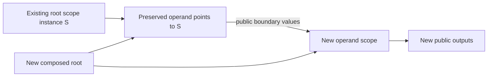
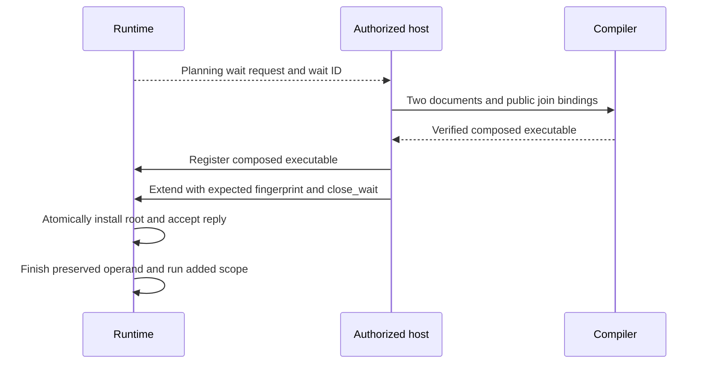

# HTLK Runtime Specification

**Status:** Draft 0.1\
**Execution core and record format:** 0.1, the unified HTLK baseline. Source modules/packages are resolved by the compiler; see [Modules](htlk-modules-spec.md).
**Companions:** [Language](htlk-grammar-spec.md) · [Syntax](htlk-ir-syntax-reference.md) · [Compiler](compiler-spec.md) · [Changes](CHANGELOG.md)

## 1. Minimal execution model

The **runtime** is the program that carries out an HTLK graph. A graph describes work as named steps connected by the values they pass to one another. For example, one step might read a question, a second ask a language model to draft an answer, and a third ask a person to review it. The runtime decides when each step has the information it needs, starts eligible work, checks returned values, and records the result.

One execution of the whole graph is a **run**. Two people submitting different questions create two runs, even if both use the same graph. The **host** is the application that starts runs and presents their results; it might be a command-line program, a web application, or another service.

This document explains the runtime from the beginning. It does not require knowledge of the compiler or a particular database. Formal record definitions and algorithms appear after the concepts they describe.

### 1.1 What the runtime receives

The graph author writes **HTLK IR**, the language used to describe the work. IR stands for *intermediate representation*: a structured description between the author's intent and execution. A separate program, the **compiler**, checks that description and converts it into a package the runtime can read.

The package is called an **executable**. Here, this does not mean a native application that the computer can launch by itself. It means the checked graph description plus the definitions needed to interpret it. It is **immutable**: its contents do not change once created. Changed instructions produce another package.

The runtime also receives the run's starting values, such as the question to answer. It keeps an **input manifest**, a named inventory of those values and of any permitted missing inputs. A manifest tells the runtime which value supplies each input; it is not another program.

“Verified” means the package passed the specified structural and consistency checks. It does not mean an eventual model answer is factually correct or that an external service will respond.

### 1.2 The five kinds of work

| Kind | Meaning | Example |
|---|---|---|
| Pure evaluation | Calculate a value using supplied inputs and fixed functions, without contacting another system or changing outside data. | Insert a person's name into a greeting. |
| MCP request | Ask a connected service to perform an operation using the Model Context Protocol, a standard request-and-response format. | Ask a model service to draft an answer, or read a document. |
| Scope | Execute a group of related steps behind its own named inputs and outputs. A reusable group is a task. | Run the research task that contains query construction, retrieval, and extraction. |
| Loop | Repeat a group of steps, explicitly carrying selected results into the next repetition. The number of repetitions is bounded. | Revise a draft using the previous review's feedback. |
| Wait | Save a request for outside input and pause that step until a valid reply or its deadline. | Ask a person which audience the answer should address. |

A **node** is a named occurrence of one of these kinds of work. An input or output **port** is a named place where a value enters or leaves it. An **edge** connects one source port to one destination port. A **binding** is the runtime's decision about which edge, if any, supplies a particular destination.

A **condition** calculates true or false. A **guard** uses a condition to decide whether a node runs or an edge supplies a value. A **precondition** checks inputs before work starts; a **postcondition** checks proposed results before they are accepted. These checks are written as `when`, `preconditions`, and `postconditions` in the IR. Their exact evaluation order is defined below.

### 1.3 What “durable coordinator” means

The runtime **coordinates** the work: it checks readiness, sends requests, accepts results, and makes the next dependent steps eligible. It does not have to perform every computation itself. A **worker** executes delegated work; an **adapter** translates an HTLK operation into the connected service's protocol messages.

The runtime is **durable** because it saves the progress required to recover after its process stops and restarts. A process is a running instance of a computer program. Recovery relies on that saved storage remaining available; durability is not a claim that data survives destruction of every storage copy.

For example, if a model reply was already saved, recovery should finish checking that reply instead of asking the model again. If a request may have reached a remote system but no reply was saved, the runtime records that uncertainty and follows the replay-safety rules in section 7.

It saves several different facts:

| Saved fact | Plain-language meaning |
|---|---|
| Accepted value | A returned value that passed its checks and is now available for authorized use. Such a value and its history are called an artifact. |
| Terminal outcome | The final status of a node: succeeded, failed, skipped, or cancelled. “Terminal” means that status will not change later. |
| Dispatch record | Evidence about an external request: whether sending was prepared, may have happened, or produced a saved response. “Dispatch” means send the request. |
| External reply | A response received from a person, service, or event integration. |
| Graph extension | A verified addition to an unfinished run, preserving its existing work. |

### 1.4 Why one authority controls saved changes

A **database** stores records so the program can read them again. A **transaction** groups related database changes so they take effect together or not at all. To **commit** a transaction means to make that group of changes authoritative and durably saved.

Suppose a drafting node returns two outputs. The runtime must not mark it succeeded while only one output is recorded as available. It saves the complete accepted output inventory and the succeeded status together. Another step sees either the accepted result or no accepted result, not a half-published success. This all-or-nothing property is called **atomicity**.

There is one **transactional authority per run**: one component at a time is entitled to make these official updates. Several workers may run concurrently, and authority can transfer after a restart, but a former owner must no longer be able to approve changes. Section 14 defines the ownership protection.

These transactions cover HTLK's own records. They do not make a remote email, file write, or other external action reversible.



**Diagram 12 — The runtime carries out the plan and remembers its progress.** Computations and external replies propose values. The runtime checks them and saves accepted results before making them available to dependent work. Groups of steps and loop repetitions use these same execution and recording rules.

### 1.5 A small implementation is sufficient

One running program can contain the coordination logic and use one transactional database. Large values may be stored separately as **blobs**, meaning sequences of bytes such as a document or image. A byte is a basic unit of stored data containing eight binary digits.

A blob can be **content-addressed**: its storage name is derived from its contents using a hash function. The same contents can share storage without confusing the separate histories of the nodes that produced them. Section 8 distinguishes a value's content identity from its producer identity.

The specification does not require each supporting responsibility to be a separate program:

| Responsibility | What it does | What is not required |
|---|---|---|
| Scheduling | Choose eligible work to start. | A separate scheduler service. |
| Queuing and event delivery | Hold work notices and tell other components about changes. | Separate queue servers or an event bus. |
| Caching | Keep reusable calculations or lookup results. | A separate cache service. |
| Policy checking | Decide whether the caller may perform the requested action. | A separately deployed policy service. |
| Graph-version tracking | Remember which checked graph package a run uses. | A separate graph-version manager. |

These responsibilities must still obey the rules below. They are simply not required to introduce additional services or additional meanings for how a graph executes. The phrase **execution semantics** means those rules about what the graph does.

Finally, **deterministic replay** means that using the same saved inputs, external results, and decisions reconstructs the same bindings and outcomes. A fresh model call can return a different answer. Saving graph packages in a consistent format does not make outside services deterministic.

## 2. Registration and trust

**Registration** checks and saves a graph package before a run can use it. It is similar to accepting a document into a controlled library: the runtime needs to know both that the document is well formed and whether the deployment trusts its source. Registration does not execute graph nodes.

The package is stored using **CBOR**, short for *Concise Binary Object Representation*, a compact way to encode lists, named fields, numbers, text, and bytes. **Encoding** turns values into stored bytes; **decoding** reads those bytes back into values. The outer package is the **envelope**; its `payload` field contains the encoded graph document. **Canonical** or **deterministic** encoding means following one specified set of representation choices, so matching normalized documents have matching bytes.

Several terms in the checking procedure have specific meanings:

| Term | Meaning here |
|---|---|
| Record or object | A group of named fields, such as a question and its audience. A field is one named part of that group. |
| List or array | Values kept in an ordered sequence. A map instead looks up values by names, called keys. |
| Boolean and null | A Boolean is true or false. Null is an explicitly supplied empty-value marker, not an omitted input. |
| JSON | JavaScript Object Notation, a text format for objects, lists, text, numbers, Booleans, and null. |
| Hash or digest | A fixed-size summary calculated from bytes. SHA-256 is the algorithm HTLK uses. It helps detect changed contents; it is not encryption. |
| Fingerprint | The digest used to identify the complete executable package's graph contents. |
| Domain separation | Include a purpose label when hashing so a graph identifier is not confused with, for example, a value identifier. |
| Attestation | Evidence about who produced or approved a package, such as a digital signature checked against a trusted key. |
| Schema | Rules describing allowed data, such as a required text field named `question`. A validator checks data against those rules. |
| Profile | The exact versions and settings of the functions, format interpreters, and policies needed to give this package its defined behavior. |
| Reachable closure | Every definition the root graph refers to, plus every definition those definitions refer to, continuing until none is missing. |
| Dependency DAG | A directed acyclic graph: arrows show prerequisites, and no chain loops back to make a step wait on itself within one iteration. |

**UTF-8** is the text encoding used for names and strings. Unknown fields, duplicate names within one record, and invalid text are rejected rather than guessed at. “Nesting” means putting lists or records inside other lists or records; limits prevent an input from consuming unbounded memory.

With these terms, `register_graph(executable_bytes, attestations)` performs the following checks before saving the registration:

1. Enforce envelope byte, nesting, string, and collection limits before unbounded allocation.
2. Decode exactly one deterministic CBOR envelope; reject duplicates, unknown fields, invalid UTF-8, tags, noncanonical encodings, and trailing bytes.
3. Require the supported format/version and verify the domain-separated fingerprint over the exact payload bytes.
4. Decode and independently validate the nested canonical document under the same encoding and size rules.
5. Recompute every content-addressed scope/template/binding record and external JSON digest; verify exact reachable closure and all references.
6. Run the shared graph verifier: types, expression contexts, data/control dependency DAGs, guards, loops, options, schema validators, and operation port definitions.
7. Match the executable's core/library/engine identities against linked implementations. Validate any compiler attestations required by deployment trust policy.
8. Commit the immutable envelope under its fingerprint.

A digest detects changed bytes; it does not authenticate the producer. Attestations are separate from executable identity. An authorized signature never allows an invalid graph to skip structural verification.

Registration is **idempotent** for the same verified envelope: repeating that request has the same registration result rather than creating another logical registration. Same fingerprint with different bytes is an integrity failure. Build times, source maps, detached signatures, and observation records are stored separately, so legitimate provenance differences cannot conflict with a semantic registration.

An **index** is a lookup aid, such as a list of consumers for each output. The runtime rebuilds indexes from the saved scope definitions; an index is not a second graph description that may disagree with them. SQLite is an example of a database embedded in an application. Its rows, or compact lookup arrays in memory, may hold such derived information. The portable executable remains the canonical CBOR package; run events and result artifacts are saved separately.

## 3. Identities and immutable inputs

A graph can contain two occurrences of a task, and each occurrence can execute once per loop repetition. Those executions need different names in saved records even when their source code and values are identical.

An **identifier**, often abbreviated ID, is the value used to name one such thing unambiguously. An **invocation** is one node occurrence executing in one scope instance. An **attempt** is one sending of an MCP request within that invocation. Retrying a request creates another attempt, not another invocation.

For example, the `review` node in iteration zero and the `review` node in iteration one are different invocations. Two network attempts to send iteration one's review request belong to the same invocation. These identities exist before the runtime has selected all input values.

In the formulas below, `hash` computes an identifier from the listed values. Quoted words are literal labels; `...arguments` means all the remaining arguments, not an HTLK source construct. `opaque` means callers must treat an identifier as a name rather than infer meaning from its spelling.

SHA-256 produces 256 binary digits. `lowercase_hex` writes the resulting bytes with the digits `0`–`9` and letters `a`–`f`; `+` joins text in these explanatory formulas. Square brackets describe a list to encode. A generation or iteration number is an ordinary counter, and `zero_based_index` means the first repetition is numbered 0.

Identity exists before input binding:

```text
run_id          = opaque host-generated identifier
root_scope_id   = hash("root_scope", run_id)
invocation_id   = hash("invocation", scope_instance_id, local_node_id)
child_scope_id  = hash("child_scope", invocation_id)
iteration_id   = hash("iteration", loop_invocation_id, zero_based_index)
attempt_id     = hash("attempt", invocation_id, one_based_attempt_number)
wait_id         = hash("wait", invocation_id, wait_purpose, generation)
extended_root_id = hash("extended_root", run_id, extension_number)
```

Define `hash(domain, ...arguments)` as `"sha256:" + lowercase_hex(SHA256(deterministic_cbor(["htlk." + domain, "0.1", ...arguments])))`. Host run IDs are strings; local IDs are identifiers; counters are nonnegative integers. Input waits always use generation zero. Approval generations start at zero and increase transactionally whenever a replacement approval request is created; a generation and its request are never reused or overwritten. Initial root IDs and extension-root IDs use distinct domains. Display paths are derived labels, not identifiers. Each runtime scope stores its immutable definition digest. A node stores the compiler-defined digest of its entire canonical node record and its origin executable fingerprint.

An invocation begins **pending**, meaning it has not yet been admitted to execute, without an input hash. **Admission** is the step that checks readiness and accepts a fixed set of inputs for that invocation. Once admitted, its complete input manifest is frozen exactly once and its `input_hash` is recorded. Attempts reuse that manifest. The active enclosing graph fingerprint is not part of invocation identity; wrapping an existing root in an additive composition must not rename or repeat its effects.

Input manifests represent each declared port explicitly as either `{ state: "value", artifact_id: ... }` or `{ state: "absent" }`. Unknown/pending is not a frozen input entry. A present null is a value artifact, not absence.

The host can supply a value directly or name an existing accepted artifact. A **tagged variant** uses a field such as `kind` to say which of those forms it is using. The host input has these two forms:

```text
InputValue =
    { kind: "inline", value: RuntimeValue }
  | { kind: "artifact", artifact_id: string }
```

This avoids mistaking an ordinary JSON object for an artifact handle. A **handle** is a reference used to locate something; it is not the referenced value itself. Artifact input references are checked for access permission, unchanged contents, and compatibility with the port type. Computations receive the value, not a handle that silently grants additional storage access.

The input hash covers port names, types, requiredness, presence, typed content digests, and security-label digests. Artifact provenance IDs remain in the manifest but do not change the content hash merely because the same accepted value was copied. Caching, if implemented, must also check authorization and operation identity; a hash match grants no reuse permission.

A **security label** is a policy-assigned marking such as `confidential`; the deployment defines what access it permits. **Influence labels** also record protected information used to decide whether a result exists, not just information copied into its text. Each binding and invocation retains its influence-label set, including labels associated with a decision that produced absence. The invocation freezes its input/guard influence labels alongside its manifest, and includes that set in the input hash. A scope boundary retains labels for its binding and completion decisions even when its manifest aliases an existing artifact. Access through that boundary requires both boundary-label and artifact-label authorization; aliasing cannot strip a control dependency's protection.

## 4. One invocation lifecycle

A **lifecycle** is the set of statuses a node execution can pass through. Here, `pending` means it has not been admitted; `active` means it has been admitted but not finished; the other four statuses are final outcomes. A status called `active` can include waiting for a reply—it does not necessarily mean a processor is currently calculating.

An invocation has one of `pending`, `active`, `succeeded`, `failed`, `skipped`, or `cancelled`. Terminal outcomes never transition to a different status.



**Diagram 13 — Invocation outcomes stay immutable.** Retrying an MCP request occurs inside active; it does not turn a terminal failed invocation back into running.

A saved **reason field** explains why a pending or active invocation has not finished: for example, waiting for a worker, awaiting approval, delaying a retry, or checking a proposed result. These reasons do not require separate node lifecycle states. A **lease** is a temporary permission for a worker to own a piece of work. **Dispatch ambiguity** means the runtime does not yet know whether an external request took effect. MCP attempt records track delivery, leases, and dispatch ambiguity independently.

Skipped means the node guard was false or a required input settled absent. Failed means an active selected dependency, expression, precondition, operation, budget, or acceptance check failed. Cancelled means the coordinator intentionally stopped the invocation. No ordinary output is accepted for failed, skipped, or cancelled nodes.

The terminal `status(@node)` and `error(@node)` functions use these immutable outcomes. They never observe transient attempt failures. Recovery consequently starts only after retries are exhausted or forbidden.

## 5. Binding reducer

A destination may have several incoming edges, each with a condition. The runtime needs one consistent procedure to select the supplied value. This procedure is the **binding reducer**: “reduce” here means turn a collection of candidate edges into one decision.

For example, a result input might have one edge for a successful primary answer and another for a fallback answer. The reducer does not choose whichever arrives first. It waits until it knows which edge conditions are true, then requires at most one true candidate.

A **guard** is a condition that returns true or false. A node guard controls whether a node runs; an edge guard controls whether that edge can supply its destination. A **producer** is the node supplying a value, and a **consumer** is a node receiving it.

Every source port has one state:

| State | Meaning |
|---|---|
| Pending | Its producer may still supply a value or a terminal result. |
| Value | A committed typed artifact exists, including explicit null. |
| Absent | Producer succeeded without that optional output, or producer was skipped. |
| Unavailable | Producer failed or was cancelled; carries the causal outcome. |

Loop carried and scope inputs are already value/absent when a scope opens. Public outputs and next values are proposed bindings until the enclosing scope commits.

Each edge guard evaluates lazily under the language's expression rules. For one destination:

1. Evaluate all candidate guards, in canonical edge-ID order, retaining pending or error results.
2. While any guard is pending, the destination remains pending. This prevents early publication before a later candidate creates a conflict.
3. Once all guards settle, an error fails the binding. If several error, select the lowest edge ID as the primary diagnostic and retain all causes.
4. More than one true guard yields `E_BINDING_CONFLICT`. No source is selected or dispatched through that destination.
5. No true guard resolves the destination absent. False edges do not wait for their source values.
6. One true guard selects that complete source. Pending waits; value transfers after authorization and validation; absence remains absence; unavailable yields `E_DEPENDENCY`.

Destination records become final only once. Input destinations, public output destinations, and loop next destinations all use this algorithm.

Node admission first resolves its node guard. False skips immediately without evaluating its inputs. An erroneous guard fails. True resolves all input destinations. Once all have settled, binding errors fail before required-absence checks; any required absence then skips; otherwise type validation and `preconditions` run before the manifest is admitted. If several inputs fail, the lowest port name in decoded UTF-8 order is the primary cause; retain the other causes. Waiting for all relevant bindings gives stable error/absence precedence independent of worker completion order. Errors from inputs of an already skipped node do not fail another node or its scope.

The compiler checks both data dependencies and condition dependencies so two nodes cannot secretly wait on each other within one iteration. External waits and operations have finite deadlines. If an unfinished scope has nothing running, no pending reply or timer, and no legal next step, the coordinator records `E_INVARIANT`. This error means an internal execution rule has been violated; the runtime must not leave the run hanging without an explanation.



**Diagram 14 — Uniform admission.** A node guard can suppress zero-input work. Once active, all inputs use the same deterministic binding reducer before any effect is dispatched.

## 6. Evaluator and pure nodes

An **expression** is a calculation such as `length(inputs.question) > 0`. The **evaluator** is the code that calculates its result. A function's **signature** describes the inputs it accepts and the result it returns, including whether an input or result may be absent. The same evaluator is used for pure nodes and conditions. It returns a value, legitimate absence, pending, or an error. Pending and unavailable are execution conditions; they are never passed into user functions as ordinary data.

Boolean operators are left-to-right and lazy. If the left operand is pending, evaluation waits; if it errors, the expression errors. `false and rhs` and `true or rhs` do not evaluate rhs. Static dependency analysis nevertheless includes both branches.

The evaluator has no **ambient capabilities**: it cannot secretly access a clock, file, credential, network connection, or mutable process variable. Rust is the implementation language used for its built-in functions; a **library** is a collection of reusable functions. Their exact implementations must match the executable's profile. **Fuel** is an accounting measure of calculation work, not elapsed time. Deterministic fuel limits count input bytes, nested expression depth, collection items visited, regular-expression pattern and compiled representation sizes, output bytes, and library work. A **regular expression**, or regex, is a pattern used to match text. Exhaustion yields `E_EXPRESSION_LIMIT`. A **watchdog** is a separate timer or supervisor that can stop a malfunctioning worker. A watchdog stop is recorded as an operational failure, never as a cached logical false.

Pure `eval` nodes need no network lease or retry attempt. The coordinator may calculate their results locally or delegate them to a pool; acceptance still uses the current invocation revision and cancellation fence. Their single declared value output is checked before atomic publication.

Preconditions and postconditions use the same engine. Each field contains one Boolean expression; multiple checks are combined with `and` or `or`, not a separate list or block. An omitted field means `true`. A false precondition yields `E_PRECONDITIONS` before the invocation starts its work; a false postcondition yields `E_POSTCONDITIONS` before proposed outputs are accepted and published. A failed postcondition cannot undo external effects already performed. An expression error remains an expression error with the contract site recorded. Contracts cannot invoke an external verifier. An LLM critic or human review is an ordinary MCP/wait node whose result feeds a pure contract or route.

## 7. MCP dispatch and attempts

An MCP call sends an **argument object**, a collection of named input fields, to a connected service. The reply is first a proposal; it does not become an accepted graph value just because it arrived.

The service's **descriptor** is its advertised operation description, including input and output schemas. **Pinning** records exactly which descriptor and schema versions the compiled graph selected. A **principal** is the authenticated user or service on whose behalf the run acts; **grants** are permissions assigned to that principal. **Authorization** checks those permissions.

Before sending each request, the coordinator or adapter:

1. Resolves the pinned deployment/server identity to an authorized connection.
2. Verifies the current descriptor against the pinned descriptor and schema digests.
3. Encodes the frozen arguments without coercion and validates the full exact input schema.
4. Checks principal grants, destination and resource scope, sensitive-data transfer, and any exact-action approval.
5. Reserves effective dispatch budgets and records the attempt and dispatch intent before sending.
6. Performs the pinned MCP method with finite timeout and bounded response size.
7. Validates the response envelope, then proposes outputs or a structured attempt failure.

Descriptor verification detects advertised drift. It cannot prove that a remote implementation has not changed between listing and invocation. A stronger deployment can attest server images or enforce a versioned endpoint. The runtime always validates the returned data; it never claims that a schema digest proves implementation behavior.

Tool success requires `isError` to be false or absent, object `structuredContent`, and conformity to the exact `outputSchema`. A tool-error response proposes no successful value even if it has schema-shaped data. Text content cannot substitute for structured output. The full protocol response may be retained for authorized diagnostics.

A **resource** is retrievable material, such as a document or image. Resource reads validate the reply's ordered text/blob entries. **Base64** represents arbitrary bytes using text characters for transmission; a blob's base64 text is decoded back to bytes. A response may contain several URIs; every returned URI is checked under the principal and requested resource policy before the snapshot is accepted. There is no blanket equality test against the requested URI. Mixed text/blob results remain a tagged collection.

A **prompt** is instructions or messages prepared for a model. Fetching an MCP prompt retrieves that material; it does not itself call the model. Prompt fetches validate the protocol result and ordered message/content blocks. They do not invoke a model or follow tool instructions embedded in prompt data.

### 7.1 Dispatch safety and retry

Only MCP operations have automatic retry policies. The normalized policy is `max_attempts`, an exact set of allowed failure codes, and an explicit delay vector. Omitted policy means one attempt. There are no ancestor retry handlers that can restart a completed task.

The effective retry decision requires all of:

- Another attempt is permitted by the node's count, deadline, delay, and remaining budgets.
- Its failure code is included in the node's retry set.
- Trusted operation policy permits replay for the observed delivery state.
- Any required approval still authorizes that exact repeated dispatch.

MCP tool annotations are hints. Replay safety comes from trusted host policy tied to the compound server and operation digest. Read/fetch retries also obey trusted policy; the runtime does not infer replay safety solely from a descriptive tool name.

Each attempt obtains an ownership record protected by **fencing**. A fence is an authority version checked when a worker returns a result. If a newer owner has taken over, the old worker's version is no longer accepted. This prevents a late, stale worker result from becoming official. It cannot stop an external action that was already sent or make the remote service recognize duplicate requests.

```text
dispatch_state =
    prepared             -- no dispatch intent committed
    possibly_sent        -- intent committed; remote effect may have happened
    response_recorded    -- durable raw response/proposal available
```

Here, **replay** means sending the request again, unlike replaying already saved local history. An **idempotency key** is a request identifier that a cooperating external service can use to recognize repeat requests and avoid repeating an effect. After a crash in `possibly_sent`, replay is allowed only for a trusted read/replay-safe operation or an external system that enforces an invocation-stable idempotency key. Otherwise the invocation fails with `E_EFFECT_UNCERTAIN`. A fallback graph can query or reconcile that outcome; the coordinator never assumes the effect did not occur.

MCP has no universal idempotency-key behavior for arbitrary tools. Trusted adapters specify the actual supported deduplication mechanism before claiming replay safety. A protocol/header key can use `hash("effect", invocation_id)` if that endpoint enforces it, with the mapping covered by trusted policy, approval, and the request audit. If the tool instead requires an argument key, it MUST already be present in the frozen authored argument object. The adapter verifies its scope and uniqueness under trusted policy; it cannot insert or replace an argument after input hashing or approval. Retries reuse exactly that key and argument object. Without either verified mechanism or independent replay safety, ambiguous delivery remains `E_EFFECT_UNCERTAIN`.

Response persistence precedes result acceptance. A crash after `response_recorded` retries local validation/commit without recalling MCP. Output schema failures may allow another safe dispatch only under an explicit retry code and replay policy. Input/precondition, descriptor, capability, and deterministic pure failures are not repaired by repeating the same call.

Retries never change inputs. Changed prompts or arguments require another node or loop iteration. Compensating operations are explicit graph nodes and may themselves fail.

## 8. Atomic output acceptance and artifacts

An operation may return several outputs. **Acceptance** is the point when the runtime finishes checking those proposed values and officially publishes them together. Here, “publishes” means makes them available to authorized graph consumers, not posts them publicly on the internet.

For any successful operation, the coordinator verifies the invocation revision/fence, validates the complete proposed output manifest, evaluates the postcondition, and commits all outputs plus the succeeded outcome in one transaction.

If immutable blobs are external to the database, upload them first under content addresses. Only committed metadata makes a blob a graph-visible artifact. Unreferenced uploads can later be collected. Failure halfway through uploading cannot expose a partial output manifest.



**Diagram 15 — Acceptance is the publication point.** A returned result becomes visible only after all value checks and the atomic success commit.

An artifact keeps the accepted value's identity separate from **provenance**, meaning where it came from and which inputs contributed to it. **Lineage** is the chain of those producer/input relationships. A storage reference says where its bytes can be retrieved; it is not the value's meaning.

Artifact records contain exactly the logical facts needed to identify and authorize a value:

```text
Artifact {
    artifact_id,
    type,
    content_digest,
    storage_reference,
    producer: { kind: "run_input", run_id, extension_number, port }
            | { kind: "node_output", invocation_id, port },
    input_artifact_ids,
    security_labels,
    accepted_at,
    validation_profile
}
```

`content_digest` hashes `["htlk.value", "0.1", normalized_type, canonical_value]` encoded under the CBOR profile. A node-output `artifact_id` hashes `["htlk.artifact", "0.1", invocation_id, output_port, content_digest]`; an inline root-input artifact hashes `["htlk.run_input", "0.1", run_id, extension_number, input_port, content_digest]`, using extension number zero at run creation. An input supplied by artifact reference retains the authorized existing artifact ID. Time, logs, and storage location are outside the content hash. A second producer of identical bytes can share a blob while retaining its own artifact record and provenance.

A scope boundary commits an output manifest referencing its selected accepted artifacts; it does not need a fictional producer invocation for the entry graph. A containing `use` or `loop` node publishes its own node-output artifacts when that boundary succeeds, recording the selected child artifacts in lineage. Iteration output manifests likewise reference accepted body artifacts. The root graph's result is its committed boundary manifest. This rule also covers direct input-to-output passthrough.

Failure records are not success artifacts. Loop intermediate artifacts and failed-scope child artifacts remain inspectable under authorization but cannot bypass their parent's uncommitted public output boundary.

Accepted artifacts are immutable. **Retention** is the policy for how long records remain available. A **tombstone** is a saved notice that data was deliberately removed, so its absence is distinguishable from corruption. **Garbage collection** removes unreferenced stored data when policy permits. Deletion creates a retention tombstone; it cannot reuse the ID for new bytes. Active manifests, open waits, retained outputs, and required recovery history protect referenced artifacts from garbage collection.

### 8.1 Runtime value encoding and labels

The types in this section describe stored data, not executable instructions. A **string** is text; a **Boolean** is true or false; `null` is an explicit empty-value marker. A **list** is an ordered sequence; a **map** associates names with values. **Recursive** means a list or map may itself contain lists or maps. Unicode assigns numbers to text characters; a Unicode scalar is a valid character code point excluding the reserved surrogate range. A **signed 64-bit integer** is a whole number from −9,223,372,036,854,775,808 through 9,223,372,036,854,775,807. **Binary64** is a 64-bit floating-point representation that stores many fractional numbers approximately; finite excludes infinity and the special not-a-number value.

`RuntimeValue` is recursively a Unicode scalar string, signed 64-bit integer, finite binary64 float, Boolean, null, byte string, list of runtime values, or map from exact strings to runtime values. The declared type validates this representation; it is not an extra wrapper around every nested value. Records, schema-constrained objects, `Error`, snapshots, and prompt results use maps/lists of these values. A `regex` value is exactly `{ pattern: string, flags: string }`, with decoded pattern text, unique flags in `ims` order, and validation by the pinned regex engine. Compiled regex state is a private cache, not serialized data. The same map may satisfy a structural record type; a typed regex operation still validates the regex constraint. There are no union branch tags or implicit type conversions. Absence occurs only in manifests or omitted map members, never as a CBOR sentinel.

All ingress and produced values obey the size/depth limits, valid-Unicode rules, signed integer range, finite-float rule, and positive-zero normalization recursively, including extra fields in open records. Applying the `json` constraint additionally rejects bytes and enforces the compiler's numeric profile. A binding validates its destination type without rewriting the source artifact's type or ID. A node that republishes the value produces its own typed output artifact; scope boundary manifests may reference already accepted artifacts of a compatible source type.

Security labels are a canonical sorted unique set of opaque strings assigned by trusted host/adapter policy, never by untrusted data fields. All influencing inputs, evaluated guard dependencies, and selected binding conditions contribute labels to the resulting value/outcome; pure computation and narrowing projections cannot remove them. Node outputs conservatively inherit the union of those labels plus trusted external-result labels. Label changes require an explicitly trusted declassification operation whose grant is recorded. An empty set means no labels were assigned, not universal access. Authorization interprets labels under deployment policy and checks access to outcomes and wait requests as well as value bytes. This prevents a pure formatting node from laundering a protected input into an unlabeled request.



**Diagram 16 — Scope boundaries preserve values without inventing a producer.** An input-to-output edge can reuse artifact A in the scope's result manifest. A containing `use` node publishes B with its own invocation identity and lineage to A; the value bytes may be shared. Boundary and artifact access checks remain in force at both steps.

## 9. Composite scopes and completion

A task is a reusable group of nodes. A **scope instance** is one execution of such a group, with its own input values and internal node executions. The group's **public outputs** are the values it promises to the containing graph. Individual internal results are not automatically public outputs.

A **precondition** is a check before execution; a **postcondition** is a check before accepting the result. They are written as `preconditions` and `postconditions`, respectively.

A scope instance has immutable inputs and a definition digest. Its precondition runs before child instantiation. A false or erroneous precondition fails the parent invocation without creating child work.

Each child follows ordinary node admission. A scope closes after every instantiated child reaches a terminal outcome. It resolves all public output destinations, validates their types/presence, and evaluates the scope postcondition. Required output absence yields `E_OUTPUT_MISSING`. Selected failed dependencies and binding conflicts fail with their respective errors.

Resolve and validate all public destinations before testing `postconditions`. Binding/type errors take precedence over missing required outputs, which take precedence over the postcondition. Within one phase, select the lowest destination port name in decoded UTF-8 order as primary and retain other causes. An operational stop such as an already committed timeout or cancellation follows journal order instead; this deterministic data-error ordering does not overrule a committed stop.

The scope succeeds exactly when its required outputs exist and its postcondition passes. It does not propagate every failed child automatically: outcome-based fallback is legal. The compiler's observability/reachability check rejects disconnected work, and an essential side effect is required through an output dependency or `postconditions = status(@save) == "succeeded"`.

A graph with empty outputs can succeed after such explicit completion checks. The runtime does not cancel “unrelated” active branches merely because an output arrived early. It settles all instantiated children, avoiding a scheduler-dependent early-success race.

A `use` node has no external dispatch attempt. It opens its referenced scope, applies definition contracts and local wrapper contracts, and publishes the same successful boundary manifest. Scope pre/postconditions and wrapper pre/postconditions are conjunctive; neither overrides the other.

Run status is `running`, `succeeded`, `failed`, or `cancelled`. `blocked` is a derived observation: a running run currently has only pending external prerequisites and no eligible internal work. The active root scope determines the terminal run result. Terminal results are immutable; cancellation, reply, and extension races are ordered by the coordinator transaction sequence.

## 10. Loop execution

An **iteration** is one repetition of a loop body. The body is the group of nodes to repeat. **Carried values** are explicit feedback from the previous repetition; **next values** are proposals for what to carry into the following one. For example, a drafting loop can carry the previous draft and reviewer feedback while keeping the original question fixed.

A loop invocation becomes active after ordinary input admission. Its body definition has input, carried, output, and next boundaries. At iteration zero, carried values come from the named loop input initializers. Later iterations use the previously committed next manifest.

For each iteration:

1. Create its deterministic scope-instance ID and bind loop inputs plus carried values.
2. Execute and settle all body nodes.
3. Resolve every next destination and every proposed loop-output destination with the standard reducer.
4. Validate presence/types. Resolve `until` against this settled body, carried values, next values, and proposed outputs.
5. If true, evaluate the loop postcondition and atomically publish the final outputs.
6. If false and another iteration is allowed, atomically record the next manifest and advance the iteration number.
7. If false at the bound, fail with `E_LOOP_LIMIT` and publish no loop outputs.

For multiple body-boundary failures, use the scope's phase ordering above, then sort destinations by `(boundary, port)` with `next` before `outputs` and port names in decoded UTF-8 order. `until` runs only after both manifests validate; loop `postconditions` runs only after a true `until`. This includes the final iteration: it must still produce valid required next values even though they will not initialize another iteration.

Body scopes have true local pre/postconditions; loop pre/postconditions live on the loop node. Body outputs are accepted iteration artifacts, but the loop node only publishes its own final outputs on termination. A committed next manifest is the sole cross-iteration feedback mechanism.

A true termination test on iteration `max_iterations - 1` succeeds. A failed next/output binding, unavailable termination operand, exhausted budget, or timeout does not count as a completed iteration or a false predicate. It fails explicitly.

Restart resumes the last committed iteration transition. It does not rerun committed iterations or create new IDs. There is no whole-loop retry; only leaf MCP dispatch can retry. Scope deadlines and the explicit iteration count bound both pure and external loops.

## 11. Waits, replies, and approvals

A wait records a question or request and releases the worker instead of keeping a worker occupied until someone replies. **JSON** is a text-based format for named fields, lists, text, numbers, true/false, and null. `request: json` means the request is data representable in that format. The **topic** labels the kind of request for the host, and the **deadline** is the time after which a new reply is too late.

A wait invocation freezes `request: json`, records its topic and deadline, and creates one durable wait record without a worker lease:

```text
WaitRecord {
    wait_id,
    run_id,
    invocation_id,
    purpose: "input" | "approval",
    generation,
    topic,
    request_artifact_id,
    response_type,
    expires_at,
    authorization_policy,
    state: "open" | "accepted" | "expired" | "cancelled",
    accepted_reply_digest?
}
```

The host API addresses `wait_id` directly. It never searches for a global source-authored correlation string. The submitting principal is authenticated by transport/session; a JSON field cannot impersonate a principal. `submit_reply` accepts only purpose `input`; policy approval is resolved through the distinct authenticated `submit_approval` operation below.

A reply transaction checks run/wait status, principal authorization, current coordinator time before the deadline, response type, and idempotency key. It atomically records the reply and proposes the wait output. The usual node postcondition then determines success. An identical accepted reply returns its existing result even if repeated after expiry; conflicting replies are rejected.

Expiry and replies race through the same transaction authority. The first valid committed transition wins. An expired input wait fails its node with `E_WAIT_EXPIRED`. Cancellation closes open waits and prevents reply acceptance.

Policy approval uses the same storage machinery with purpose `approval`. Its request binds the origin executable fingerprint, immutable node definition digest, input hash, invocation, requested authority, requesting principal, policy version, and expiry. Only an authorized approver can resolve it through `submit_approval(wait_id, request_digest, decision, idempotency_key)`, where decision is `allow` or `deny`. The API verifies the exact request digest, current open generation, approver authority, and deadline, and records the authenticated approver and disposition. It does not produce a graph-visible Boolean output. A denial or unrenewed expiry fails the waiting invocation with `E_APPROVAL_DENIED`.

The adapter rechecks an allow disposition immediately before every dispatch. A changed policy request or a policy-required renewal closes any old open record and creates a fresh generation atomically, within the original invocation deadline; replies to the old generation cannot authorize the new request. An already accepted record remains immutable but can no longer authorize the superseding request. The invocation stays active; generation changes never alter its arguments or revive a terminal outcome. Ordinary data containing `approved: true` is not a disposition.



**Diagram 17 — Renewing approval does not revive old authority.** A retry of an already accepted approval can return its historical receipt without authorizing the replacement request. Each generation has a different wait ID, while the invocation and its arguments remain unchanged.

Resource notifications start new runs through trusted trigger configuration by default. An authorized integration can submit such an event to an explicit matching wait in the same run. Raw MCP notifications need not contain a stable event ID; the host must define its deduplication contract, and cannot claim exactly-once triggering from URI plus timestamp alone.

Remote durable jobs can use start/query/cancel tools and an explicit wait/loop graph. The runtime does not add a second MCP-task-specific execution state machine in 0.1.

## 12. Additive live extension

A **join** combines two complete graphs by connecting public output ports to public input ports. **Compile-time** means while preparing and checking a graph, before executing that proposed structure. **Live extension** means adding checked work to a run that has already started and has not finished.

A compile-time join creates an immutable graph. Live extension attaches an ordinary new root around the old scope instance, preserving accepted and running work. It has no invalidation engine, semantic node diff, or automatic cache-based replay.

The host submits a registered composed executable plus the expected current fingerprint. The runtime accepts only if:

1. The run is nonterminal, and the expected active fingerprint equals the current value.
2. The new root has the binary-join shape: exactly two unguarded ordinary scope nodes, true root and wrapper contracts, empty root/wrapper local limits, and only unconditional public-boundary bindings.
3. One node refers to the exact current root definition digest and closure under the same execution profile. That is the preserved operand.
4. No edge introduces a new input prerequisite to the preserved operand. Its entire input manifest, including optional absence, is unchanged.
5. Every new public input is explicitly supplied or bound from existing root inputs under the composed interface. The preserved operand receives byte-identical typed values and label identities.
6. New root input values, catalogs, security policy, budgets, and public output definitions pass ordinary validation.
7. New ancestry does not tighten the preserved scope's admitted limits or change existing approval/dispatch identities.

These checks describe legal append-only extension. Other valid compiled graphs can start new runs.

The installation transaction creates `extended_root_id` using the next extension number (the first is one) and a new sibling scope. It mounts the existing root scope instance as the preserved operand without changing its scope ID, invocations, child IDs, input manifest, attempts, leases, approvals, or outcomes. New scopes use their ordinary fresh identities. The active fingerprint and root pointer advance atomically.

The wrapper for the preserved operand adopts the old scope's existing boundary result or continues waiting for it. It does not re-evaluate the old precondition or dispatch old nodes. This is scope mounting, not artifact-level reuse.



**Diagram 18 — Extending a run preserves identity.** The existing scope instance is mounted under a new parent. Its workers and artifacts remain associated with their original invocation IDs.

### 12.1 Durable installation window

Completion may race with host compilation. To keep a run open deliberately, its graph includes a typed planning wait on a required completion path. The host compiles the extension while this wait is open.

`extend_run` may include `close_wait = { wait_id, value, idempotency_key }`. In one transaction, the runtime validates the extension, installs the new root, and accepts the specified input-wait response belonging to the preserved operand. Only afterward can the old root complete and expose values to its new sibling.

The response is validated exactly like `submit_reply`; it cannot close an approval wait or address an unrelated run. Invalid extension or invalid reply changes neither the wait nor the graph. This is a host transaction that combines existing operations, not a source handler that rewrites input bindings.

A run that already terminated cannot be extended. The host starts a new run using explicitly selected prior artifacts. Replanning that changes existing nodes also starts a new run. Prior accepted bytes and audit history remain available.

A complete planning-window graph can make the planning context available in the wait request while its public outputs remain uncommitted:

```htlk
ir_version = "0.1"

graph extensible {
    inputs = { context = string }
    outputs = { context = string }
    nodes {
        request = eval(json, { context = inputs.context }) {
            inputs = { context = string }
        }
        extension_window = wait(boolean) {
            topic = "graph_extension"
            timeout_ms = 600000
        }
    }
    edges {
        edge request_context { from = inputs.context to = request.inputs.context }
        edge open_window { from = request.outputs.value to = extension_window.inputs.request }
        edge publish_context { from = inputs.context to = outputs.context }
    }
    postconditions = status(@extension_window) == "succeeded"
}
```

The host reads the explicit wait request, produces another complete IR document, compiles a public-context-to-input join, registers it, and calls `extend_run` with `close_wait.value = true`. The Boolean acknowledges this input wait; it is not an authority grant. A failed compilation leaves the window open until its existing deadline, enabling bounded host retries.



**Diagram 19 — A durable compiler-in-the-loop window.** Planning data is carried by an explicit wait request. Installation commits before that wait can release the old root's completion path.

## 13. Limits, authorization, and cancellation

A **limit** is a maximum allowed duration, amount of work, or simultaneous activity. A **budget reservation** sets aside capacity before starting work so several workers cannot each spend the same remaining allowance. **Deployment policy** is configuration controlled by the system operator, not by the graph author. An **ancestor** is a containing task, loop, or root graph.

The effective ceiling is the tightest applicable limit from deployment, principal, run, ancestor, definition, and node settings. Omitted source fields inherit; they do not deny all capabilities or create unlimited defaults. Compiler profile defaults supply finite operation/attempt deadlines. Source cannot grant authority.

A node/scope deadline starts when it is admitted, and excludes time waiting for its input dependencies; ancestor deadlines still bound that waiting. MCP attempt deadlines additionally bound each dispatch. A wait deadline starts when its wait record opens. Deadlines use persisted coordinator timestamps.

Budgets reserve call count, concurrency, and any enforceable token/cost allowance before dispatch. A hard external token/cost budget is accepted only when trusted metering and a server/adapter-enforced reservation bound exist. Estimated usage followed by a report cannot guarantee a hard ceiling. Unsupported enforcement yields `E_BUDGET_UNSUPPORTED` before a run starts or an affected extension installs.

Spent usage is never refunded by failure, cancellation, retries, or extension. Unused reserved capacity may be released only after its disposition is known. Ambiguous external dispatch retains its reservation until reconciled; pretending it spent zero could permit overspending.

On extension, the new root's aggregate counters include all already incurred usage and outstanding reservations of the preserved operand. The original run-wide ceilings and deadline remain in force. New ancestry does not reset or replenish a budget. Limits on the new sibling start with that sibling's own fresh usage, within the remaining run-wide allowance.

Authorization checks the actual principal, exact operation, current policy, requested resource scope, and sensitivity labels. Omitting a source capability list does not accidentally deny all operations; 0.1 has no source authority-grant declaration. Pure functions receive no credentials.

Cancellation fences future acceptance, closes waits, and prevents new dispatch. The runtime requests cooperative remote cancellation when available, waits only for the configured grace period, and records any uncertain effect. Cancellation cannot undo a completed external action. A scope failure caused by its deadline similarly stops descendants before finalizing the parent failure.

A committed success/failure outcome wins over a later cancellation. If cancellation commits first, a later response is retained for diagnostics/reconciliation but cannot publish successful outputs.

## 14. Persistence and crash recovery

Recovery must distinguish a saved decision from an operation that might have happened outside the runtime. A **journal** is an ordered record of committed changes. An **outbox** is a saved list of notifications waiting to be delivered; it lets the runtime save a result and the need to announce it in the same transaction. A notification can then be delivered more than once without creating another accepted result.

One run has one fenced transactional writer at a time. Database transactions update authoritative records, append journal entries, and enqueue outbox notifications atomically. **Event sourcing** means reconstructing current state from the recorded change history. A **snapshot** is a saved current-state summary used to shorten that reconstruction. An implementation may use this approach, but separate services for the history and snapshots are not required.

A journal entry has `run_id`, monotonically increasing `sequence`, `event_type`, `record_version = "0.1"`, actor, authoritative timestamp, causation/idempotency information, and a typed payload. The implementation's event schemas must reconstruct its authoritative record transitions. The portable executable schema does not prescribe a private database layout.

Required durable facts include inputs and scope definitions, invocation outcomes, binding decisions and causes, admitted manifests, MCP dispatch intent and response records, waits/replies, budget reservations, loop transitions, artifact metadata, cancellation fences, extensions, and final run output manifests.

Record externally significant scheduler choices as well, including which eligible dispatch acquires contested capacity and which authoritative timeout/policy decision commits first. No total ordering is imposed on independent MCP effects merely because their nodes have sorted serialization IDs. If application correctness requires an order, encode a dependency. Replay consumes the committed choices; a fresh run may legitimately observe different external timing.

Recovery loads committed records or replays the journal, verifies referenced artifacts, reacquires coordinator ownership with a higher fence, reconciles ambiguous dispatch, rebuilds indexes, and continues the reducer. Replay never invokes MCP. A missing recorded pure decision may be recomputed using its exact implementation and immutable inputs; already committed decisions are not replaced.

Queue deliveries are hints and may duplicate. A duplicate candidate cannot create a second accepted output manifest. The outbox makes notification delivery recoverable after a commit; it does not make remote effects transactional with HTLK.

Retention must preserve active manifests, open waits, committed loop checkpoints, and the audit window promised by the deployment. Retention expiry has a tombstone; it is distinguishable from corrupted content.

## 15. Runtime API

An **API**, or application programming interface, is the set of operations another program can request. These definitions describe the runtime's logical API, not a released software library or a required network endpoint layout. The host's authenticated request context supplies who the caller is; a field inside an ordinary data object cannot impersonate that caller.

In the notation below, parentheses contain supplied arguments, `->` separates an operation from its result, braces group named fields, and `?` marks an optional argument. `map(T)` means named entries whose values have type T. Runtime values use the representation defined in section 8.1. HTTP is a network request-and-response protocol; an implementation exposing this API over HTTP must define how it carries bytes and tagged input forms rather than guessing.

```text
register_graph(
    executable_bytes,
    attestations
) -> { fingerprint, graph_id }

start_run(
    fingerprint,
    inputs: map(InputValue),
    idempotency_key,
    limits?
) -> { run_id }

submit_reply(
    wait_id,
    value: RuntimeValue,
    idempotency_key
) -> { wait_id, disposition }

submit_approval(
    wait_id,
    request_digest,
    decision: "allow" | "deny",
    idempotency_key
) -> { wait_id, disposition }

extend_run(
    run_id,
    expected_fingerprint,
    composed_fingerprint,
    inputs: map(InputValue),
    idempotency_key,
    close_wait?
) -> { active_fingerprint, extension_number }

cancel_run(
    run_id,
    reason,
    idempotency_key
) -> { run_id, status }

inspect_run(run_id) -> RunView
inspect_node(run_id, invocation_id) -> NodeView
inspect_graph(fingerprint) -> GraphView
read_artifact(artifact_id) -> AuthorizedValue
```

The caller principal comes from authenticated request context. Idempotency keys are required for mutating host operations. They are scoped by principal, method, and target; the stored request digest includes all semantic arguments. Same key with a different request yields `E_IDEMPOTENCY_CONFLICT`. Retention bounds are advertised by the host.

`start_run` rejects invalid input or unsupported budget enforcement before creating work. A valid run whose root precondition fails is created and terminates failed with that evidence. `extend_run` inputs exactly match the composed root's public input declarations; no hidden old-value inference occurs.

RunView exposes active fingerprint, root scope ID, terminal/blocked status and reasons, inputs, outputs, open waits, usage, and extension history. NodeView exposes definition/operation identity, status, guard result, each candidate binding, admitted input hash, attempts, wait, loop iteration, output artifacts, and causes. GraphView exposes scope hierarchy, ports, data and guard dependencies, types, descriptors, library identities, and completion checks.

## 16. Stable failures

An **error code** is a stable machine-readable name for a kind of failure. Applications can route on the code without depending on the wording of a human-readable message. `E_` codes below are runtime errors; `MCP_` codes concern connected-service calls. These names describe what happened, not permission to retry it.

| Code | Meaning |
|---|---|
| `E_EXECUTABLE` | Malformed/noncanonical/unsupported executable or invalid graph invariant. |
| `E_DIGEST` | Envelope, content-addressed record, document, or artifact integrity mismatch. |
| `E_PROFILE` | Required core, library, or engine implementation unavailable. |
| `E_INPUT` | Host or bound input violates required type/schema. |
| `E_BINDING_CONFLICT` | More than one candidate guard is true for a destination. |
| `E_DEPENDENCY` | Selected source failed or was cancelled. |
| `E_OUTPUT_MISSING` | Required public output or next value settled absent. |
| `E_EXPRESSION` | Invalid access, operation, or expression operand. |
| `E_EXPRESSION_ABSENT` | Optional absence used where a value is required. |
| `E_EXPRESSION_LIMIT` | Deterministic evaluator fuel exhausted. |
| `E_PRECONDITIONS`, `E_POSTCONDITIONS` | False precondition or postcondition. |
| `MCP_IDENTITY`, `MCP_DESCRIPTOR` | Live advertised identity/descriptor differs from compiled pin. |
| `MCP_TRANSPORT`, `MCP_TIMEOUT` | Transport failure or attempt deadline. |
| `MCP_PROTOCOL`, `MCP_TOOL_ERROR` | Invalid protocol response or explicit tool error. |
| `E_OUTPUT_SCHEMA` | Candidate output violates its declared type/schema. |
| `E_EFFECT_UNCERTAIN` | Remote outcome ambiguous and replay is not authorized. |
| `E_WAIT_EXPIRED` | Typed external input did not arrive before the deadline. |
| `E_APPROVAL_DENIED` | Exact-action approval denied or expired. |
| `E_POLICY` | Principal or data-transfer authorization denied. |
| `E_BUDGET`, `E_BUDGET_UNSUPPORTED` | Capacity exhausted or requested hard enforcement unavailable. |
| `E_TIMEOUT`, `E_LOOP_LIMIT` | Scope/node elapsed deadline or repeat-until bound reached. |
| `E_EXTENSION_CONFLICT`, `E_EXTENSION` | Stale active root or non-additive installation. |
| `E_IDEMPOTENCY_CONFLICT` | Key reused with different request content. |
| `E_CANCELLED`, `E_FENCED` | Cancelled target or stale acceptance authority. |
| `E_INVARIANT` | Runtime state cannot satisfy a verified execution invariant. |

A stable error record contains `code` and a redacted `message`, fixed when the terminal outcome commits. Expressions always see that stored record. Inspection may apply additional viewer-specific redaction but cannot change the record used by graph evaluation. Detailed causal IDs and protected diagnostics remain available through authorized inspection. Codes do not automatically authorize retries. Failure policies are explicit per MCP node.

## 17. Required conformance scenarios

A **conformance test** checks whether an implementation obeys the specification. The table below describes situations that must be tested and the results they must produce. It is a set of implementation requirements, not a claim that these tests have already been run.

| Scenario | Required result |
|---|---|
| Late second true guard after an earlier candidate | No early consumer dispatch; conflict after guards settle. |
| Optional input has no active candidate | Admitted manifest contains absence. |
| Present null on a nullable input | Remains a present value across MCP/CBOR. |
| Failed source on the sole true edge | Dependency failure, including for an optional destination. |
| Skipped source on the sole true edge | Absence; skips a required consumer or fails a required scope output. |
| False guard on a zero-input write node | No MCP dispatch. |
| Primary terminal failure with guarded fallback | Fallback can produce successful scope output. |
| Unexported required side effect | Scope postcondition determines success explicitly. |
| Crash after response persisted | Local acceptance resumes without another MCP call. |
| Crash after dispatch intent, unsafe operation | Effect uncertainty; no blind replay. |
| Duplicate acceptance/reply | One immutable output or reply disposition. |
| Old approval reply after a replacement generation opens | No authority for the replacement; a repeated accepted request can return only its historical receipt. |
| Adapter proposes to insert an argument idempotency key | Reject mutation; arguments must already be present in the frozen, approved object. |
| Several input bindings fail in different worker orders | Same UTF-8-lowest port is primary after all relevant bindings settle. |
| Protected input is projected or passed through a scope | Value and control influence labels remain enforced at the receiving boundary. |
| Last iteration satisfies until | Loop succeeds at the bound. |
| Pure loop never satisfies until | Exact iteration limit failure. |
| Extension while old MCP request is running | Old invocation, lease, approval, and input identities unchanged. |
| Install and planning-wait closure | Both commit or neither does. |
| Terminal run receives extension/reply | Terminal result remains immutable. |
| Rebuild all local indexes | Same bindings and outcomes from authoritative records. |

The runtime does not need extra built-in mechanisms to pick the first completed sibling, continue after a selected number of replies, or automatically cancel competing branches when a winner appears. It also does not need to revise previously accepted outcomes, load new predicate implementations during a run, or invent different execution rules for each remote service. An application that needs such behavior gives that responsibility to an explicit MCP operation or host service. The surrounding HTLK graph still follows the execution rules defined here.
